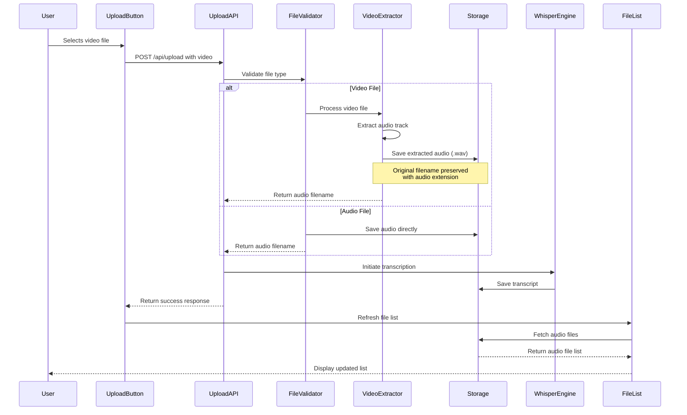
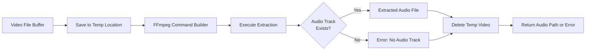
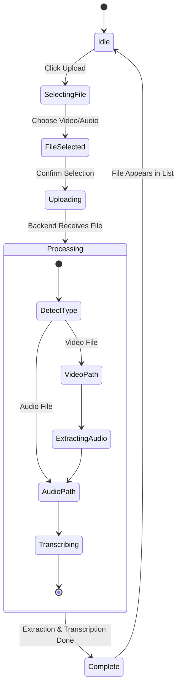
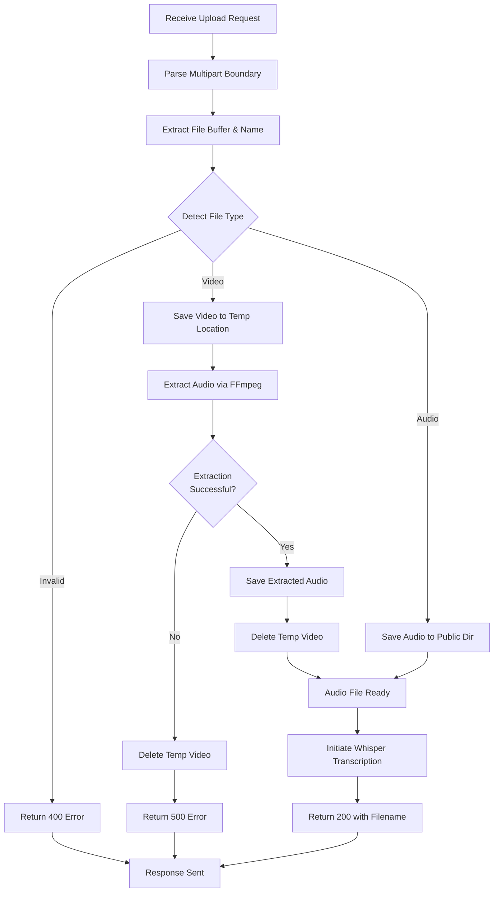

# Video Processing with Audio Extraction Feature

## Overview

This feature extends the existing audio upload and transcription system to support video file uploads. When a user uploads a video file, the system automatically extracts the audio track and processes it as if it were an audio file, seamlessly integrating with the existing Whisper transcription and LLM introspection workflows.

The enhancement maintains the existing offline-first architecture and privacy-focused approach, processing all video-to-audio extraction locally without external services.

### Key Objectives

- Enable users to upload video files through the existing upload interface
- Automatically extract audio tracks from video files
- Display extracted audio files in the audio file list alongside directly uploaded audio files
- Maintain compatibility with existing transcription and introspection workflows
- Preserve the offline-first architecture and local processing guarantee

### Repository Type

Full-Stack Application (Next.js with API routes and React frontend)

## Technology Stack Enhancement

### New Dependencies

The following technology will be integrated to enable video processing:

| Technology | Purpose | Justification |
|------------|---------|---------------|
| FFmpeg | Audio extraction from video files | Industry-standard tool for multimedia processing, supports all common video formats, runs locally |
| fluent-ffmpeg | Node.js wrapper for FFmpeg | Provides programmatic API for FFmpeg operations with promise support |

### Supported Video Formats

| Format | Extension | Container Type | Common Use Case |
|--------|-----------|----------------|-----------------|
| MP4 | .mp4 | MPEG-4 | Most common video format |
| MOV | .mov | QuickTime | macOS native format |
| AVI | .avi | Audio Video Interleave | Legacy Windows format |
| MKV | .mkv | Matroska | Open-source container |
| WebM | .webm | WebM | Web-optimized format |
| FLV | .flv | Flash Video | Streaming video format |

## Architecture

### System Component Interaction

```mermaid
flowchart TB
    subgraph "Frontend Layer"
        UI[Upload Button Component]
        FileList[File List Display]
    end
    
    subgraph "API Layer"
        UploadAPI[/api/upload]
        ListAPI[/api/list]
        TranscribeAPI[/api/transcribe]
    end
    
    subgraph "Processing Layer"
        FileValidator[File Type Validator]
        VideoProcessor[Video Audio Extractor]
        WhisperEngine[Whisper Transcription]
    end
    
    subgraph "Storage Layer"
        PublicDir[(Public Directory)]
        AudioFiles[Audio Files]
        VideoFiles[Video Files - Optional]
        Transcripts[Transcript Files]
    end
    
    UI -->|Upload Video/Audio| UploadAPI
    UploadAPI --> FileValidator
    FileValidator -->|Video File| VideoProcessor
    FileValidator -->|Audio File| AudioFiles
    VideoProcessor -->|Extract Audio| AudioFiles
    AudioFiles --> WhisperEngine
    WhisperEngine --> Transcripts
    AudioFiles --> PublicDir
    Transcripts --> PublicDir
    ListAPI --> PublicDir
    PublicDir --> FileList
    FileList -->|Select File| TranscribeAPI
    TranscribeAPI --> WhisperEngine
```

### Data Flow for Video Upload



## Feature Architecture

### Upload Flow Enhancement

The existing upload flow will be extended with video detection and processing capabilities while maintaining backward compatibility with direct audio uploads.

#### File Type Detection Strategy

When a file is uploaded, the system determines its type through the following process:

1. Extract file extension from the uploaded filename
2. Normalize extension to lowercase for case-insensitive matching
3. Check against supported audio extensions - if match found, process as audio
4. Check against supported video extensions - if match found, process as video
5. If neither matches, reject the file with an appropriate error message

#### Video Processing Workflow

When a video file is detected, the following processing sequence occurs:

1. **Temporary Storage**: Save the uploaded video buffer to a temporary location in the public directory
2. **Audio Extraction**: Invoke FFmpeg to extract the audio track from the video file
3. **Format Conversion**: Convert extracted audio to WAV format for consistency with existing audio handling
4. **Filename Preservation**: Use the original video filename but replace the extension with .wav
5. **Cleanup**: Remove the temporary video file after successful audio extraction
6. **Handoff**: Pass the extracted audio file to the existing Whisper transcription pipeline

### File Type Validation Module

A centralized validation module determines file types and validates format support.

#### File Type Categories

| Category | Detection Method | Supported Extensions |
|----------|------------------|---------------------|
| Audio | Extension matching | .wav, .mp3, .ogg, .flac, .m4a |
| Video | Extension matching | .mp4, .mov, .avi, .mkv, .webm, .flv |
| Unsupported | Fallback | All others (rejected) |

#### Validation Response Structure

The validator returns a structured response indicating:

- File type category (audio, video, or invalid)
- Whether the file is supported
- Original file extension
- Recommended processing strategy

### Audio Extraction Service

The audio extraction service handles all video-to-audio conversion operations.

#### Extraction Configuration

| Parameter | Value | Rationale |
|-----------|-------|-----------|
| Output Format | WAV | Uncompressed format, maximum compatibility with Whisper |
| Sample Rate | 16000 Hz | Whisper optimal sample rate |
| Channels | Mono | Reduces file size, sufficient for speech transcription |
| Audio Codec | PCM | Lossless encoding |
| Bitrate | Not specified | Let FFmpeg determine optimal bitrate for WAV |

#### Extraction Process Flow



#### Error Handling Scenarios

| Error Condition | Detection Method | User-Facing Message |
|----------------|------------------|---------------------|
| No audio track in video | FFmpeg stderr output analysis | "The uploaded video does not contain an audio track" |
| FFmpeg not installed | Command execution failure | "Video processing is not available. FFmpeg is required." |
| Corrupted video file | FFmpeg exit code non-zero | "The video file appears to be corrupted and cannot be processed" |
| Insufficient disk space | File system write error | "Insufficient disk space to process video" |
| Extraction timeout | Process timeout (5 minutes) | "Video processing timed out. Please try a smaller file." |

### File System Organization

The public directory structure remains largely unchanged, with extracted audio files stored alongside directly uploaded audio files.

#### File Naming Convention

| Source Type | Original Filename | Stored Filename | Example |
|-------------|-------------------|----------------|---------|
| Audio Upload | interview.mp3 | interview.mp3 | interview.mp3 |
| Video Upload | presentation.mp4 | presentation.wav | presentation.wav |
| Video Upload | meeting.mov | meeting.wav | meeting.wav |

This convention ensures that:
- Each video produces one audio file with a predictable name
- Users can identify which audio files originated from videos
- Transcription and introspection files follow existing naming patterns

#### Associated Files

When a video is uploaded and processed, the following files are created:

| File Type | Naming Pattern | Created By | Example |
|-----------|----------------|-----------|---------|
| Extracted Audio | {original_name}.wav | Video Extractor | presentation.wav |
| Transcription | {original_name}.wav.txt | Whisper Engine | presentation.wav.txt |
| Introspection | {original_name}.wav.introspection.txt | LLM Processor | presentation.wav.introspection.txt |

### Frontend Enhancement

The frontend requires minimal changes due to the design's emphasis on backend processing transparency.

#### Upload Button Modification

The ActionUploadButton component's file input accept attribute must be expanded to include video formats.

Current behavior:
- Accepts only audio files via `accept="audio/*"`

Enhanced behavior:
- Accepts both audio and video files via `accept="audio/*,video/*"`

This change enables the file picker to show both audio and video files, while all processing logic remains on the backend.

#### File List Display Logic

The Application component already filters files by extension when displaying the list. The current implementation shows only .wav files.

Current filtering logic:
- Filters files array to show only items ending with .wav extension

No change required because:
- Extracted audio from videos is saved as .wav
- The existing filter automatically includes extracted audio files
- Users see a unified list of audio files regardless of source

#### User Experience Flow



### API Endpoint Modifications

#### /api/upload Endpoint Enhancement

The upload endpoint serves as the entry point for both audio and video files.

##### Request Handling Flow



##### Response Structure

| Status Code | Condition | Response Body | Example |
|-------------|-----------|---------------|---------|
| 200 | Successful audio upload | `{ "success": true, "data": "filename.mp3" }` | Audio uploaded directly |
| 200 | Successful video extraction | `{ "success": true, "data": "filename.wav" }` | Video processed to audio |
| 400 | Invalid file type | `{ "error": true, "message": "Unsupported file format" }` | User uploaded .txt file |
| 400 | Missing boundary | `{ "error": true, "message": "Missing boundary" }` | Malformed multipart request |
| 500 | Extraction failure | `{ "error": true, "message": "Failed to extract audio from video" }` | Corrupted video or FFmpeg error |
| 500 | FFmpeg not available | `{ "error": true, "message": "Video processing unavailable" }` | FFmpeg not installed |

#### /api/list Endpoint

No modifications required. The endpoint already scans the public directory and returns all files. The frontend filtering ensures only audio files are displayed.

### Configuration Management

#### Environment Variables

New optional configuration variables for video processing:

| Variable Name | Purpose | Default Value | Required |
|---------------|---------|---------------|----------|
| FFMPEG_PATH | Custom FFmpeg binary path | System PATH | No |
| VIDEO_PROCESSING_TIMEOUT | Maximum extraction time (ms) | 300000 (5 min) | No |
| KEEP_ORIGINAL_VIDEO | Preserve uploaded video files | false | No |
| EXTRACTED_AUDIO_FORMAT | Output format for extracted audio | wav | No |

#### FFmpeg Installation Detection

The system must gracefully handle scenarios where FFmpeg is not installed.

Detection strategy:
1. On first video upload attempt, check if FFmpeg command is available
2. Cache the detection result to avoid repeated checks
3. If FFmpeg is not found, return a descriptive error and suggest installation
4. If FFmpeg is found, cache the binary path for subsequent operations

### Error Handling and User Feedback

#### Processing State Communication

During video processing, users must receive clear feedback about the system's state.

| Processing Stage | UI Indicator | Duration Estimate | User Action |
|------------------|--------------|-------------------|-------------|
| Uploading video | Loading spinner, "Uploading..." | 1-30 seconds | Wait |
| Extracting audio | Loading spinner, "Processing video..." | 10-120 seconds | Wait |
| Transcribing audio | Loading spinner, "Transcribing..." | 60-300 seconds | Wait |
| Complete | File appears in list | N/A | Select file |

#### Error Recovery Strategies

| Error Type | Recovery Action | User Guidance |
|------------|----------------|---------------|
| Unsupported format | Reject file immediately | "Please upload a supported video format: MP4, MOV, AVI, MKV, WebM, FLV" |
| No audio track | Reject after detection | "This video does not contain an audio track" |
| Extraction timeout | Cancel operation, cleanup temp files | "Video processing timed out. Try a shorter video or smaller file" |
| FFmpeg missing | Reject with installation guidance | "Video processing requires FFmpeg. Please install FFmpeg to enable this feature" |
| Disk space error | Reject with space check | "Insufficient disk space. Please free up space and try again" |

### Performance Considerations

#### Processing Time Estimates

| Video Duration | Estimated Extraction Time | Estimated Transcription Time | Total Time |
|----------------|--------------------------|------------------------------|------------|
| 5 minutes | 5-15 seconds | 30-90 seconds | 35-105 seconds |
| 15 minutes | 10-30 seconds | 90-180 seconds | 100-210 seconds |
| 30 minutes | 20-60 seconds | 180-360 seconds | 200-420 seconds |
| 60 minutes | 40-120 seconds | 360-600 seconds | 400-720 seconds |

#### Resource Management

Video processing is resource-intensive. The following strategies ensure system stability:

1. **Sequential Processing**: Process only one video at a time to prevent resource exhaustion
2. **Temporary File Cleanup**: Delete temporary video files immediately after extraction
3. **Timeout Protection**: Enforce maximum processing time to prevent indefinite hangs
4. **Memory Management**: Stream video data rather than loading entire files into memory when possible

#### File Size Handling

Large video files require special consideration:

| File Size Range | Special Handling |
|-----------------|------------------|
| 0-50 MB | Standard processing, no special measures |
| 50-200 MB | Warn user about longer processing time |
| 200-500 MB | Strongly recommend file compression before upload |
| 500+ MB | Consider rejecting with suggestion to split file |

### Security Considerations

#### File Type Validation

Relying solely on file extensions is insufficient for security. The system must validate actual file content:

1. **Extension Validation**: First line of defense, checks file extension
2. **MIME Type Validation**: Verify Content-Type header matches expected video/audio types
3. **Magic Byte Validation**: Check file header bytes to confirm actual file type (optional enhancement)

#### Path Traversal Prevention

All file operations must prevent directory traversal attacks:

- Sanitize uploaded filenames using `path.basename()` to strip directory components
- Validate that all file operations remain within the public directory
- Reject filenames containing suspicious characters or patterns

#### Resource Exhaustion Protection

Video processing can be exploited for denial-of-service:

- Enforce file size limits on uploads
- Implement timeout mechanisms for long-running operations
- Rate limit upload requests per user session
- Monitor disk space before accepting uploads

### Testing Strategy

#### Unit Testing Scope

| Component | Test Cases |
|-----------|-----------|
| File Type Validator | Valid audio extension, valid video extension, invalid extension, case sensitivity, edge cases (no extension, multiple dots) |
| Audio Extractor | Successful extraction, video without audio track, corrupted video, FFmpeg unavailable, extraction timeout |
| Filename Sanitization | Path traversal attempts, special characters, Unicode characters, very long names |
| Error Handlers | Each error condition returns appropriate status code and message |

#### Integration Testing Scope

| Workflow | Test Scenario |
|----------|---------------|
| Video Upload | End-to-end: upload MP4 → extract audio → verify WAV file exists → verify file appears in list |
| Audio Upload | Ensure existing audio upload functionality remains unchanged |
| Mixed Uploads | Upload audio, then video, then audio → verify all appear correctly |
| Error Recovery | Upload invalid file → verify error message → verify no temp files remain |

#### Manual Testing Checklist

- [ ] Upload various video formats (MP4, MOV, AVI, MKV, WebM)
- [ ] Upload video without audio track → verify appropriate error
- [ ] Upload very large video → verify timeout handling
- [ ] Upload multiple videos in sequence → verify no resource leaks
- [ ] Verify extracted audio plays correctly
- [ ] Verify transcription works on extracted audio
- [ ] Verify introspection works on video-sourced transcripts
- [ ] Test with FFmpeg not installed → verify graceful degradation

### Migration and Deployment

#### Pre-Deployment Requirements

| Requirement | Verification Method | Importance |
|-------------|---------------------|------------|
| FFmpeg Installation | Run `ffmpeg -version` on deployment server | Critical |
| Disk Space | Verify sufficient space for temporary video storage | High |
| Node Modules | Install fluent-ffmpeg package via npm | Critical |
| File Permissions | Ensure write permissions on public directory | Critical |

#### Backward Compatibility

The feature is designed to be fully backward compatible:

- Existing audio upload functionality remains unchanged
- Existing transcription and introspection workflows unaffected
- No database schema changes required
- No breaking changes to API contracts

#### Rollback Strategy

If issues arise in production:

1. Remove video extensions from upload button accept attribute
2. Add file type check in /api/upload to reject video files
3. System reverts to audio-only mode with no data loss

### Future Enhancements

Potential future improvements to this feature:

| Enhancement | Description | Complexity |
|-------------|-------------|------------|
| Video Preview | Show video thumbnail in file list | Medium |
| Multi-Track Selection | Allow user to choose which audio track to extract when multiple exist | High |
| Batch Processing | Process multiple videos simultaneously | High |
| Progress Indication | Show real-time progress during extraction | Medium |
| Format Selection | Let users choose output audio format (WAV, MP3, etc.) | Low |
| Quality Settings | Allow users to specify extraction quality/bitrate | Low |
| Keep Original Video | Option to preserve uploaded video files | Low |

## Constraints and Assumptions

### Constraints

1. Video processing is limited to files containing audio tracks - silent videos will be rejected
2. FFmpeg must be installed on the server for video processing to function
3. Processing time increases linearly with video duration
4. Large video files may encounter timeout limitations
5. The feature maintains the offline-first architecture - no cloud processing services

### Assumptions

1. Users primarily upload videos containing spoken content (interviews, presentations, podcasts)
2. The server has sufficient disk space for temporary video storage during processing
3. FFmpeg is properly installed and accessible in the system PATH or via FFMPEG_PATH environment variable
4. Users accept that video processing takes longer than direct audio uploads
5. The extracted audio quality from video is sufficient for Whisper transcription accuracy
