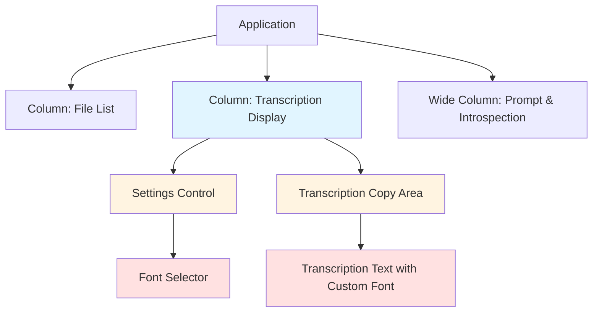
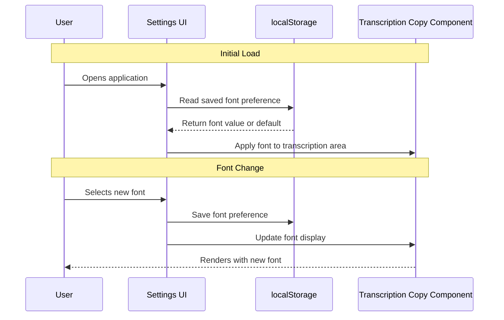
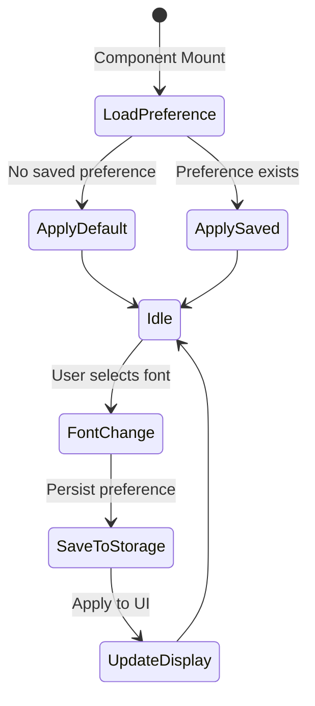
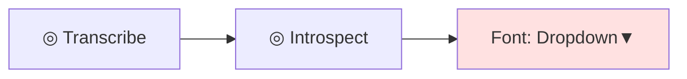

# Font Customization Feature Design

## Overview

This feature introduces font customization capabilities for the transcription display area, enabling the user to select from a variety of system fonts. The transcription column will default to a monospace font for improved readability of transcribed text. As an MVP for local single-user deployment, the implementation prioritizes simplicity using browser localStorage for persistence.

### Core Value

- **Improved Readability**: Monospace fonts provide better alignment and readability for transcribed text
- **User Personalization**: Allow the solo user to customize their viewing experience based on preference
- **Local Persistence**: Font preference persists across browser sessions without requiring backend storage

## Technology Stack

| Component | Technology |
|-----------|-----------|
| Frontend Framework | Next.js 15.3.3 with React 19.1.0 |
| Styling | SCSS Modules |
| State Management | React useState + localStorage |
| Target Environment | Local development server (port 10000) |

## Architecture

### Component Hierarchy

The font customization feature integrates into the existing Application component structure:

### Data Flow

## Feature Specifications

### Font Options

The font selector will provide access to commonly available system fonts:

| Font Family | Category | Use Case |
|-------------|----------|----------|
| SF Mono (SFMonoSquare-Regular) | Monospace | Default - optimal for code/transcription |
| Consolas | Monospace | Windows monospace alternative |
| Monaco | Monospace | macOS monospace alternative |
| Courier New | Monospace | Cross-platform classic monospace |
| Menlo | Monospace | macOS monospace variant |
| Ubuntu Mono | Monospace | Linux monospace option |
| Roboto Mono | Monospace | Modern geometric monospace |
| Silvana-Regular | Serif | Existing serif font |
| System Default | Sans-serif | -apple-system, BlinkMacSystemFont, Helvetica |

### Settings Interface

The settings control will be minimal and non-intrusive:

**Location**: Positioned in the top section of the transcription column, alongside existing action buttons

**Visual Design**:
- Inline dropdown selector labeled "Font:"
- Styled consistently with existing action buttons
- Same disabled state behavior as other controls (during upload/transcription/introspection)

**Interaction States**:

| State | Behavior |
|-------|----------|
| Enabled | Dropdown allows font selection, changes apply immediately |
| Disabled | Dropdown is non-interactive (cursor: not-allowed, reduced opacity) |
| Selected | Shows current font choice |

### Transcription Display Modification

**Target Element**: The Copy component within the transcription column

**Default Behavior**:
- Transcription text displays in the selected monospace font
- Font preference applies only to transcription content, not file list or other UI elements
- Maintains existing text size, line-height, and white-space properties

**CSS Variable Approach**:

A new CSS custom property will control the transcription font:

| Variable Name | Purpose | Default Value |
|---------------|---------|---------------|
| --font-transcription | Controls transcription display font | var(--font-family-mono) |

### Persistence Strategy

**Storage Mechanism**: Browser localStorage

**Storage Schema**:

| Key | Value Format | Example |
|-----|--------------|---------|
| `transcription-font-preference` | String (font-family CSS value) | `"SF Mono, Consolas, monospace"` |

**Persistence Flow**:

1. **On Application Mount**:
   - Read `transcription-font-preference` from localStorage
   - If value exists, apply to transcription display
   - If no value exists, use default monospace font

2. **On Font Selection**:
   - Update localStorage with new preference
   - Apply new font to transcription display immediately
   - No page reload required

3. **On Font Reset** (optional):
   - Clear localStorage key
   - Revert to default monospace font

## Component Design

### Settings Control Component

**Purpose**: Provides UI for font selection

**Visual Placement**: Within the `.top` section of the transcription column

**Properties**:

| Property | Type | Purpose |
|----------|------|---------|
| disabled | boolean | Mirrors upload/transcription/introspection states |
| selectedFont | string | Current font selection |
| onFontChange | function | Callback when font selection changes |

**Font Options Structure**:

Each font option contains:
- Display name (user-friendly label)
- CSS font-family value (technical font stack)
- Category tag (for potential grouping)

### Transcription Display Component

**Modification Strategy**: Enhance existing Copy component in transcription column

**Style Application**: Dynamic inline style or CSS class based on selected font

**CSS Integration**:

The `.copy` class in `Application.module.scss` will be enhanced to accept font customization:

| Selector | Modification | Purpose |
|----------|--------------|---------|
| `.copy.transcription` | Additional variant class | Targets only transcription copy area |
| Dynamic CSS variable | Applied via inline style | Allows runtime font changes |

## State Management

### Application State

New state additions to the Application component:

| State Variable | Type | Initial Value | Purpose |
|----------------|------|---------------|---------|
| transcriptionFont | string | Read from localStorage or default | Stores current font selection |

### State Update Flow

## Visual Design Specifications

### Settings Control Layout

**Alignment**: Right-aligned within `.top` section
**Spacing**: 24px left margin (consistent with existing actions)
**Typography**: 
- Label: Same as action buttons (--type-scale-fixed-small, uppercase, --font-family-mono)
- Dropdown: Renders in selected font for preview

### Dropdown Styling

| Property | Value | Rationale |
|----------|-------|-----------|
| Background | var(--theme-background) | Consistent with theme |
| Border | 1px solid var(--theme-border) | Subtle visual boundary |
| Padding | 4px 8px | Compact but touchable |
| Font-size | var(--type-scale-fixed-small) | Matches action buttons |
| Color | var(--theme-text) | Standard text color |
| Hover state | Background: var(--theme-text), Color: var(--color-black-100) | Matches action button hover |

## Testing Strategy

### Manual Testing Scenarios

| Test Case | Steps | Expected Result |
|-----------|-------|-----------------|
| Default font on first load | Open app for first time | Transcription displays in SF Mono |
| Font selection | Select different font from dropdown | Transcription updates immediately |
| Font persistence | Select font, refresh browser | Same font applied after reload |
| Disabled state | Attempt to change font during transcription | Dropdown is disabled |
| Cross-browser compatibility | Test in Chrome, Firefox, Safari | Fonts render correctly or fall back gracefully |
| Font preview in dropdown | Open dropdown | Each option displays in its respective font |
| Settings position | View transcription column | Font selector aligned with action buttons |

### Edge Cases

| Scenario | Expected Behavior |
|----------|-------------------|
| Font not available on system | Falls back to next font in stack, ultimately to generic monospace |
| localStorage disabled/full | Uses default font, continues to function |
| Empty transcription | Font selector still functional, ready for when content loads |
| Very long transcription | Font applies consistently across all text |

## Design Constraints

### MVP Scope Limitations

**Out of Scope for MVP**:
- Font size customization
- Line height adjustment
- Color customization
- Export of settings
- Backend storage of preferences
- Multi-user preference profiles
- Font upload/custom fonts
- Preview pane for font testing

**Rationale**: Single local user deployment does not require complex preference management or backend infrastructure.

### Browser Compatibility

The feature relies on:
- localStorage (supported in all modern browsers)
- CSS custom properties (supported in all modern browsers)
- System fonts (fallback chains ensure compatibility)

**Minimum Requirements**: Modern evergreen browsers (Chrome 90+, Firefox 88+, Safari 14+)

## Migration & Deployment

### Deployment Strategy

**Zero-Migration Deployment**: 
- No database changes required
- No API modifications needed
- Frontend-only changes
- Backward compatible (no breaking changes)

### Rollout Plan

| Phase | Action | Impact |
|-------|--------|--------|
| 1. Add Settings UI | Deploy font selector control | Visible to user but not functional |
| 2. Add Persistence | Implement localStorage logic | Font selection works and persists |
| 3. Apply Styling | Connect font to transcription display | Feature fully operational |

**Rollback**: Simply revert frontend code changes; no data cleanup required.

## Performance Considerations

### Performance Impact

| Aspect | Impact | Mitigation |
|--------|--------|------------|
| localStorage read | Minimal (synchronous, ~1ms) | Single read on mount |
| Font application | None (CSS property change) | Browser-native rendering |
| Re-renders | Minimal | Only transcription area re-renders |
| Bundle size | Negligible (~1-2KB) | No external dependencies |

### Optimization Strategy

- Read localStorage only once on component mount
- Avoid re-renders of unaffected components
- Use CSS variables for efficient style updates
- Leverage browser font caching

## Future Enhancements

Potential extensions beyond MVP scope:

| Enhancement | Benefit | Complexity |
|-------------|---------|------------|
| Font size slider | Accessibility for vision impairment | Low |
| Line spacing control | Improved readability for long transcriptions | Low |
| Dark/light theme toggle | Eye strain reduction | Medium |
| Export settings as JSON | Backup and restore preferences | Low |
| Keyboard shortcuts for font cycling | Power user efficiency | Medium |
| Custom font upload | Support for specialty fonts | High |
| Per-file font memory | Different fonts for different contexts | Medium |

## Accessibility Considerations

| Consideration | Implementation |
|---------------|----------------|
| Keyboard navigation | Dropdown fully accessible via keyboard (Tab, Arrow keys, Enter) |
| Screen reader support | Label "Font:" associated with dropdown via semantic HTML |
| Focus indicators | Standard browser focus styling maintained |
| Sufficient contrast | All font options maintain theme color contrast ratios |
| Font fallbacks | Ensures text remains readable even if preferred font unavailable |
