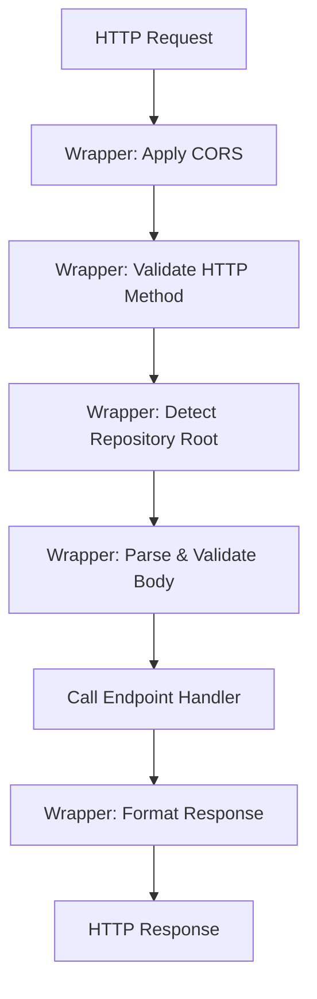
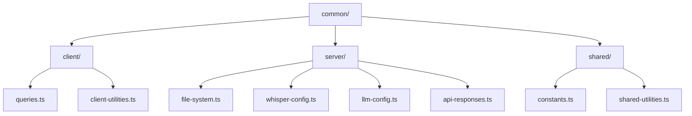
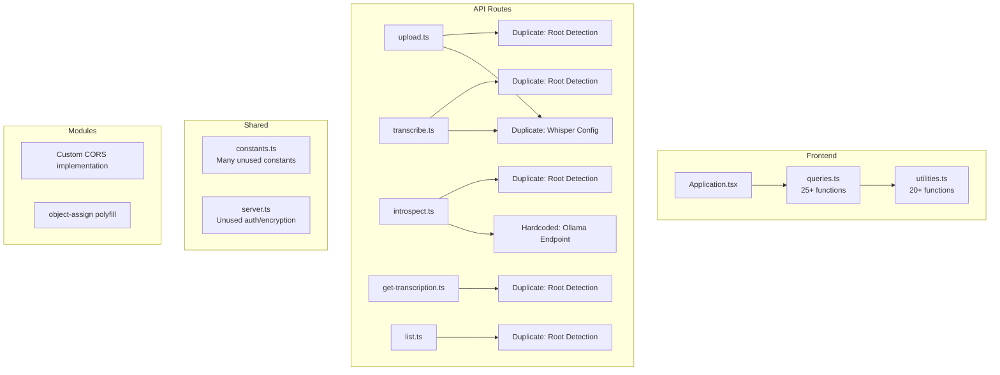
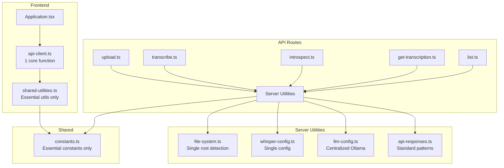

# Project Refactoring Design

## Overview

This design document outlines a comprehensive refactoring plan for the offline-first Next.js audio transcription application. The refactoring focuses on applying DRY (Don't Repeat Yourself) principles, eliminating over-engineering for an MVP used by a single local user, and improving code maintainability while preserving all existing functionality.

**Target Repository**: nextjs-offline-whisper-to-llm  
**User Context**: Single user, local development/usage only  
**Primary Goal**: Simplify codebase by removing duplication and unnecessary abstractions

## Current State Analysis

### Identified Issues

#### Code Duplication

**Repository Root Detection Pattern**
- Duplicated across 5 API endpoints (`upload.ts`, `transcribe.ts`, `introspect.ts`, `get-transcription.ts`, `list.ts`)
- Each endpoint implements identical logic to locate the repository root by searching for `global.scss`
- Approximately 10-12 lines of repeated code per file

**Whisper Configuration**
- Identical Whisper configuration object appears in both `upload.ts` and `transcribe.ts`
- Configuration includes 13 identical properties in both locations
- Changes require synchronization across multiple files

**API Response Patterns**
- Repeated error response structure: `{ error: true, data: null }`
- Repeated success response structure: `{ success: true, data: ... }`
- No consistent error handling abstraction

**CORS Middleware Application**
- Every API endpoint begins with `await Server.cors(req, res)`
- Could be handled once at a higher level

#### Over-Engineering for MVP Context

**Unused Query Functions**
- The `queries.ts` file contains 25+ functions designed for a full-featured SaaS application
- Functions like `onUserListData`, `onRefreshDocuments`, `onPublicUserAuthenticate`, `onUserUploadDataGCS`, etc. are not used in the current MVP
- These functions reference an external API (`api.internet.dev`) irrelevant to the offline-first local use case

**Authentication/Encryption Infrastructure**
- The `server.ts` includes AES decryption functionality and API key setup mechanisms
- Comments reference partnership requirements and server-side decryption for external services
- Not applicable for single-user local environment

**Unnecessary Utility Functions**
- Functions like `getDomainFromEmailWithoutAnySubdomain`, `formatDollars`, `timeAgo`, `createSlug` are unused
- Originally from a template but not relevant to audio transcription workflow

**Complex Constants**
- User tier definitions, payment structures, and payout configurations in `constants.ts`
- Terminal color definitions unused in the application
- API endpoint constants pointing to external services

**Modules Directory**
- Contains custom implementations of `cors.ts`, `object-assign.ts`, and `vary.ts`
- These are maintained variations of standard packages, adding maintenance overhead

### Architecture Observations

The application follows a straightforward data flow:
1. User uploads audio file
2. File is transcribed using local Whisper
3. Transcription is introspected using local Ollama LLM
4. Results are displayed and stored locally

For a single-user local MVP, the current architecture contains abstractions designed for multi-user, cloud-based scenarios.

## Refactoring Strategy

### Principle: Pragmatic Simplification

The refactoring will maintain all existing functionality while:
- Eliminating code duplication through shared utilities
- Removing unused code paths and abstractions
- Consolidating configuration in centralized locations
- Simplifying API structure for local-only usage

### Non-Goals

This refactoring will NOT:
- Change the user interface or user experience
- Alter the core transcription or introspection workflows
- Modify the data storage approach (public directory)
- Introduce new dependencies or frameworks
- Change the Next.js application structure

## Detailed Refactoring Design

### Phase 1: Consolidate Shared Server Utilities

#### Create Centralized File System Utilities

**Purpose**: Eliminate duplicated repository root detection logic

**New Module**: `common/file-system.ts`

**Functionality**:
- Single function to detect repository root directory
- Single function to construct paths within the public directory
- Shared file existence validation
- Error handling for file system operations

**Functions to Implement**:

| Function Name | Purpose | Return Type |
|---------------|---------|-------------|
| `getRepositoryRoot()` | Detect repository root by locating global.scss | string or null |
| `getPublicDirectoryPath()` | Return absolute path to public directory | string |
| `getPublicFilePath(filename)` | Construct absolute path for file in public directory | string |
| `fileExists(filePath)` | Check if file exists at given path | boolean |
| `ensurePublicDirectory()` | Verify public directory exists and is writable | boolean |

**Implementation Strategy**:
- Cache repository root detection result after first call to avoid repeated file system traversal
- Validate paths to prevent directory traversal vulnerabilities (even for local use, good practice)
- Consistent error handling with descriptive messages

#### Consolidate Whisper Configuration

**Purpose**: Single source of truth for Whisper transcription settings

**Location**: `common/whisper-config.ts`

**Configuration Structure**:

| Property | Value | Rationale |
|----------|-------|-----------|
| modelName | large-v3-turbo | Balance between accuracy and speed |
| autoDownloadModelName | large-v3-turbo | Consistent with modelName |
| removeWavFileAfterTranscription | false | Preserve original audio files |
| withCuda | false | CPU-only processing for compatibility |
| whisperOptions.outputInText | true | Only text output needed |
| whisperOptions.outputInCsv | false | Unused format |
| whisperOptions.outputInJson | false | Unused format |
| whisperOptions.outputInSrt | false | Unused subtitle format |
| whisperOptions.translateToEnglish | false | Preserve original language |
| whisperOptions.timestamps_length | 30 | Standard chunk size |

**Function to Export**:
- `getWhisperConfiguration()` - Returns complete configuration object
- Optional: `transcribeAudioFile(filePath)` - Wrapper around nodewhisper with standard config

#### Standardize API Response Patterns

**Purpose**: Consistent response structure across all endpoints

**New Module**: `common/api-responses.ts`

**Response Patterns**:

```
Success Response:
{
  success: true,
  data: <payload>
}

Error Response:
{
  error: true,
  data: null,
  message?: <optional error description>
}
```

**Functions to Implement**:

| Function | Purpose | Parameters |
|----------|---------|------------|
| `successResponse(res, data, statusCode?)` | Send standardized success response | Response object, data payload, optional HTTP status |
| `errorResponse(res, statusCode, message?)` | Send standardized error response | Response object, HTTP status, optional message |
| `notFoundResponse(res)` | Shorthand for 404 errors | Response object |
| `badRequestResponse(res, message?)` | Shorthand for 400 errors | Response object, optional message |
| `serverErrorResponse(res, message?)` | Shorthand for 500 errors | Response object, optional message |

**Benefits**:
- Eliminates repeated response object construction
- Ensures consistent response structure for client parsing
- Simplifies error handling in API routes

### Phase 2: Eliminate Unused Code

#### Clean Up Queries Module

**Current State**: 25+ functions, only 1 actively used (`getData`)

**Actions**:

1. Retain only the generic `getData` function used by the application
2. Remove all unused functions:
   - User authentication functions (`onPublicUserAuthenticate`, `onUserRegenerateAPIKey`)
   - Data management functions (`onUserListData`, `onUserDeleteData`)
   - Document management functions (`onRefreshDocuments`, `onUserCreateDocument`, etc.)
   - Post/thread management functions (`onRefreshPosts`, `onUserCreatePost`, etc.)
   - File upload functions (`onUserUploadDataGCS`, `onUserUploadDataS3`)

3. Simplify `getData` function:
   - Remove unused `key` parameter (no API authentication needed for local-only app)
   - Simplify error handling since all calls are local
   - Remove `qualifier` parameter if all responses use "data" field consistently

**Simplified Interface**:

| Function | Parameters | Purpose |
|----------|------------|---------|
| `fetchAPI(route, body)` | API route path, request body | Single unified API call function |

#### Remove Unused Utilities

**Functions to Remove**:
- `getDomainFromEmailWithoutAnySubdomain` - Email/domain parsing not needed
- `formatDollars` - No payment processing
- `onHandleThemeChange` - Theme switching not implemented
- `calculatePositionWithGutter` - Positioning utility not used
- `toDateISOString` - Date formatting not used in UI
- `createSlug` - URL slug generation not needed
- `isUrl` - URL validation not needed
- `timeAgo` - Relative time display not used
- `generateNonce` - Cryptographic nonce not needed
- `pluralize` - Text pluralization not used
- `filterUndefined` - Object filtering not used

**Functions to Retain**:
- `isEmpty` - Used for validation throughout application
- `getFontPreference` / `setFontPreference` - Used for font selector feature
- `debounce` - General-purpose utility, may be useful for future enhancements
- `bytesToSize` - Could be useful for displaying audio file sizes
- `elide` - Text truncation utility

#### Simplify Constants Module

**Current State**: Multiple constant groups for unused features

**Actions**:

1. **Remove Unused Constant Groups**:
   - `Users.tiers` - User tier system not applicable
   - `Tiers` - Pricing tiers not needed
   - `Payments` - Payment processing not needed
   - `Payouts` - Payout system not needed
   - `TERMINAL_COLORS` - Terminal colors not used in web application
   - `API` - External API endpoint not used

2. **Retain Essential Constants**:
   - `Query.directives` - Used in Ollama prompt construction
   - `FONT_OPTIONS` - Used by font selector feature
   - `DEFAULT_TRANSCRIPTION_FONT` - Default font setting
   - `TRANSCRIPTION_FONT_STORAGE_KEY` - LocalStorage key for preferences

3. **Consider Adding**:
   - Ollama endpoint URL as constant (currently hardcoded as `http://localhost:11434`)
   - Default prompt file name (`__prompt.txt`)
   - Supported audio file extensions (currently in multiple places)

**Simplified Structure**:

| Constant Group | Purpose |
|----------------|---------|
| LLM Configuration | Ollama endpoint, model name, prompt directives |
| File Handling | Supported audio formats, default file names |
| UI Preferences | Font options, storage keys |

#### Remove Authentication Infrastructure

**Current State**: `server.ts` contains AES decryption and external API authentication

**Actions**:

1. Remove `decrypt` function - AES decryption not needed for local-only app
2. Remove `setup` function - Session/cookie-based authentication not needed
3. Remove `tryKeyWithoutCookie` function - API key validation not needed
4. Retain `cors` middleware initialization only if needed (see CORS discussion below)
5. Retain `initMiddleware` helper only if CORS is kept

**Consideration**: 
For a local-only single-user application, CORS restrictions may be unnecessary. The browser and Next.js server are both localhost, reducing CORS relevance.

**Decision Matrix**:

| Scenario | Keep CORS? | Rationale |
|----------|-----------|-----------|
| Browser calls API on same localhost domain | No | Same-origin, CORS not triggered |
| Future: Access from different port | Maybe | Could be handled by Next.js config |
| Production deployment | Yes | If ever deployed, CORS becomes relevant |

**Recommendation**: Keep minimal CORS setup in case of future needs, but consider it optional for pure local development.

#### Evaluate Modules Directory

**Current State**: Custom implementations of standard functionality

**Files**:
- `cors.ts` - Custom CORS middleware implementation
- `object-assign.ts` - Object assignment polyfill
- `vary.ts` - HTTP Vary header utility

**Evaluation**:

| Module | Standard Alternative | Recommendation |
|--------|---------------------|----------------|
| cors.ts | `cors` npm package | Use standard package if keeping CORS |
| object-assign.ts | Native `Object.assign()` | Remove, use native (supported in Node 18+) |
| vary.ts | Rarely used utility | Remove if not needed by custom CORS |

**Action**: 
- If keeping CORS: Replace custom implementation with standard `cors` package
- If removing CORS: Delete entire modules directory
- Remove `object-assign.ts` as native `Object.assign()` is available in target Node version (18+)

### Phase 3: Improve API Endpoint Structure

#### Consolidate Common Endpoint Logic

**Purpose**: Apply shared setup/validation logic once rather than in each endpoint

**Pattern to Implement**: API Middleware Chain

**Common Operations Across Endpoints**:
1. CORS handling (if kept)
2. Method validation (POST vs GET)
3. Request body parsing
4. Repository root detection
5. Error response formatting

**Approach**: Higher-Order Function or Middleware Wrapper

**Function Structure**:

```
Middleware Wrapper Pattern:
- Input: Endpoint-specific handler function
- Output: Wrapped handler with common logic applied
- Benefits: DRY principle, consistent behavior, simplified endpoints
```

**Handler Signature**:

| Parameter | Type | Purpose |
|-----------|------|---------|
| context | Object | Contains req, res, publicDir, validated body |
| endpoint handler | Function | Actual business logic for the endpoint |

**Example Flow**:



#### Standardize Request Validation

**Current State**: Each endpoint manually checks for required parameters

**Pattern**: Validation Schema per Endpoint

**Validation Requirements by Endpoint**:

| Endpoint | Required Field | Validation Rule |
|----------|---------------|-----------------|
| /api/upload | file in multipart | Non-empty file with valid audio extension |
| /api/transcribe | name | Non-empty string, references existing audio file |
| /api/introspect | name | Non-empty string, references existing transcript |
| /api/get-transcription | name | Non-empty string |
| /api/get-introspection | name | Non-empty string |
| /api/update-prompt | prompt | Non-empty string |
| /api/list | (none) | No body validation needed |
| /api/get-prompt | (none) | No body validation needed |

**Validation Helper Design**:

| Function | Purpose | Return |
|----------|---------|--------|
| `validateRequired(value, fieldName)` | Check if value exists and is non-empty | Throws error with field name if invalid |
| `validateAudioFileName(name)` | Ensure filename has valid audio extension | Throws error if invalid format |
| `validateFileExists(filePath)` | Verify file exists before processing | Throws error with 404 if not found |

**Benefits**:
- Consistent validation error messages
- Centralized validation logic
- Easier to extend validation rules

#### Reduce Endpoint-Specific Boilerplate

**Current Pattern** (repeated in multiple files):

```
Analysis of current endpoint structure shows:
- Lines 1-10: Imports
- Lines 10-15: Config export
- Lines 15-20: CORS and method validation
- Lines 20-30: Repository root detection
- Lines 30-40: Business logic
- Lines 40-50: Response formatting
```

**Target Pattern**:

```
Simplified endpoint structure:
- Lines 1-5: Imports
- Lines 5-10: Endpoint-specific business logic only
- Lines 10-15: Export wrapped with common handler
```

**Estimated Reduction**: ~30-40% fewer lines per endpoint file

### Phase 4: Configuration Centralization

#### Whisper Model Configuration

**Current Issues**:
- Model name hardcoded in multiple locations
- Configuration object duplicated in `upload.ts` and `transcribe.ts`

**Solution**: Single configuration file

**Location**: `common/whisper-config.ts`

**Exported Values**:

| Export | Type | Purpose |
|--------|------|---------|
| WHISPER_MODEL | string | Model name for nodewhisper |
| WHISPER_CONFIG | object | Complete configuration for nodewhisper |
| transcribeFile(path) | function | Wrapper applying standard config |

**Benefits**:
- Change model in one place (e.g., switching to different Whisper version)
- Consistent transcription behavior across upload and re-transcription
- Easier testing with mock configurations

#### Ollama Configuration

**Current Issues**:
- Ollama endpoint hardcoded as `http://localhost:11434`
- Model name `gemma3:27b` hardcoded in `introspect.ts`
- Query directives in constants but endpoint URL is not

**Solution**: Centralized LLM configuration

**Location**: `common/llm-config.ts`

**Configuration Structure**:

| Property | Value | Environment Override |
|----------|-------|---------------------|
| OLLAMA_ENDPOINT | http://localhost:11434 | OLLAMA_HOST |
| OLLAMA_MODEL | gemma3:27b | OLLAMA_MODEL |
| OLLAMA_TIMEOUT | 0 (no timeout) | N/A |
| QUERY_DIRECTIVES | From constants | N/A |

**Benefits**:
- Environment-based configuration for different Ollama setups
- Easier to switch LLM models for testing
- Centralized timeout and request configuration

#### File Storage Configuration

**Current Issues**:
- Prompt file name `__prompt.txt` hardcoded in multiple endpoints
- Supported audio extensions defined inconsistently

**Solution**: File system constants

**Location**: `common/file-system.ts` (alongside utilities)

**Constants**:

| Constant | Value | Purpose |
|----------|-------|---------|
| PROMPT_FILE_NAME | __prompt.txt | Default system prompt file |
| SUPPORTED_AUDIO_EXTENSIONS | [.wav, .mp3, .ogg, .flac, .m4a] | Valid upload formats |
| TRANSCRIPTION_EXTENSION | .txt | Extension for transcript files |
| INTROSPECTION_EXTENSION | .introspection.txt | Extension for introspection results |

**Functions Using These**:

| Function | Uses Constant |
|----------|---------------|
| `getPromptFilePath()` | PROMPT_FILE_NAME |
| `getTranscriptionPath(audioFile)` | TRANSCRIPTION_EXTENSION |
| `getIntrospectionPath(audioFile)` | INTROSPECTION_EXTENSION |
| `isValidAudioFile(filename)` | SUPPORTED_AUDIO_EXTENSIONS |

### Phase 5: Simplify Frontend API Calls

#### Streamline Queries Module

**Current State**: Generic `getData` function with unused parameters

**Issues**:
- `key` parameter passed but never used (no authentication)
- `qualifier` parameter with default value, but all calls use "data"
- Try-catch returns null on error without error information

**Simplified Design**:

**Function Signature**: `apiCall(route, body)`

**Behavior**:
- POST request to specified route
- JSON body serialization
- Standard error handling
- Returns data directly or null on error

**Error Handling Strategy**:

| Error Type | Current Behavior | Improved Behavior |
|------------|------------------|-------------------|
| Network error | Return null | Return null, log to console for debugging |
| HTTP error status | Return null | Return null, log status code |
| Invalid JSON response | Return null | Return null, log parse error |
| Missing data field | Return null | Return null (expected for some endpoints) |

**Usage Simplification**:

```
Current pattern:
const response = await Queries.getData({ 
  route: '/api/get-transcription', 
  body: { name } 
});

Simplified pattern:
const response = await apiCall('/api/get-transcription', { name });
```

**Benefits**:
- Less verbose API calls in components
- Clearer parameter requirements
- Easier to add request/response interceptors in future

#### Reduce Repetitive Error Handling in Components

**Current Pattern**: Component checks `response`, then checks `response.data`

**Observed in**: `Application.tsx` has multiple instances of:
```
Pattern:
const response = await Queries.getData(...)
setData(response ? response.data : '')
```

**Improvement Options**:

| Approach | Pros | Cons |
|----------|------|------|
| Return data directly, throw on error | Simpler usage | Requires try-catch in components |
| Return `{ data, error }` tuple | Explicit error handling | More verbose |
| Keep current, simplify response structure | Minimal change | Still repetitive |

**Recommendation**: Keep current pattern but simplify response access

**Helper Function**: 
- `extractData(response, defaultValue)` - Returns `response?.data ?? defaultValue`
- Used in components to reduce ternary expressions

### Phase 6: Improve Code Organization

#### Restructure Common Directory

**Current State**: Mix of client and server utilities in single directory

**Issues**:
- `server.ts` only used by API routes, but in common directory
- `queries.ts` only used by client components
- `utilities.ts` has both client and server-safe functions
- `constants.ts` mixes client and server constants

**Proposed Structure**:



**Directory Purpose**:

| Directory | Contents | Used By |
|-----------|----------|---------|
| common/client/ | Browser-specific code (API calls, LocalStorage) | Components |
| common/server/ | Node.js-specific code (file system, external processes) | API routes |
| common/shared/ | Utilities safe in both environments | Both |

**Benefits**:
- Clear separation of concerns
- Prevents accidental use of Node.js APIs in browser
- Easier to configure build optimizations (tree-shaking)
- Better TypeScript configuration per directory

**Migration Impact**: Requires updating import paths across files

**Alternative (Minimal Change)**: Keep current structure, just rename files for clarity:
- `server.ts` → `server-utilities.ts`
- `queries.ts` → `api-client.ts`
- `utilities.ts` → `shared-utilities.ts`

#### Consolidate Component Helpers

**Current State**: Small helper components defined within `Application.tsx`

**Components Defined Inline**:
- `Action` - Clickable action button with disabled state
- `File` - File list item with selection state
- `Copy` - Content display area
- `TranscriptionCopy` - Transcription-specific display with font styling
- `Prompt` - Wrapper around TextArea

**Consideration**: Move to separate files or keep inline?

| Approach | Pros | Cons |
|----------|------|------|
| Keep inline | All logic in one file, simple for small components | Application.tsx is 270 lines |
| Extract to separate files | Smaller main component, reusable | More files to navigate |
| Extract to same file as exports | Balance between organization and simplicity | Adds file size |

**Recommendation for MVP**: Keep inline since they're tightly coupled to Application component and unlikely to be reused

**Alternative**: Extract to bottom of same file with clear comment separator for organization


## Implementation Sequence

### Phase 1: Foundation (Estimated 2-3 hours)


**Order of Operations**:
1. Create `common/server/file-system.ts` with repository root detection
2. Create `common/server/whisper-config.ts` with consolidated configuration
3. Create `common/server/api-responses.ts` with response helpers
4. Refactor `upload.ts` to use new utilities (proof of concept)
5. Test upload functionality to verify nothing broke
6. Commit checkpoint

### Phase 2: API Endpoints Migration (Estimated 3-4 hours)

**Order**:
1. Update `transcribe.ts` (similar to upload, good second target)
2. Update `introspect.ts` (most complex logic)
3. Update `get-transcription.ts` and `get-introspection.ts` (similar patterns)
4. Update `list.ts` (simplest endpoint)
5. Update `get-prompt.ts` and `update-prompt.ts`
6. Verify all features work through UI testing
7. Commit checkpoint

### Phase 3: Cleanup (Estimated 2 hours)

**Order**:
1. Remove unused functions from `queries.ts`, rename to `api-client.ts`
2. Remove unused functions from `utilities.ts`, rename to `shared-utilities.ts`
3. Clean up `constants.ts`, remove unused constant groups
4. Evaluate and potentially remove `server.ts` and `modules/` directory
5. Update all import paths to reflect new file names
6. Verify application builds and runs
7. Commit checkpoint

### Phase 4: Configuration Centralization (Estimated 1-2 hours)

**Order**:
1. Create `common/server/llm-config.ts` with Ollama configuration
2. Update `introspect.ts` to use centralized config
3. Move file name constants to `file-system.ts`
4. Update relevant API endpoints to use constants
5. Test transcription and introspection workflows
6. Commit checkpoint

### Phase 5: Frontend Refinement (Estimated 1-2 hours)

**Order**:
1. Simplify `api-client.ts` (formerly queries.ts)
2. Update `Application.tsx` to use simplified API calls
3. Test all user interactions (upload, transcribe, introspect, prompt update)
4. Verify LocalStorage font preference still works
5. Commit checkpoint

### Phase 6: Documentation (Estimated 1 hour)

**Order**:
1. Update README.md with simplified architecture description
2. Add inline code comments to new utility modules
3. Create architecture diagram showing refactored structure
4. Document configuration options (Whisper model, Ollama endpoint)
5. Final commit

**Total Estimated Time**: 10-14 hours

**Recommended Approach**: Implement in 2-3 sessions to avoid fatigue-induced errors

## File Changes Summary

### New Files

| File Path | Purpose | Lines (est.) |
|-----------|---------|--------------|
| common/server/file-system.ts | Repository root detection, path utilities | 80-100 |
| common/server/whisper-config.ts | Whisper configuration and wrapper | 40-50 |
| common/server/llm-config.ts | Ollama endpoint and model configuration | 30-40 |
| common/server/api-responses.ts | Standardized response helpers | 50-60 |

### Modified Files

| File Path | Change Type | Line Reduction (est.) |
|-----------|-------------|-----------------------|
| pages/api/upload.ts | Refactor using new utilities | -30 to -40 lines |
| pages/api/transcribe.ts | Refactor using new utilities | -30 to -40 lines |
| pages/api/introspect.ts | Use centralized config | -10 to -15 lines |
| pages/api/get-transcription.ts | Use new utilities | -15 to -20 lines |
| pages/api/get-introspection.ts | Use new utilities | -15 to -20 lines |
| pages/api/list.ts | Use new utilities | -10 to -15 lines |
| common/queries.ts → api-client.ts | Remove unused functions, rename | -150 to -170 lines |
| common/utilities.ts → shared-utilities.ts | Remove unused functions, rename | -100 to -120 lines |
| common/constants.ts | Remove unused constants | -50 to -60 lines |
| components/Application.tsx | Use simplified API calls | Neutral (reformatting) |

### Deleted Files

| File Path | Reason |
|-----------|--------|
| common/server.ts | Functionality moved to api-responses.ts or removed |
| modules/cors.ts | Replaced with standard package or removed |
| modules/object-assign.ts | Native Object.assign available in Node 18+ |
| modules/vary.ts | Only used by custom CORS implementation |

**Total Line Count Reduction**: Estimated 450-550 lines (approximately 20-25% of codebase)

**Net Effect**: More functionality in fewer lines through better organization

## Risk Assessment

### Low Risk Changes

| Change | Risk Level | Mitigation |
|--------|------------|------------|
| Creating new utility modules | Low | No existing code depends on them yet |
| Removing unused functions | Low | Verify with search that they're truly unused |
| Consolidating configuration | Low | Original values preserved in new locations |

### Medium Risk Changes

| Change | Risk Level | Mitigation |
|--------|------------|------------|
| Refactoring API endpoints | Medium | Test each endpoint after refactoring |
| Renaming files | Medium | Update all imports, use IDE refactoring tools |
| Changing response patterns | Medium | Ensure client code handles new patterns |

### High Risk Changes

| Change | Risk Level | Mitigation |
|--------|------------|------------|
| Removing modules directory | Medium-High | Verify CORS still works, test all endpoints |
| Restructuring common directory | Medium-High | Make incremental changes, test after each |

### Manual Verification Checkpoints

**After Each Phase**:
1. Run `npm run local` and verify application starts
2. Upload an audio file
3. Transcribe the file
4. Run introspection on transcription
5. Update default prompt
6. Verify font selector works
7. Check browser console for errors

**Before Final Commit**:
- Full manual verification of all features
- Verify no TypeScript errors
- Verify no runtime console errors
- Test with both existing and new audio files

## Success Criteria

### Functional Requirements

✓ All existing features work without regression:
- Audio file upload
- Transcription with Whisper
- Introspection with Ollama
- Prompt customization
- Font selection
- File listing and selection

### Code Quality Metrics

✓ Reduction in code duplication:
- No repeated repository root detection logic
- Single Whisper configuration definition
- Single Ollama configuration definition
- Consistent API response patterns

✓ Improved maintainability:
- Change Whisper model in one location
- Change Ollama model in one location
- Add new API endpoint with minimal boilerplate
- Clear separation between client and server code

✓ Simplified codebase:
- 20-25% reduction in total lines of code
- Removal of all unused functions and constants
- Focused utilities relevant to actual use case

### Documentation

✓ Updated README with simplified architecture
✓ Inline comments in new utility modules
✓ Clear configuration options documented

## Post-Refactoring Maintenance

### Configuration Files to Watch

| File | What to Update | When |
|------|----------------|------|
| common/server/whisper-config.ts | Model name | When upgrading Whisper |
| common/server/llm-config.ts | Model name, endpoint | When changing Ollama setup |
| common/server/file-system.ts | File extensions | When adding new audio formats |
| common/constants.ts | Font options | When adding new fonts |

### Future Enhancement Opportunities

**Enabled by This Refactoring**:

1. **Environment-Based Configuration**
   - Easy to add .env support for Ollama endpoint
   - Model names configurable without code changes

2. **Batch Processing**
   - Centralized Whisper/Ollama wrappers make batch transcription simpler
   - File system utilities support iterating over multiple files

3. **Error Logging**
   - Standardized response helpers provide hook points for logging
   - File system utilities can log all file operations

4. **Alternative LLM Support**
   - Centralized LLM config makes swapping providers easier
   - Abstract query interface supports different backends

## Architecture Diagram

### Current Architecture (Before Refactoring)



### Target Architecture (After Refactoring)



**Key Improvements Visible in Diagram**:
- Single path for common operations (file system, configuration)
- Elimination of duplicate blocks in API routes
- Clear separation between frontend and server utilities
- Removed unused modules and abstractions

## Validation Plan

### Pre-Refactoring Baseline

**Capture Current Behavior**:
1. Upload sample audio file and note exact output
2. Transcribe and save the transcription text
3. Run introspection and save the result
4. Document current file structure in public/ directory
5. Record current application behavior as baseline

### During Refactoring Validation

**After Each File Change**:
- TypeScript compiler shows no errors
- Application builds successfully
- No new console warnings or errors

**After Each Phase**:
- Full feature test as described in Testing Checkpoints
- Compare transcription output to baseline (should be identical)
- Verify file structure matches expected pattern

### Post-Refactoring Verification

**Functional Testing**:
1. Upload 3 different audio files (different formats)
2. Transcribe all 3 files
3. Run introspection on all 3 transcriptions
4. Update prompt and verify it persists
5. Test font selector and verify preference saves
6. Reload page and verify state restoration

**Code Quality Checks**:
1. Run TypeScript compiler in strict mode
2. Search codebase for remaining duplicate code patterns
3. Verify no unused imports remain
4. Check for TODO comments added during refactoring

**Performance Validation**:
- Compare transcription time (should be identical)
- Compare introspection time (should be identical)
- Verify no degradation in UI responsiveness

## Rollback Strategy

### Incremental Commits

**Commit After Each Phase**:
- Phase 1: Foundation utilities created
- Phase 2: First API endpoint refactored
- Phase 3: All API endpoints refactored
- Phase 4: Unused code removed
- Phase 5: Frontend simplified
- Phase 6: Documentation updated

**Git Branch Strategy**:
- Create feature branch: `refactor/dry-principles`
- Commit after each phase with descriptive message
- Keep main branch stable
- Merge only after full validation

### Rollback Decision Points

| Scenario | Action |
|----------|--------|
| Single file breaks | Revert that file's changes, debug, retry |
| Phase breaks core functionality | Revert to previous phase commit |
| Multiple issues discovered | Revert entire branch, redesign approach |
| TypeScript errors can't be resolved | Revert problematic change, adjust design |

**Recovery Time**: Each phase should be small enough to revert and retry within 30 minutes

## Documentation Updates Required

### README.md Updates

**Sections to Modify**:

1. **Architecture Section** (Add):
   - Simplified architecture diagram
   - Description of server utilities
   - Configuration file locations

2. **Configuration Section** (Add):
   - How to change Whisper model
   - How to change Ollama model/endpoint
   - Supported audio formats

3. **Development Section** (Update):
   - New file structure
   - Where to add new features
   - Testing approach

### Code Documentation

**Files Requiring Inline Documentation**:

| File | Documentation Type |
|------|-------------------|
| common/server/file-system.ts | JSDoc comments for all exported functions |
| common/server/whisper-config.ts | Configuration options explained |
| common/server/llm-config.ts | Environment variable overrides documented |
| common/server/api-responses.ts | Response format examples |

### Architecture Documentation

**New Documents to Create**:

1. **ARCHITECTURE.md**:
   - System overview
   - Data flow diagrams
   - API endpoint reference
   - Configuration guide

2. **DEVELOPMENT.md**:
   - How to add new features
   - Testing guidelines
   - Code organization principles
