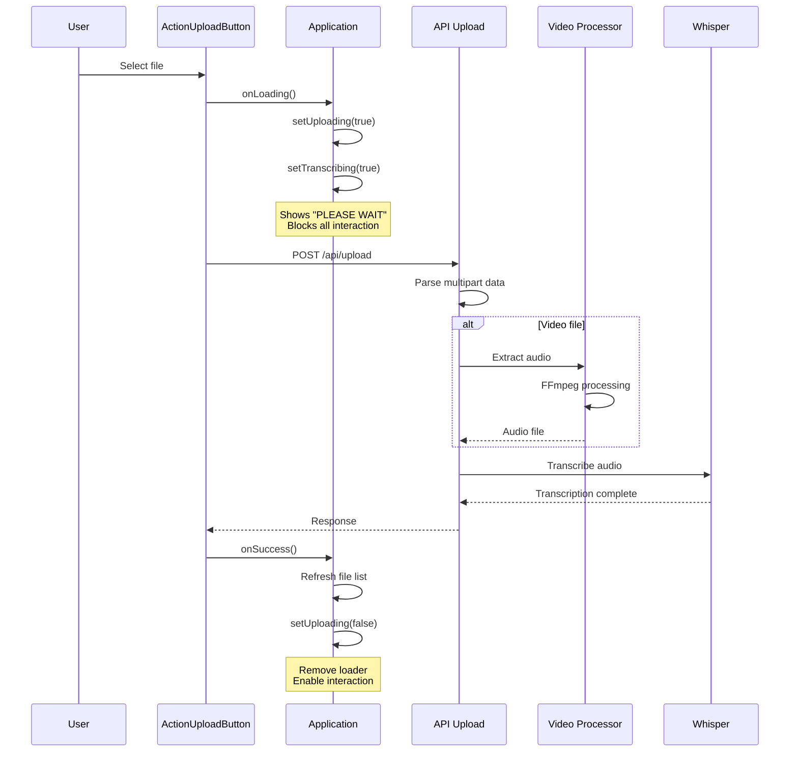
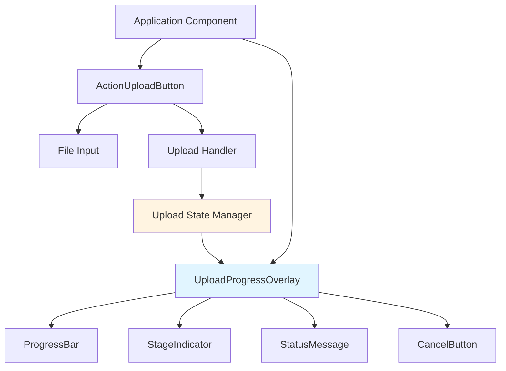
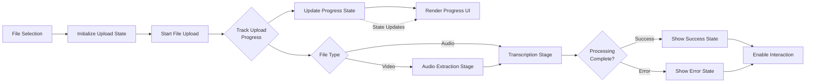
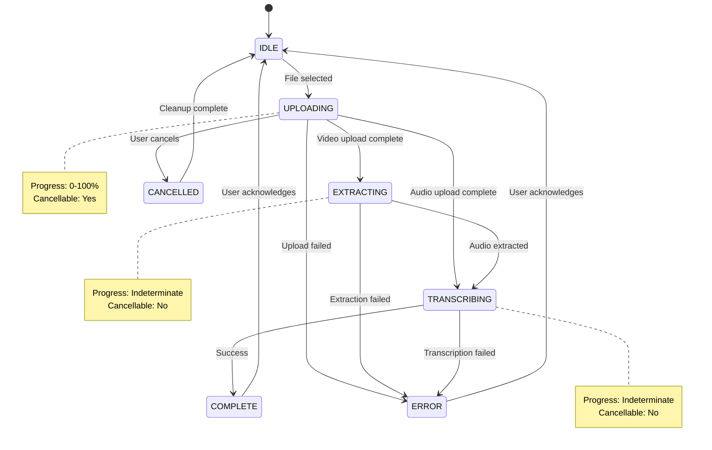
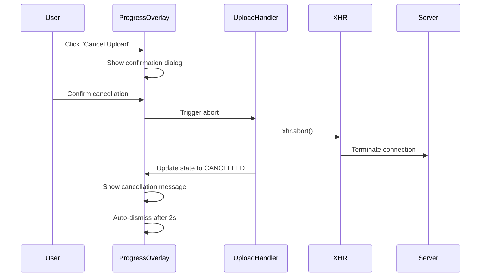
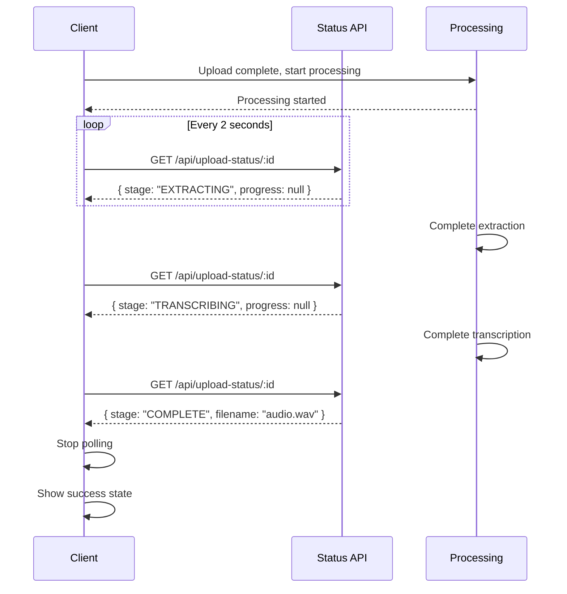

# Upload Progress Visualization

## Overview

This design addresses the current lack of visual feedback during file upload and processing operations. Currently, when users upload audio or video files, the interface enters a blocking state displaying only a generic "PLEASE WAIT" message with a circular loader, providing no indication of processing progress, current stage, or success/failure status. This creates poor user experience, especially for video uploads which involve multiple processing stages (upload, audio extraction, transcription) that can take several minutes.

The solution introduces a comprehensive progress visualization system that provides real-time feedback on upload progress, processing stages, and operation outcomes.

## Current System Analysis

### Existing Upload Flow

The current upload process follows this sequence:



### Current State Management

| State Variable | Purpose | Current Limitation |
|---------------|---------|-------------------|
| `uploading` | Indicates upload/initialization in progress | Binary state - no progress information |
| `transcribing` | Shows transcription is active | No stage differentiation |
| `introspecting` | Indicates introspection process | Not related to upload |

### Identified Problems

1. **No Upload Progress**: User cannot see file upload percentage
2. **No Stage Indication**: No visibility into which processing stage is active (upload, extraction, transcription)
3. **No Success Confirmation**: No clear feedback when upload completes successfully
4. **No Error Reporting**: Failures occur silently or with generic error messages
5. **Blocking UI**: Entire interface is disabled during upload
6. **No Cancellation**: Users cannot abort long-running uploads
7. **No Time Estimation**: No indication of expected completion time

## Architecture

### Component Structure



### Data Flow



### Progress State Model

The upload progress system maintains a structured state representing the current operation:

| Property | Type | Description |
|----------|------|-------------|
| `stage` | enum | Current processing stage (UPLOADING, EXTRACTING, TRANSCRIBING, COMPLETE, ERROR) |
| `uploadProgress` | number | Upload percentage (0-100) |
| `fileName` | string | Name of file being processed |
| `fileSize` | number | Total file size in bytes |
| `uploadedBytes` | number | Number of bytes uploaded |
| `message` | string | Current status message |
| `error` | string/null | Error message if operation failed |
| `startTime` | timestamp | When upload began |
| `estimatedTimeRemaining` | number/null | Estimated seconds until completion |
| `canCancel` | boolean | Whether cancellation is currently allowed |

### Processing Stages



## Upload Progress Tracking

### Client-Side Progress Monitoring

The upload progress will be tracked using the XMLHttpRequest progress events, which provide upload byte information:

**Progress Calculation Strategy:**

1. **Upload Phase (0-100%)**:
   - Track bytes uploaded vs total file size
   - Update progress state in real-time
   - Calculate upload speed for time estimation

2. **Processing Phase (Indeterminate)**:
   - Display animated progress indicator
   - Show current stage name
   - No percentage (server processing time varies)

### Time Estimation Algorithm

**Approach:**

- Calculate average upload speed over the last 5 seconds
- Estimate remaining upload time: `(totalBytes - uploadedBytes) / averageSpeed`
- Add conservative buffer time for processing stages
- Update estimation as upload progresses

**Estimation Table:**

| Stage | Estimation Method |
|-------|------------------|
| Upload | Based on current upload speed |
| Audio Extraction | Fixed estimate: ~30-60 seconds (varies by video length) |
| Transcription | Heuristic: ~5 minutes for typical audio |

## User Interface Design

### Progress Overlay Layout

The progress overlay will appear as a modal overlay covering the application, preventing interaction while providing comprehensive feedback:

**Visual Hierarchy:**

```
┌─────────────────────────────────────────┐
│         Upload Progress Overlay          │
├─────────────────────────────────────────┤
│                                          │
│  Stage Indicator                         │
│  ◉ Uploading → ○ Extracting → ○ Transcr.│
│                                          │
│  File Information                        │
│  📁 example-video.mp4 (45.2 MB)        │
│                                          │
│  Progress Bar                            │
│  ████████████░░░░░░░░░░░░  54%         │
│                                          │
│  Status Message                          │
│  Uploading file... 24.5 MB of 45.2 MB   │
│                                          │
│  Time Estimation                         │
│  Estimated time remaining: 23 seconds    │
│                                          │
│  Actions                                 │
│  [Cancel Upload]                         │
│                                          │
└─────────────────────────────────────────┘
```

### Stage Indicator Visual States

Each processing stage will be represented visually:

| Stage | Visual Representation | Color | Animation |
|-------|---------------------|-------|-----------|
| UPLOADING | Filled circle with upload icon | Blue | Pulsing |
| EXTRACTING | Filled circle with extraction icon | Blue | Pulsing |
| TRANSCRIBING | Filled circle with transcription icon | Blue | Pulsing |
| COMPLETE | Checkmark icon | Green | Fade in |
| ERROR | X icon | Red | None |
| Pending | Empty circle | Gray | None |

### Progress Bar Variations

**Determinate Progress (Upload Stage):**
- Standard progress bar with percentage
- Color: Primary blue
- Shows exact percentage (e.g., "54%")

**Indeterminate Progress (Processing Stages):**
- Animated striped progress bar
- Moving shimmer effect
- No percentage shown

### Status Messages

**Message Examples by Stage:**

| Stage | Status Message Pattern |
|-------|----------------------|
| UPLOADING | "Uploading {filename}... {uploadedMB} of {totalMB} MB" |
| EXTRACTING | "Extracting audio from video..." |
| TRANSCRIBING | "Transcribing audio with Whisper..." |
| COMPLETE | "✓ Upload and processing complete!" |
| ERROR | "✗ Error: {errorMessage}" |

### Success State Display

When upload completes successfully:

1. **Visual Transition:**
   - Progress bar fills to 100%
   - Stage indicators show all complete
   - Background color transitions to success green
   - Checkmark animation appears

2. **Success Message:**
   - Display: "✓ {filename} uploaded and transcribed successfully!"
   - Duration: 3 seconds auto-dismiss or manual close

3. **Action Options:**
   - Button: "View Transcription" (navigates to file)
   - Button: "Close" (dismisses overlay)

### Error State Display

When an error occurs:

1. **Visual Changes:**
   - Progress bar changes to red
   - Failed stage indicator shows error icon
   - Background tint changes to error red

2. **Error Message Display:**
   - Primary message: Short error summary
   - Secondary details: Technical error details (collapsible)
   - Suggested actions if applicable

3. **Error Recovery Options:**
   - Button: "Retry Upload"
   - Button: "Choose Different File"
   - Button: "Close"

**Error Message Examples:**

| Error Type | User-Friendly Message | Technical Details |
|-----------|---------------------|------------------|
| Network failure | "Upload interrupted. Please check your connection." | "Network error: Failed to fetch" |
| File type invalid | "Unsupported file format. Please upload audio or video." | "File validation error: .xyz not supported" |
| FFmpeg unavailable | "Video processing unavailable. Please upload audio files." | "FFmpeg not found in system PATH" |
| Transcription failed | "Audio transcription failed. Please try again." | "Whisper error: Model loading failed" |
| Server error | "Server error occurred. Please try again later." | "500 Internal Server Error" |

## Upload Cancellation

### Cancellation Mechanism

Users can cancel uploads during the upload phase only. Once processing begins server-side, cancellation is not permitted.

**Cancellation Flow:**



### Cancellation States

| Stage | Cancellable | Reason |
|-------|------------|--------|
| UPLOADING | Yes | Network request can be aborted |
| EXTRACTING | No | FFmpeg process already started |
| TRANSCRIBING | No | Whisper process already started |
| COMPLETE | N/A | Process finished |
| ERROR | N/A | Process failed |

### Cancellation UI

**Cancel Button State:**

- **Enabled State:** "Cancel Upload" button visible and active
- **Disabled State:** Button grayed out with tooltip "Processing cannot be cancelled"
- **Confirmation:** Dialog asking "Are you sure you want to cancel this upload?"

## Backend Integration Requirements

### API Response Enhancements

The upload API must provide structured responses to enable progress tracking:

**Success Response Schema:**

| Field | Type | Description |
|-------|------|-------------|
| `success` | boolean | Operation success indicator |
| `filename` | string | Processed audio filename |
| `originalFilename` | string | Original uploaded filename |
| `fileType` | string | "audio" or "video" |
| `stages` | array | Completed processing stages |

**Error Response Schema:**

| Field | Type | Description |
|-------|------|-------------|
| `success` | boolean | Always false for errors |
| `error` | string | User-friendly error message |
| `technicalError` | string | Detailed technical error (optional) |
| `stage` | string | Stage where error occurred |
| `recoverable` | boolean | Whether retry is recommended |

### Server-Sent Events for Processing Progress

For processing stages that cannot report real-time progress via upload events, the system will poll status:

**Status Polling Mechanism:**



**Upload Status Endpoint Specification:**

| Attribute | Value |
|-----------|-------|
| Endpoint | `/api/upload-status/:uploadId` |
| Method | GET |
| Purpose | Retrieve current processing status |
| Response | `{ stage: string, message: string, error?: string }` |

**Implementation Note:** Status will be tracked using in-memory state or temporary file system markers during processing.

## State Management Strategy

### Upload State Structure

The upload progress state will be managed within the Application component:

```
uploadProgress: {
  active: boolean,
  stage: 'IDLE' | 'UPLOADING' | 'EXTRACTING' | 'TRANSCRIBING' | 'COMPLETE' | 'ERROR' | 'CANCELLED',
  fileName: string,
  fileSize: number,
  uploadedBytes: number,
  uploadProgress: number, // 0-100
  message: string,
  error: string | null,
  startTime: number,
  estimatedTimeRemaining: number | null,
  canCancel: boolean,
  uploadId: string | null
}
```

### State Transitions

**Transition Table:**

| From State | To State | Trigger | Side Effects |
|-----------|----------|---------|-------------|
| IDLE | UPLOADING | File selected | Initialize upload, start progress tracking |
| UPLOADING | EXTRACTING | Video upload complete | Start polling status endpoint |
| UPLOADING | TRANSCRIBING | Audio upload complete | Start polling status endpoint |
| UPLOADING | CANCELLED | User cancels | Abort XHR, cleanup |
| UPLOADING | ERROR | Upload fails | Display error message |
| EXTRACTING | TRANSCRIBING | Extraction complete | Update stage indicator |
| EXTRACTING | ERROR | Extraction fails | Display error message |
| TRANSCRIBING | COMPLETE | Transcription complete | Show success, refresh file list |
| TRANSCRIBING | ERROR | Transcription fails | Display error message |
| COMPLETE | IDLE | User dismisses | Clear state, enable UI |
| ERROR | IDLE | User dismisses or retries | Clear state, enable UI |
| CANCELLED | IDLE | Auto-dismiss after 2s | Clear state, enable UI |

### State Update Handlers

**Handler Responsibilities:**

| Handler | Purpose | Invoked By |
|---------|---------|-----------|
| `initializeUpload()` | Set initial state when upload begins | File selection |
| `updateUploadProgress()` | Update progress percentage and bytes | XHR progress event |
| `transitionToStage()` | Move to next processing stage | Upload completion, polling |
| `handleUploadSuccess()` | Set complete state, trigger success UI | Final API response |
| `handleUploadError()` | Set error state with message | Error events, failed responses |
| `cancelUpload()` | Abort upload, set cancelled state | Cancel button click |
| `resetUploadState()` | Clear all upload state back to IDLE | User dismisses overlay |

## Responsive Behavior

### Mobile Adaptations

**Layout Adjustments for Small Screens:**

| Screen Size | Overlay Width | Font Size | Button Layout |
|------------|--------------|-----------|---------------|
| Desktop (>1024px) | 600px fixed | 16px | Horizontal |
| Tablet (768-1024px) | 80% width | 15px | Horizontal |
| Mobile (<768px) | 95% width | 14px | Vertical stack |

**Mobile-Specific Changes:**

- Stage indicators: Vertical layout instead of horizontal
- Progress bar: Slightly larger touch target
- Cancel button: Full width on mobile
- File size display: Abbreviated (45.2 MB → 45MB)

### Accessibility Considerations

**ARIA Attributes:**

| Element | ARIA Role | ARIA Properties |
|---------|-----------|----------------|
| Progress Overlay | dialog | aria-labelledby="upload-progress-title", aria-modal="true" |
| Progress Bar | progressbar | aria-valuenow, aria-valuemin="0", aria-valuemax="100" |
| Stage Indicators | list | aria-label="Processing stages" |
| Status Message | status | aria-live="polite" |
| Error Message | alert | aria-live="assertive" |
| Cancel Button | button | aria-label="Cancel upload" |

**Keyboard Navigation:**

- Tab: Navigate between cancel button and close button
- Escape: Trigger cancel action (with confirmation)
- Enter/Space: Activate focused button

**Screen Reader Announcements:**

- Announce progress milestones: 25%, 50%, 75%, 100%
- Announce stage transitions
- Announce success or error states immediately

## Component Integration

### ActionUploadButton Modifications

**Current Behavior:**
- Triggers `onLoading()` callback immediately on file selection
- Triggers `onSuccess()` callback with response data

**Enhanced Behavior:**
- Initialize upload progress state
- Attach XHR progress event listeners
- Update progress state in real-time
- Handle cancellation requests
- Transition through processing stages

**New Props Interface:**

| Prop | Type | Description |
|------|------|-------------|
| `disabled` | boolean | Whether upload is disabled |
| `onUploadStart` | function | Called when upload begins |
| `onProgress` | function | Called with progress updates |
| `onStageChange` | function | Called when processing stage changes |
| `onSuccess` | function | Called on completion |
| `onError` | function | Called on failure |
| `onCancel` | function | Called when upload cancelled |

### Application Component Integration

**New State Variables:**

- `uploadProgress`: Full upload progress state object
- `showUploadOverlay`: Boolean to control overlay visibility

**New Methods:**

- `handleUploadProgress(progressData)`: Update progress state
- `handleStageTransition(newStage)`: Transition to new processing stage
- `handleUploadComplete(data)`: Handle successful completion
- `handleUploadError(error)`: Handle upload failure
- `cancelCurrentUpload()`: Initiate cancellation
- `dismissUploadOverlay()`: Reset state and hide overlay

### New Component: UploadProgressOverlay

**Component Responsibilities:**

- Render modal overlay with progress information
- Display stage indicators with current stage highlighted
- Show progress bar (determinate or indeterminate based on stage)
- Display status messages and time estimates
- Provide cancel functionality
- Handle success/error state displays
- Auto-dismiss on completion (configurable)

**Component Props:**

| Prop | Type | Description |
|------|------|-------------|
| `isVisible` | boolean | Control overlay visibility |
| `uploadState` | object | Complete upload progress state |
| `onCancel` | function | Callback for cancel action |
| `onDismiss` | function | Callback for overlay dismissal |
| `onRetry` | function | Callback for retry action (error state) |

## Testing Strategy

### Progress Tracking Validation

**Test Scenarios:**

| Scenario | Expected Behavior | Validation Method |
|----------|------------------|------------------|
| Audio upload progress | Progress bar updates smoothly from 0-100% | Monitor state updates during upload |
| Video upload progress | Progress bar reaches 100%, then stages advance | Verify stage transitions |
| Large file upload | Time estimation appears and updates | Check estimation calculation accuracy |
| Fast upload | Progress updates without visual glitches | Test with small files |
| Slow upload | Progress shows incremental updates | Throttled network simulation |

### Stage Transition Validation

**Test Matrix:**

| File Type | Expected Stages | Test Method |
|-----------|----------------|-------------|
| Audio (WAV) | UPLOADING → TRANSCRIBING → COMPLETE | Upload WAV file, verify stages |
| Audio (MP3) | UPLOADING → TRANSCRIBING → COMPLETE | Upload MP3 file, verify stages |
| Video (MP4) | UPLOADING → EXTRACTING → TRANSCRIBING → COMPLETE | Upload MP4 file, verify all stages |
| Video (MOV) | UPLOADING → EXTRACTING → TRANSCRIBING → COMPLETE | Upload MOV file, verify all stages |

### Error Handling Validation

**Error Simulation Tests:**

| Error Condition | Simulation Method | Expected UI Response |
|----------------|------------------|---------------------|
| Network failure during upload | Disconnect network mid-upload | Error state with retry option |
| Unsupported file type | Upload .txt file | Error state with file format message |
| FFmpeg unavailable | Remove FFmpeg from path | Error state with video processing message |
| Server error | Mock 500 response | Error state with generic server error |
| Transcription failure | Corrupt audio file | Error state with transcription error |

### Cancellation Validation

**Cancellation Test Cases:**

| Test Case | Action | Expected Outcome |
|-----------|--------|-----------------|
| Cancel during upload | Click cancel at 50% upload | Upload aborted, CANCELLED state shown |
| Cancel during extraction | Click cancel during extraction | Cancel button disabled, message shown |
| Cancel with confirmation | Click cancel, then cancel confirmation | Upload continues |
| Cancel confirmation timeout | Click cancel, wait, then confirm | Confirmation works regardless |

### Accessibility Testing

**Validation Checklist:**

- [ ] All interactive elements keyboard accessible
- [ ] Focus indicators visible on all focusable elements
- [ ] Screen reader announces progress updates
- [ ] ARIA attributes correctly applied
- [ ] Color contrast meets WCAG AA standards
- [ ] Error messages announced to screen readers
- [ ] Success state announced to screen readers

## Performance Considerations

### Progress Update Throttling

**Challenge:** XHR progress events fire very frequently (potentially hundreds of times per second), causing excessive re-renders.

**Solution:** Throttle progress state updates to maximum 10 updates per second:

- Capture progress events at full frequency
- Update state at most once every 100ms
- Ensure final 100% update is never throttled

### Overlay Rendering Optimization

**Strategies:**

1. **Conditional Rendering:** Only mount overlay component when upload is active
2. **Animation Performance:** Use CSS transforms for animations (GPU-accelerated)
3. **State Updates:** Minimize state updates to only changed values
4. **Memoization:** Memoize expensive calculations (time estimation)

### Memory Management

**Considerations:**

- Clear upload state when overlay dismissed
- Abort any pending polling requests on unmount
- Remove event listeners on cleanup
- Clear timeout/interval references

## Future Enhancements

### Potential Improvements

| Enhancement | Description | Complexity |
|------------|-------------|-----------|
| Multiple file upload | Support uploading multiple files with progress for each | High |
| Upload queue | Queue multiple uploads, process sequentially | Medium |
| Upload resume | Resume interrupted uploads from last checkpoint | High |
| Real-time processing progress | Show actual transcription progress percentage | High |
| Upload history | Track and display past uploads with timestamps | Medium |
| Bandwidth throttling | Allow users to limit upload speed | Low |
| Drag-and-drop upload | Support drag-and-drop file selection | Low |
| File validation preview | Show file info before upload begins | Low |

### Extensibility Points

**Design Considerations for Future Extensions:**

1. **Progress State Schema:** Designed to accommodate additional stages without breaking changes
2. **Event Hooks:** Provide event callbacks for extensibility (onProgressMilestone, onStageComplete)
3. **Custom Stage Definitions:** Allow custom processing stages to be registered
4. **Progress Calculation Plugins:** Support custom progress calculation strategies
5. **UI Customization:** Support theme customization for overlay appearance