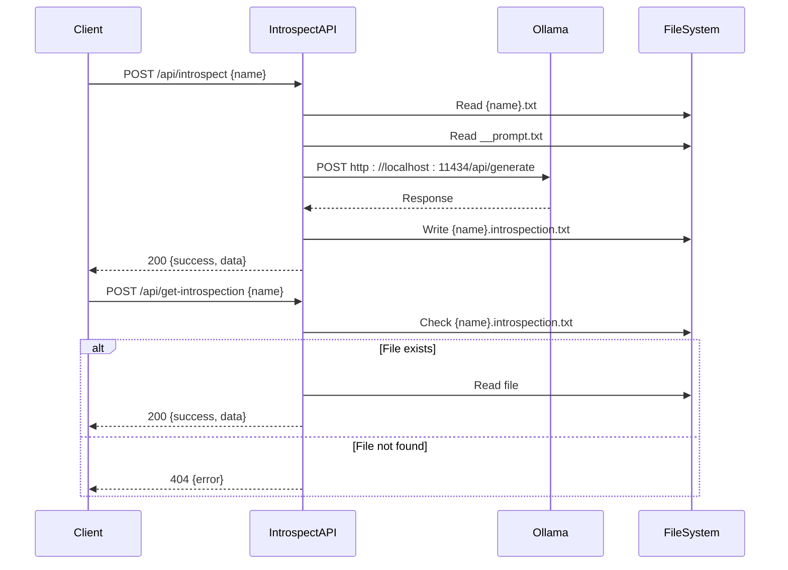
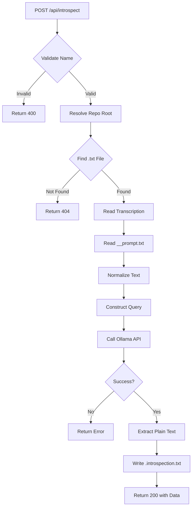

# AI Introspection API

<cite>
**Referenced Files in This Document**   
- [introspect.ts](file://pages/api/introspect.ts)
- [get-introspection.ts](file://pages/api/get-introspection.ts)
- [get-prompt.ts](file://pages/api/get-prompt.ts)
- [get-transcription.ts](file://pages/api/get-transcription.ts)
- [Application.tsx](file://components/Application.tsx)
- [queries.ts](file://common/queries.ts)
- [__prompt.txt](file://public/__prompt.txt)
</cite>

## Table of Contents
1. [Introduction](#introduction)
2. [Core Endpoints](#core-endpoints)
3. [Server-Side Processing Flow](#server-side-processing-flow)
4. [Client-Side Implementation](#client-side-implementation)
5. [Error Handling](#error-handling)
6. [Performance Considerations](#performance-considerations)
7. [Usage Examples](#usage-examples)
8. [Conclusion](#conclusion)

## Introduction

The AI Introspection API enables users to analyze audio transcriptions using a local Large Language Model (LLM) via Ollama. The system provides two primary endpoints: `POST /api/introspect` for initiating analysis of a transcription by file ID, and `GET /api/get-introspection` for retrieving the generated insights. This documentation details the asynchronous processing model, server-side workflow, client integration, and error scenarios involved in generating introspective analysis from audio content.

**Section sources**
- [introspect.ts](file://pages/api/introspect.ts#L94-L148)
- [get-introspection.ts](file://pages/api/get-introspection.ts#L14-L47)

## Core Endpoints

### POST /api/introspect

This endpoint triggers the introspection process for a given audio transcription. It accepts a JSON payload containing the audio file name (without extension) and performs the following steps:
1. Retrieves the transcription text from the corresponding `.txt` file in the public directory
2. Loads the current analysis prompt from `__prompt.txt`
3. Constructs a query combining the transcript and prompt
4. Sends the query to the local Ollama LLM service
5. Stores the generated introspection result in a `.introspection.txt` file
6. Returns the analysis result in the response

The endpoint requires a `name` parameter in the request body and returns a 200 status with the generated content upon success, or appropriate error codes for validation, file not found, or server issues.

### GET /api/get-introspection

This polling endpoint retrieves the introspection result for a given audio file. It checks for the existence of the corresponding `.introspection.txt` file and returns its content if available. The endpoint follows the same file naming convention as the introspect endpoint, replacing `.wav` with `.wav.introspection.txt`. It returns a 404 status if no introspection result exists, indicating that analysis has not been performed or is still in progress.



**Diagram sources**
- [introspect.ts](file://pages/api/introspect.ts#L94-L148)
- [get-introspection.ts](file://pages/api/get-introspection.ts#L14-L47)
- [get-prompt.ts](file://pages/api/get-prompt.ts#L14-L43)
- [get-transcription.ts](file://pages/api/get-transcription.ts#L14-L48)

**Section sources**
- [introspect.ts](file://pages/api/introspect.ts#L94-L148)
- [get-introspection.ts](file://pages/api/get-introspection.ts#L14-L47)

## Server-Side Processing Flow

The introspection process follows a sequential workflow from transcription retrieval to LLM analysis and result storage:

1. **File Resolution**: The system determines the repository root by locating `global.scss`, ensuring correct path resolution regardless of execution context.

2. **Transcription Retrieval**: The transcription text is loaded from `{name}.txt` in the public directory. The text undergoes normalization to handle line breaks and hyphenated words appropriately.

3. **Prompt Integration**: The current analysis prompt is loaded from `__prompt.txt` in the public directory and combined with the normalized transcription within a structured XML-like format.

4. **LLM Query**: The combined query is sent to the Ollama HTTP API at `http://localhost:11434/api/generate` using the gemma3:27b model. The request uses an undici Agent with no timeout to accommodate long inference times.

5. **Response Processing**: The raw LLM response is processed to extract plain text content, with special handling for responses wrapped in `<plain_text_response>` tags.

6. **Result Storage**: The processed introspection result is written to `{name}.introspection.txt`, overwriting any existing file.



**Diagram sources**
- [introspect.ts](file://pages/api/introspect.ts#L94-L148)
- [__prompt.txt](file://public/__prompt.txt)

**Section sources**
- [introspect.ts](file://pages/api/introspect.ts#L94-L148)
- [__prompt.txt](file://public/__prompt.txt)

## Client-Side Implementation

The client-side implementation in Application.tsx manages the introspection workflow through React state and API calls:

- **State Management**: The component maintains state for `introspecting` (boolean flag) and `introspection` (result text), enabling UI feedback during processing.

- **User Interface**: The "◎ Introspect" button triggers the analysis process, with confirmation dialogs to prevent accidental long-running operations.

- **Asynchronous Flow**: Upon button click, the component sets `introspecting` to true, calls the introspect API, and updates the `introspection` state with the response data before resetting `introspecting`.

- **Polling Integration**: While the current implementation retrieves results immediately after processing, the same `get-introspection` endpoint could be used for polling in a true asynchronous scenario.

- **UI State**: The interface disables interactive elements (upload, transcribe, introspect buttons, font selector) during active processing to prevent race conditions.

```mermaid
classDiagram
class Application {
-prompt : string
-current : string
-files : string[]
-uploading : boolean
-transcribing : boolean
-introspecting : boolean
-transcription : string
-introspection : string
-transcriptionFont : string
+onSelect(name) : Promise~void~
+init() : Promise~void~
+handleFontChange(font : string) : void
}
class Queries {
+getData(config) : Promise~any~
}
Application --> Queries : "uses"
Application --> "POST /api/introspect" : "calls"
Application --> "POST /api/get-introspection" : "calls"
Application --> "POST /api/get-prompt" : "calls"
Application --> "POST /api/get-transcription" : "calls"
```

**Diagram sources**
- [Application.tsx](file://components/Application.tsx#L49-L51)
- [queries.ts](file://common/queries.ts#L1-L201)

**Section sources**
- [Application.tsx](file://components/Application.tsx#L49-L64)
- [queries.ts](file://common/queries.ts#L1-L201)

## Error Handling

The API implements comprehensive error handling for various failure scenarios:

- **Validation Errors**: Returns 400 status when the `name` parameter is missing or empty.

- **File Not Found**: Returns 404 status when the requested transcription file does not exist.

- **Repository Resolution**: Returns 409 status when the repository root cannot be determined.

- **Ollama Service Unavailable**: The `queryOllamaHTTP` function returns null when the Ollama service is not running or rejects the request, which propagates as an empty result in the response.

- **File System Errors**: The `get-introspection` endpoint returns 500 status for file read errors, while the `introspect` endpoint includes try-catch blocks for file deletion operations.

- **Prompt Loading**: Returns 404 if `__prompt.txt` is missing, preventing analysis without a valid prompt.

The client-side code handles API errors by checking for `error` fields in responses and treating null responses as failures, ensuring graceful degradation when backend services are unavailable.

**Section sources**
- [introspect.ts](file://pages/api/introspect.ts#L94-L148)
- [get-introspection.ts](file://pages/api/get-introspection.ts#L14-L47)
- [get-prompt.ts](file://pages/api/get-prompt.ts#L14-L43)

## Performance Considerations

The introspection process involves significant computational resources and time due to LLM inference:

- **Processing Time**: Both transcription and introspection operations may take over five minutes, as indicated in client-side confirmation dialogs.

- **Memory Usage**: The gemma3:27b model requires substantial memory resources, which should be considered when deploying the application.

- **Timeout Configuration**: The use of an undici Agent with zero timeout settings (`headersTimeout: 0, bodyTimeout: 0`) prevents premature request termination during long inference periods.

- **File I/O**: The system performs multiple file operations (read transcription, read prompt, write introspection) which should be optimized for the underlying storage system.

- **Resource Contention**: The UI disables all interactive elements during processing to prevent multiple concurrent operations that could overwhelm system resources.

For production deployment, consider implementing true asynchronous processing with job queues and webhooks instead of long-polling HTTP requests, along with proper resource monitoring and scaling.

**Section sources**
- [introspect.ts](file://pages/api/introspect.ts#L63-L86)
- [Application.tsx](file://components/Application.tsx#L115-L118)

## Usage Examples

### Curl Commands

Initiate introspection:
```bash
curl -X POST http://localhost:3000/api/introspect \
  -H "Content-Type: application/json" \
  -d '{"name": "the-motivation-mindset-with-risa-williams.wav"}'
```

Retrieve introspection results:
```bash
curl -X POST http://localhost:3000/api/get-introspection \
  -H "Content-Type: application/json" \
  -d '{"name": "the-motivation-mindset-with-risa-williams.wav"}'
```

### Client-Side Usage

The Application component demonstrates typical usage:

```typescript
// Trigger introspection
const response = await Queries.getData({ 
  route: '/api/introspect', 
  body: { name: current } 
});
setIntrospection(response ? response.data : '');
```

```typescript
// Retrieve existing introspection
const introspectionResponse = await Queries.getData({ 
  route: '/api/get-introspection', 
  body: { name } 
});
setIntrospection(introspectionResponse ? introspectionResponse.data : '');
```

The current prompt template (from `__prompt.txt`) requests:
- 10 meaningful insights in detail
- Identification of logical disconnects with the real world
- Responses in the voice of one of the world's best professors without self-reference

**Section sources**
- [Application.tsx](file://components/Application.tsx#L64-L64)
- [queries.ts](file://common/queries.ts#L1-L201)
- [__prompt.txt](file://public/__prompt.txt)

## Conclusion

The AI Introspection API provides a complete solution for analyzing audio transcriptions using a local LLM. The system combines server-side processing with client-side state management to deliver a seamless user experience for generating insightful analysis. Key features include asynchronous processing, comprehensive error handling, and a clear separation of concerns between transcription management and introspection generation. For optimal performance, ensure the Ollama service is running with adequate resources, and consider the long processing times when designing user workflows.