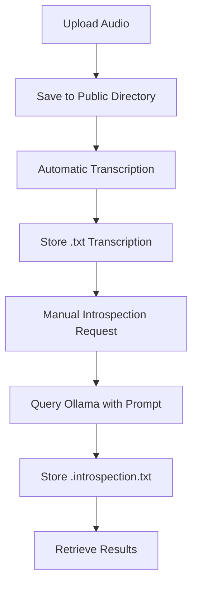

# API Reference

<cite>
**Referenced Files in This Document**   
- [upload.ts](file://pages/api/upload.ts)
- [transcribe.ts](file://pages/api/transcribe.ts)
- [introspect.ts](file://pages/api/introspect.ts)
- [get-transcription.ts](file://pages/api/get-transcription.ts)
- [get-introspection.ts](file://pages/api/get-introspection.ts)
- [update-prompt.ts](file://pages/api/update-prompt.ts)
- [list.ts](file://pages/api/list.ts)
- [get-prompt.ts](file://pages/api/get-prompt.ts)
- [queries.ts](file://common/queries.ts)
- [constants.ts](file://common/constants.ts)
- [server.ts](file://common/server.ts)
- [Application.tsx](file://components/Application.tsx)
</cite>

## Table of Contents
1. [Introduction](#introduction)
2. [Core Endpoints](#core-endpoints)
3. [Authentication and Security](#authentication-and-security)
4. [Client Integration](#client-integration)
5. [Performance and Error Handling](#performance-and-error-handling)
6. [Appendices](#appendices)

## Introduction

This document provides comprehensive API documentation for the RESTful endpoints exposed by the Next.js API routes in the offline-first audio transcription and introspection application. The system enables local audio processing using Whisper for transcription and Ollama for LLM-based introspection, ensuring data privacy by keeping all processing on the user's machine.

The API supports audio upload, transcription, introspection, prompt management, and file listing operations. All endpoints are designed for local execution and do not require external authentication, though they implement CORS protection. The architecture prioritizes offline functionality, with all audio and text processing occurring locally via Whisper and Ollama.

**Section sources**
- [README.md](file://README.md#L0-L64)
- [Application.tsx](file://components/Application.tsx#L0-L241)

## Core Endpoints

### Upload Endpoint
- **HTTP Method**: POST
- **URL Pattern**: `/api/upload`
- **Authentication**: Not required (local execution)
- **Request Schema**: 
  - Content-Type: multipart/form-data
  - Body: Form data containing audio file under "file" key
- **Response Schema**:
  ```json
  {
    "success": boolean,
    "data": string|null
  }
  ```
- **Input Format**: Audio files in MP3, WAV, OGG, FLAC, or M4A formats
- **Processing**: Automatically triggers Whisper transcription upon upload
- **Example curl**:
  ```bash
  curl -X POST -F "file=@audio.wav" http://localhost:10000/api/upload
  ```

**Section sources**
- [upload.ts](file://pages/api/upload.ts#L16-L106)
- [ActionUploadButton.tsx](file://components/ActionUploadButton.tsx#L5-L59)

### Transcribe Endpoint
- **HTTP Method**: POST
- **URL Pattern**: `/api/transcribe`
- **Authentication**: Not required
- **Request Schema**:
  ```json
  {
    "name": string
  }
  ```
- **Response Schema**:
  ```json
  {
    "success": boolean,
    "data": string|null
  }
  ```
- **Output**: Initiates Whisper transcription of specified audio file
- **Processing Configuration**: Uses 'large-v3-turbo' model with text-only output
- **Example curl**:
  ```bash
  curl -X POST -H "Content-Type: application/json" -d '{"name":"audio.wav"}' http://localhost:10000/api/transcribe
  ```

**Section sources**
- [transcribe.ts](file://pages/api/transcribe.ts#L16-L64)

### Introspect Endpoint
- **HTTP Method**: POST
- **URL Pattern**: `/api/introspect`
- **Authentication**: Not required
- **Request Schema**:
  ```json
  {
    "name": string
  }
  ```
- **Response Schema**:
  ```json
  {
    "success": boolean,
    "data": string|null,
    "out": string
  }
  ```
- **Processing**: Sends transcription to locally running Ollama instance (gemma3:27b model)
- **Output**: Generates introspection text and saves to `.introspection.txt` file
- **Example curl**:
  ```bash
  curl -X POST -H "Content-Type: application/json" -d '{"name":"audio.wav"}' http://localhost:10000/api/introspect
  ```

**Section sources**
- [introspect.ts](file://pages/api/introspect.ts#L94-L148)

### Get Transcription Endpoint
- **HTTP Method**: POST
- **URL Pattern**: `/api/get-transcription`
- **Authentication**: Not required
- **Request Schema**:
  ```json
  {
    "name": string
  }
  ```
- **Response Schema**:
  ```json
  {
    "success": boolean,
    "data": string|null
  }
  ```
- **Output**: Returns plain text transcription from `.txt` file
- **Error Handling**: Returns 404 if transcription not found
- **Example curl**:
  ```bash
  curl -X POST -H "Content-Type: application/json" -d '{"name":"audio.wav"}' http://localhost:10000/api/get-transcription
  ```

**Section sources**
- [get-transcription.ts](file://pages/api/get-transcription.ts#L14-L47)

### Get Introspection Endpoint
- **HTTP Method**: POST
- **URL Pattern**: `/api/get-introspection`
- **Authentication**: Not required
- **Request Schema**:
  ```json
  {
    "name": string
  }
  ```
- **Response Schema**:
  ```json
  {
    "success": boolean,
    "data": string|null
  }
  ```
- **Output**: Returns introspection results from `.introspection.txt` file
- **File Mapping**: Converts `.wav` to `.wav.introspection.txt`
- **Example curl**:
  ```bash
  curl -X POST -H "Content-Type: application/json" -d '{"name":"audio.wav"}' http://localhost:10000/api/get-introspection
  ```

**Section sources**
- [get-introspection.ts](file://pages/api/get-introspection.ts#L14-L47)

### Update Prompt Endpoint
- **HTTP Method**: POST
- **URL Pattern**: `/api/update-prompt`
- **Authentication**: Not required
- **Request Schema**:
  ```json
  {
    "prompt": string
  }
  ```
- **Response Schema**:
  ```json
  {
    "success": boolean,
    "data": string,
    "out": string
  }
  ```
- **Storage**: Saves prompt to `public/__prompt.txt`
- **Validation**: Rejects empty prompts with 400 status
- **Example curl**:
  ```bash
  curl -X POST -H "Content-Type: application/json" -d '{"prompt":"Analyze the speaker'\''s motivation techniques"}' http://localhost:10000/api/update-prompt
  ```

**Section sources**
- [update-prompt.ts](file://pages/api/update-prompt.ts#L15-L49)

### List Endpoint
- **HTTP Method**: POST
- **URL Pattern**: `/api/list`
- **Authentication**: Not required
- **Request Schema**: Empty POST body
- **Response Schema**:
  ```json
  {
    "success": boolean,
    "data": string[]
  }
  ```
- **Output**: Returns array of audio filenames in public directory
- **Supported Formats**: MP3, WAV, OGG, FLAC, M4A (case-insensitive)
- **Example curl**:
  ```bash
  curl -X POST http://localhost:10000/api/list
  ```

**Section sources**
- [list.ts](file://pages/api/list.ts#L14-L39)

### Get Prompt Endpoint
- **HTTP Method**: POST
- **URL Pattern**: `/api/get-prompt`
- **Authentication**: Not required
- **Request Schema**: Empty POST body
- **Response Schema**:
  ```json
  {
    "success": boolean,
    "data": string|null
  }
  ```
- **Output**: Returns current prompt content from `__prompt.txt`
- **Error Handling**: Returns 404 if prompt file not found
- **Example curl**:
  ```bash
  curl -X POST http://localhost:10000/api/get-prompt
  ```

**Section sources**
- [get-prompt.ts](file://pages/api/get-prompt.ts#L15-L42)

## Authentication and Security

### Security Model
The application operates in an offline-first mode with no external authentication requirements. All processing occurs locally, eliminating the need for traditional API keys or OAuth flows. The security model relies on:
- Local execution: All endpoints only accessible on localhost
- CORS protection: Implemented on all API routes
- File system isolation: Processing limited to public directory

### File Upload Validation
- **Format Validation**: Only accepts audio files with extensions: mp3, wav, ogg, flac, m4a
- **Boundary Checking**: Validates multipart form data boundaries
- **Path Sanitization**: Uses `path.basename()` to prevent directory traversal
- **Existence Verification**: Confirms file existence before processing

### Local Execution Risks
- **Resource Intensive**: Whisper and Ollama processes consume significant CPU and memory
- **No Rate Limiting**: Multiple concurrent requests may degrade system performance
- **Disk Usage**: Transcriptions and introspections stored permanently in public directory
- **Model Dependencies**: Requires local installation of Whisper and Ollama with specific models

**Section sources**
- [server.ts](file://common/server.ts#L0-L98)
- [upload.ts](file://pages/api/upload.ts#L16-L106)
- [constants.ts](file://common/constants.ts#L0-L69)

## Client Integration

### queries.ts Integration
The `queries.ts` file provides wrapper functions for API interaction:

```javascript
// Example usage from Application.tsx
const response = await Queries.getData({ 
  route: '/api/list' 
});

const transcriptionResponse = await Queries.getData({ 
  route: '/api/get-transcription', 
  body: { name } 
});
```

### Client-Side Implementation
The Application component demonstrates proper API integration:
- **State Management**: Tracks uploading, transcribing, and introspecting states
- **Sequential Processing**: Prevents concurrent operations with state checks
- **User Confirmation**: Uses confirm dialogs for long-running processes
- **Error Handling**: Alerts users to empty selections or processing errors

### Client-Side Invocation Examples
```javascript
// Upload via FormData
const formData = new FormData();
formData.append('file', file);
await fetch('/api/upload', { method: 'POST', body: formData });

// API calls with JSON
await fetch('/api/transcribe', {
  method: 'POST',
  headers: { 'Content-Type': 'application/json' },
  body: JSON.stringify({ name: 'audio.wav' })
});
```

**Section sources**
- [queries.ts](file://common/queries.ts#L31-L200)
- [Application.tsx](file://components/Application.tsx#L0-L241)

## Performance and Error Handling

### Error Responses
| Status Code | Scenario | Response Body |
|-----------|---------|---------------|
| 400 | Missing required parameters | `{ error: true, data: null }` |
| 404 | Resource not found | `{ error: true, data: null }` |
| 405 | Invalid HTTP method | `{ error: true, data: null }` |
| 409 | Repository root not found | `{ error: true, data: null }` |
| 500 | File read/write error | `{ error: true, data: null }` |

### Performance Characteristics
- **Processing Times**: 
  - Transcription: ~1.5x real-time (20-minute audio takes ~30 minutes)
  - Introspection: ~2-5 minutes per transcript depending on length
- **Resource Constraints**: 
  - Memory: Ollama requires ~20GB RAM for gemma3:27b model
  - Storage: Audio files and text outputs stored locally with no cleanup
- **Rate Limiting**: No formal rate limiting; performance constrained by local hardware

### Processing Pipeline


**Diagram sources**
- [upload.ts](file://pages/api/upload.ts#L16-L106)
- [transcribe.ts](file://pages/api/transcribe.ts#L16-L64)
- [introspect.ts](file://pages/api/introspect.ts#L94-L148)

**Section sources**
- [introspect.ts](file://pages/api/introspect.ts#L81-L81)
- [Application.tsx](file://components/Application.tsx#L40-L44)

## Appendices

### Setup Requirements
- **Whisper Model**: `large-v3-turbo` must be downloaded
- **Ollama Model**: `gemma3:27b` recommended for introspection
- **System Dependencies**: cmake, ffmpeg, ollama
- **Environment**: Node.js with Next.js support

### Directory Structure
- **Input/Output**: All files stored in `/public` directory
- **Naming Convention**: 
  - Transcription: `[filename].txt`
  - Introspection: `[filename].txt.introspection.txt` or `[filename].wav.introspection.txt`
  - Prompt: `__prompt.txt`

### Configuration Constants
- **Response Limit**: Disabled for all API routes (`responseLimit: false`)
- **Processing Model**: Hardcoded to 'large-v3-turbo' for Whisper
- **LLM Endpoint**: Fixed to `http://localhost:11434/api/generate`

**Section sources**
- [constants.ts](file://common/constants.ts#L0-L69)
- [config.js](file://next.config.js)
- [package.json](file://package.json)