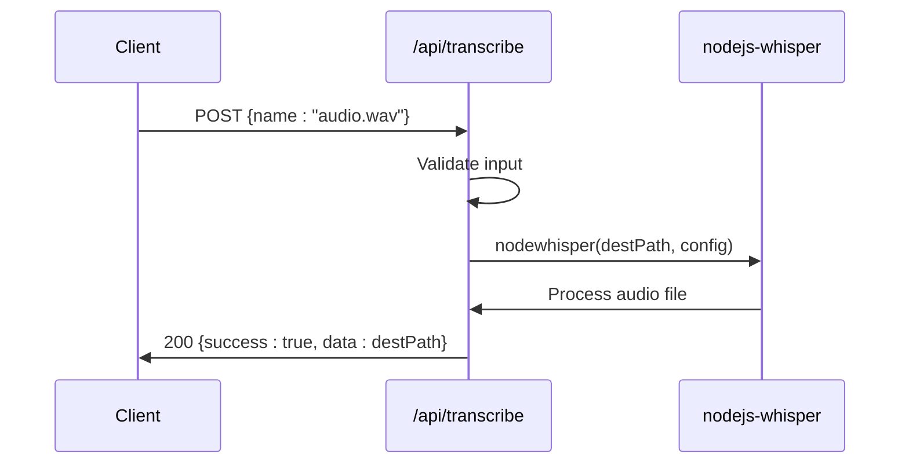
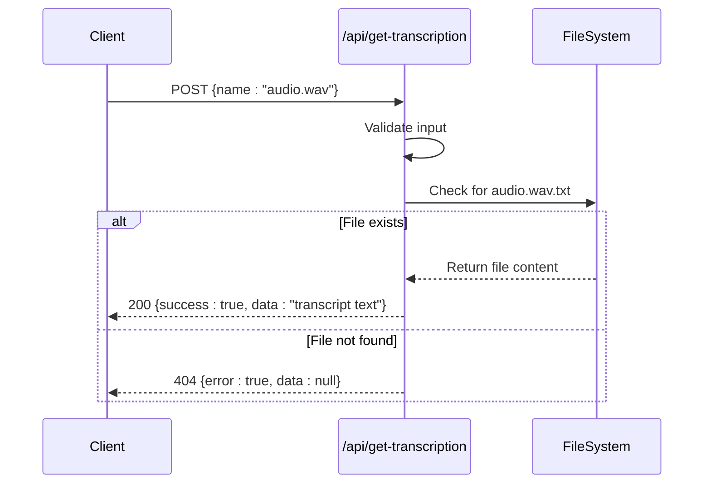
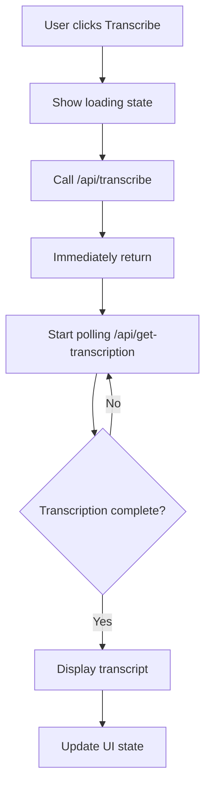
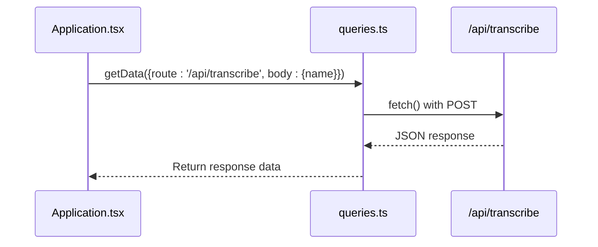
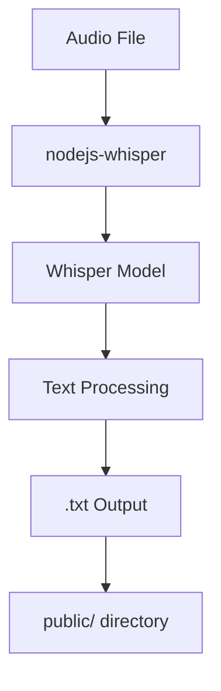
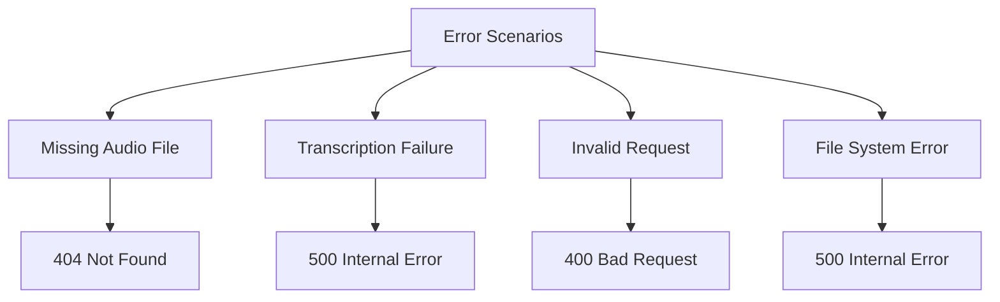

# Audio Transcription API

<cite>
**Referenced Files in This Document**   
- [transcribe.ts](file://pages/api/transcribe.ts)
- [get-transcription.ts](file://pages/api/get-transcription.ts)
- [Application.tsx](file://components/Application.tsx)
- [queries.ts](file://common/queries.ts)
- [upload.ts](file://pages/api/upload.ts)
- [utilities.ts](file://common/utilities.ts)
- [constants.ts](file://common/constants.ts)
</cite>

## Table of Contents
1. [Introduction](#introduction)
2. [Transcription Initiation](#transcription-initiation)
3. [Transcription Retrieval](#transcription-retrieval)
4. [Client Implementation](#client-implementation)
5. [Server-Side Processing](#server-side-processing)
6. [Error Handling](#error-handling)
7. [Performance Considerations](#performance-considerations)

## Introduction

The Audio Transcription API provides endpoints for initiating and retrieving Whisper-based transcription of audio files. The system enables users to upload audio files and asynchronously process them into text transcripts using the nodejs-whisper library. This documentation details the two primary endpoints: POST /api/transcribe for initiating transcription and GET /api/get-transcription for retrieving completed transcripts. The API follows an asynchronous processing model where transcription occurs in the background after initiation, requiring clients to poll for results.

## Transcription Initiation

The POST /api/transcribe endpoint initiates the transcription process for a specified audio file using the Whisper large-v3-turbo model. This endpoint accepts a JSON payload containing the audio file name and triggers asynchronous processing.

**Request Structure**
- Method: POST
- Endpoint: /api/transcribe
- Content-Type: application/json
- Body: { "name": "filename.wav" }

**Processing Behavior**
The transcription process is asynchronous and occurs server-side using the nodejs-whisper library with the following configuration:
- Model: large-v3-turbo
- Output format: plain text (.txt)
- CUDA acceleration: disabled
- Audio file retention: preserved after transcription

The endpoint returns immediately with a 200 status code upon successful initiation, regardless of the transcription processing time. The actual transcription occurs in the background, and clients must use the /api/get-transcription endpoint to retrieve results once processing is complete.

**Section sources**
- [transcribe.ts](file://pages/api/transcribe.ts#L16-L64)
- [upload.ts](file://pages/api/upload.ts#L78-L106)

## Transcription Retrieval

The GET /api/get-transcription endpoint enables clients to retrieve the text result of a completed transcription by polling with the original audio file name.

**Response Formats**
The endpoint returns different responses based on the transcription status:

| Status | HTTP Code | Response Format | Description |
|--------|---------|----------------|-------------|
| Processing | 404 | {error: true, data: null} | Transcription not yet complete |
| Completed | 200 | {success: true, data: "transcript text"} | Transcription available |
| Failed | 500 | {error: true, data: null} | Server error reading transcription |

**Request Parameters**
- Method: POST
- Endpoint: /api/get-transcription
- Body: { "name": "filename.wav" } (without .txt extension)

The system checks for the existence of a .txt file with the same base name as the audio file in the public directory. When the transcription is complete, the text output is stored as "[filename].txt" and can be retrieved through this endpoint.

**Section sources**
- [get-transcription.ts](file://pages/api/get-transcription.ts#L14-L47)

## Client Implementation

The client-side implementation in Application.tsx demonstrates the complete workflow for initiating transcription and polling for results using query functions.

**Query Function Usage**
The client uses the getData function from queries.ts to interact with both transcription endpoints:

The implementation pattern includes:
1. User interface elements that trigger transcription
2. Loading states during processing
3. Asynchronous calls to initiate transcription
4. Polling mechanism to retrieve results
5. Error handling for failed requests

The client manages UI state through React hooks, showing loading indicators during transcription and updating the display when results are available.

**Section sources**
- [Application.tsx](file://components/Application.tsx#L175-L212)
- [queries.ts](file://common/queries.ts#L3-L29)

## Server-Side Processing

The server-side integration with nodejs-whisper handles the core transcription functionality, processing audio files and generating text outputs stored in the file system.

**Integration Details**
The transcription process follows these steps:
1. Receive audio file name from request
2. Resolve repository root directory by searching for global.scss
3. Construct file path in the public directory
4. Invoke nodewhisper with configured options
5. Generate text output with .txt extension
6. Store output in the same directory as the source audio

The system uses the large-v3-turbo model with specific configuration:
- Text output only (outputInText: true)
- No timestamp generation (wordTimestamps: false)
- No translation (translateToEnglish: false)
- 30-second timestamp segments (timestamps_length: 30)

Transcription outputs are stored in the public directory with the naming convention "[original_filename].txt", making them accessible via the retrieval endpoint.

**Section sources**
- [transcribe.ts](file://pages/api/transcribe.ts#L16-L64)
- [upload.ts](file://pages/api/upload.ts#L78-L106)
- [constants.ts](file://common/constants.ts#L124-L125)

## Error Handling

The API implements comprehensive error handling for various failure scenarios in the transcription workflow.

**Error Scenarios and Responses**
- **Missing audio file**: Returns 404 when the specified audio file does not exist
- **Invalid request**: Returns 400 when the request body is missing or invalid
- **Repository resolution failure**: Returns 409 when the repository root cannot be determined
- **File system errors**: Returns 500 when reading the transcription file fails
- **Empty name parameter**: Returns 400 when the name field is missing or empty

The system uses the Utilities.isEmpty function to validate the name parameter before processing, ensuring that only valid requests proceed to transcription. Error responses follow a consistent format with {error: true, data: null} to indicate failure conditions.

**Section sources**
- [transcribe.ts](file://pages/api/transcribe.ts#L16-L64)
- [get-transcription.ts](file://pages/api/get-transcription.ts#L14-L47)
- [utilities.ts](file://common/utilities.ts#L302-L314)

## Performance Considerations

The transcription system's performance is influenced by audio length, hardware capabilities, and model configuration.

**Processing Expectations**
- Audio files up to 20 minutes have been successfully tested
- Processing time exceeds 5 minutes for longer recordings
- CPU-based processing (CUDA disabled) affects performance
- Large-v3-turbo model requires significant computational resources

**Hardware Requirements**
The system operates entirely offline with local processing, requiring:
- Sufficient CPU power for Whisper model execution
- Adequate RAM for model loading and audio processing
- Storage space for audio files and transcription outputs
- Node.js environment with appropriate dependencies

**Optimization Factors**
- Model size: large-v3-turbo balances accuracy and performance
- Output configuration: text-only output reduces processing overhead
- File handling: direct file system operations minimize latency
- Asynchronous design: non-blocking API calls improve responsiveness

Users should expect longer processing times for extended audio recordings, with the interface providing loading indicators during transcription. The system is designed for offline use, ensuring data privacy but relying on local hardware capabilities for performance.

**Section sources**
- [transcribe.ts](file://pages/api/transcribe.ts#L16-L64)
- [Application.tsx](file://components/Application.tsx#L175-L212)
- [constants.ts](file://common/constants.ts#L124-L125)