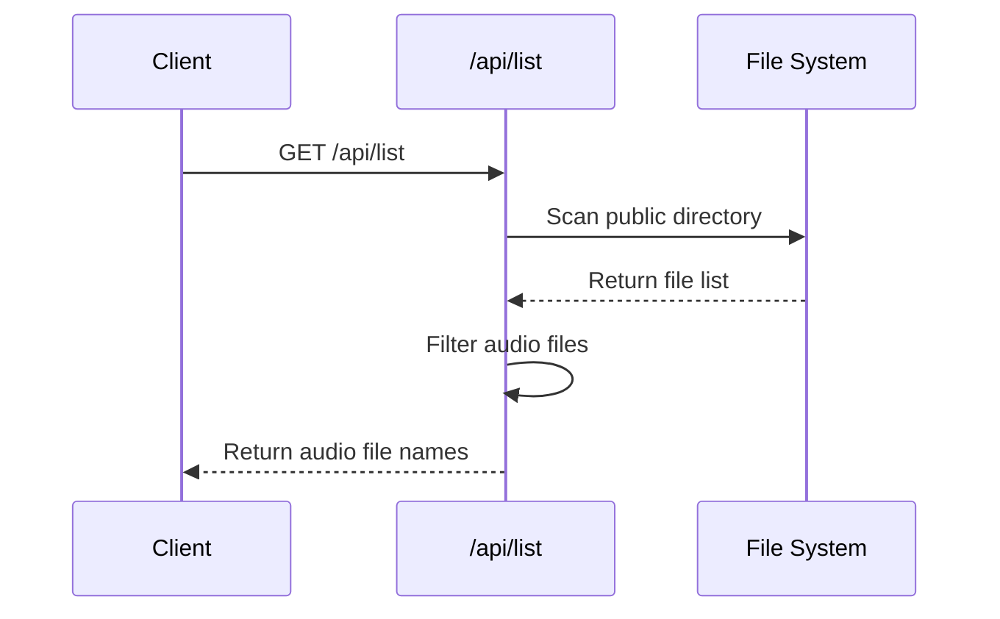
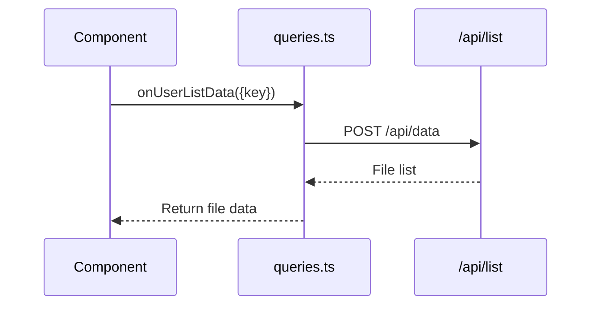
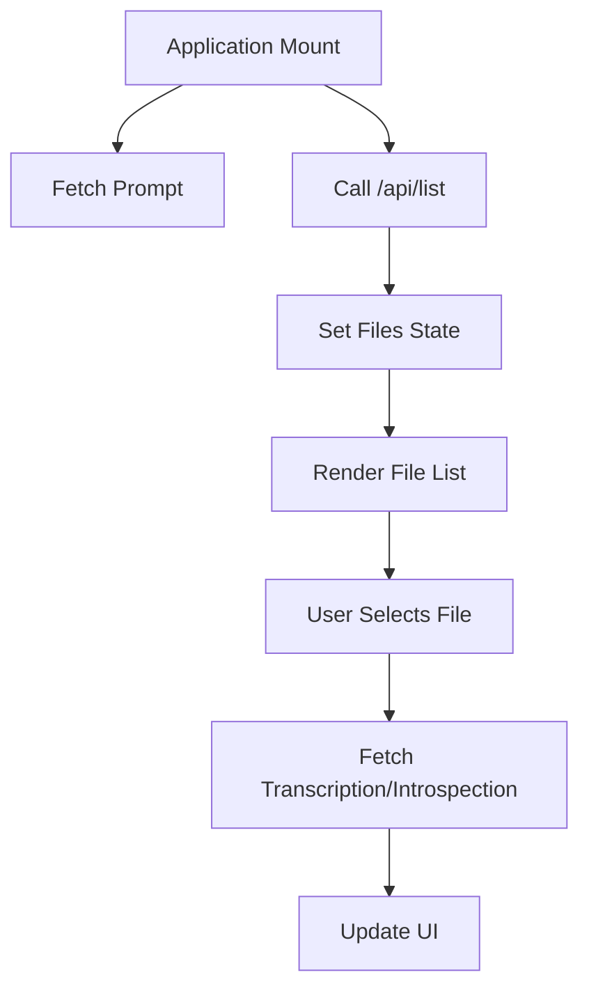

# File Management API

<cite>
**Referenced Files in This Document**   
- [list.ts](file://pages/api/list.ts)
- [queries.ts](file://common/queries.ts)
- [Application.tsx](file://components/Application.tsx)
- [get-transcription.ts](file://pages/api/get-transcription.ts)
- [get-introspection.ts](file://pages/api/get-introspection.ts)
- [transcribe.ts](file://pages/api/transcribe.ts)
- [introspect.ts](file://pages/api/introspect.ts)
- [constants.ts](file://common/constants.ts)
</cite>

## Table of Contents
1. [Introduction](#introduction)
2. [File Listing Endpoint](#file-listing-endpoint)
3. [Response Schema](#response-schema)
4. [Client-Side Usage](#client-side-usage)
5. [UI Integration](#ui-integration)
6. [Security Considerations](#security-considerations)
7. [Performance Implications](#performance-implications)
8. [Troubleshooting](#troubleshooting)
9. [File Naming Convention](#file-naming-convention)

## Introduction
This document provides comprehensive API documentation for the file listing functionality in the audio processing application. The system enables users to upload audio files, generate transcriptions using Whisper, and create introspections using LLM analysis. The core of this functionality revolves around the file listing endpoint that scans the public directory to expose available audio content and its associated metadata.

## File Listing Endpoint
The GET /api/list endpoint scans the public directory to return a list of available audio files. This endpoint serves as the foundation for the file selection interface, allowing users to browse and select audio files for processing.



**Diagram sources**
- [list.ts](file://pages/api/list.ts#L14-L39)

**Section sources**
- [list.ts](file://pages/api/list.ts#L14-L39)

## Response Schema
The endpoint returns a JSON response containing audio file metadata. The response includes file names that can be used to retrieve transcriptions and introspections.

```json
{
  "success": true,
  "data": [
    "audio-file-1.wav",
    "audio-file-2.mp3",
    "presentation.ogg"
  ]
}
```

The response schema includes:
- **success**: Boolean indicating request status
- **data**: Array of audio file names with supported extensions (.wav, .mp3, .ogg, .flac, .m4a)

The system determines file processing status (transcribed, introspected) by checking for the existence of corresponding .txt and .txt.introspection files, though this status is not directly included in the list response.

**Section sources**
- [list.ts](file://pages/api/list.ts#L14-L39)
- [get-transcription.ts](file://pages/api/get-transcription.ts#L14-L47)
- [get-introspection.ts](file://pages/api/get-introspection.ts#L14-L47)

## Client-Side Usage
The onUserListData function in queries.ts serves as the client-side interface to the file listing endpoint, abstracting the API call for use in React components.



**Diagram sources**
- [queries.ts](file://common/queries.ts#L31-L35)

**Section sources**
- [queries.ts](file://common/queries.ts#L31-L35)

### Example Usage
```bash
curl -X POST "https://api.internet.dev/api/data" \
  -H "X-API-KEY: your-api-key" \
  -H "Content-Type: application/json" \
  -d "{}"
```

The client-side function onUserListData handles the API interaction:

```javascript
export async function onUserListData({ key }) {
  const route = `${Constants.API}/data`;
  const body = {};
  return await getData({ route, key, body });
}
```

## UI Integration
The Application.tsx component uses the file listing data to populate the file selection interface, creating a seamless user experience for managing audio files.



**Diagram sources**
- [Application.tsx](file://components/Application.tsx#L43-L269)

**Section sources**
- [Application.tsx](file://components/Application.tsx#L43-L269)

When a user uploads a new file, the interface automatically refreshes the file list:

```javascript
onSuccess: async ({ data }) => {
  const response = await Queries.getData({ route: '/api/list' });
  setFiles(response.data);
  // Update UI states
}
```

The component maintains state for the current file, transcription, and introspection, updating the interface as processing occurs.

## Security Considerations
The implementation includes several security measures to protect the file system and prevent unauthorized access.

### Directory Traversal Prevention
The endpoint uses a repository root detection mechanism that searches for 'global.scss' to establish the base path, preventing access to directories outside the intended scope.

```javascript
let repoRoot = entryScript;
if (!existsSync(path.join(entryScript, 'global.scss'))) {
  let dir = path.dirname(entryScript);
  while (dir !== '/' && !existsSync(path.join(dir, 'global.scss'))) {
    dir = path.dirname(dir);
  }
  repoRoot = dir;
}
```

### Path Exposure
The API returns only file names without directory paths, minimizing information disclosure. Full paths are constructed server-side using the established repoRoot, preventing clients from specifying arbitrary paths.

### CORS Protection
All API endpoints, including the file listing, implement CORS protection through the Server.cors middleware, restricting access to authorized domains.

**Section sources**
- [list.ts](file://pages/api/list.ts#L14-L39)
- [server.ts](file://common/server.ts)
- [Application.tsx](file://components/Application.tsx#L43-L269)

## Performance Implications
The file listing approach has several performance characteristics that impact scalability and user experience.

### Large File Collections
The current implementation reads all files in the public directory and filters client-side, which can become inefficient with large numbers of files. For optimal performance, consider implementing:

- Server-side pagination
- Caching mechanisms
- File system watchers for real-time updates

### Caching Strategies
Potential caching approaches include:

1. **Client-side caching**: Store the file list in component state or React Query
2. **Server-side caching**: Implement Redis or in-memory cache for file listings
3. **Browser caching**: Use appropriate HTTP cache headers

The Application component already implements basic client-side state management, reducing redundant API calls after initial load.

**Section sources**
- [list.ts](file://pages/api/list.ts#L14-L39)
- [Application.tsx](file://components/Application.tsx#L43-L269)

## Troubleshooting
Common issues and their solutions for the file management system.

### Missing Files
If files appear missing from the list:
1. Verify files are in the public directory
2. Check file extensions are supported (.wav, .mp3, .ogg, .flac, .m4a)
3. Ensure the server has read permissions for the files
4. Restart the application if file system changes aren't detected

### Incorrect Status Reporting
When transcription or introspection status appears incorrect:
1. Verify the corresponding .txt or .txt.introspection files exist
2. Check file naming consistency between audio and text files
3. Ensure processing completed successfully (check server logs)
4. Refresh the file list after processing completes

### Upload Issues
For upload problems:
1. Verify file size is within limits
2. Check network connectivity
3. Ensure the upload endpoint is accessible
4. Confirm CORS configuration allows the request

**Section sources**
- [list.ts](file://pages/api/list.ts#L14-L39)
- [Application.tsx](file://components/Application.tsx#L43-L269)
- [upload.ts](file://pages/api/upload.ts)

## File Naming Convention
The system follows a specific naming convention to associate audio files with their transcriptions and introspections.

### Primary Files
- Audio files: `filename.wav`, `filename.mp3`, etc.
- Transcriptions: `filename.txt` (corresponding to `filename.wav`)
- Introspections: `filename.txt.introspection.txt`

### Special Files
- Default prompt: `__prompt.txt` in the public directory
- Audio with introspection: `the-motivation-mindset-with-risa-williams.wav.introspection.txt`

The system uses consistent naming patterns to establish relationships between files:
- Transcription files replace the audio extension with .txt
- Introspection files append `.introspection.txt` to the transcription filename
- The original audio filename is used as the base for all derived files

This convention enables the system to programmatically determine the existence and status of processed files by checking for the presence of corresponding text files.

**Section sources**
- [list.ts](file://pages/api/list.ts#L14-L39)
- [get-transcription.ts](file://pages/api/get-transcription.ts#L14-L47)
- [get-introspection.ts](file://pages/api/get-introspection.ts#L14-L47)
- [introspect.ts](file://pages/api/introspect.ts#L94-L148)