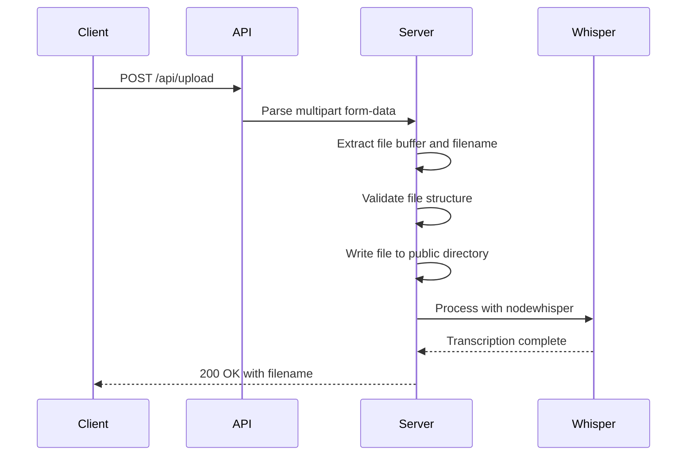
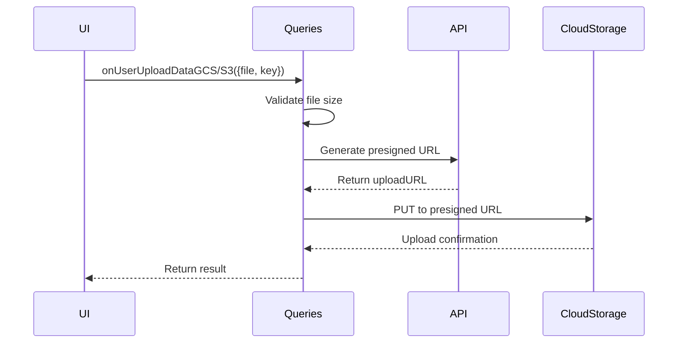
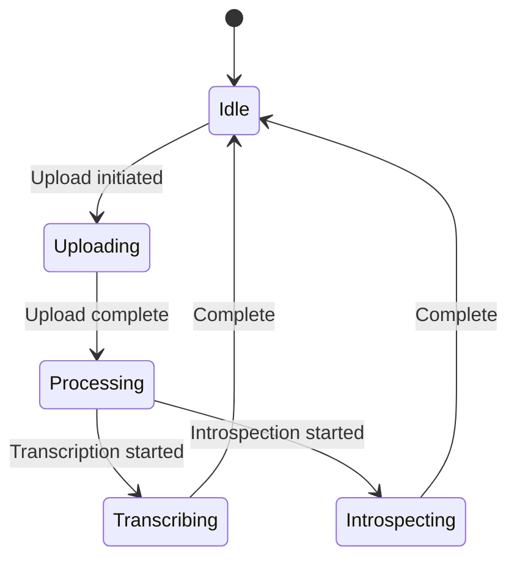

# File Upload API

<cite>
**Referenced Files in This Document**   
- [upload.ts](file://pages/api/upload.ts)
- [queries.ts](file://common/queries.ts)
- [Application.tsx](file://components/Application.tsx)
- [constants.ts](file://common/constants.ts)
</cite>

## Table of Contents
1. [Introduction](#introduction)
2. [API Endpoint Specification](#api-endpoint-specification)
3. [Request Structure](#request-structure)
4. [Response Schema](#response-schema)
5. [Client-Side Implementation](#client-side-implementation)
6. [Security Considerations](#security-considerations)
7. [Integration with Application Component](#integration-with-application-component)
8. [Troubleshooting Guide](#troubleshooting-guide)
9. [Performance Guidance](#performance-guidance)

## Introduction
This document provides comprehensive documentation for the file upload endpoint in the Next.js application that enables offline Whisper-to-LLM transcription. The API endpoint handles audio file uploads, stores them in the public directory, and automatically processes them using the Whisper transcription model. This documentation covers the complete API specification, implementation details, security measures, and integration patterns used throughout the application.

## API Endpoint Specification



**Diagram sources**
- [upload.ts](file://pages/api/upload.ts#L16-L106)

**Section sources**
- [upload.ts](file://pages/api/upload.ts#L1-L107)

## Request Structure

### HTTP Method and URL
- **Method**: POST
- **URL**: `/api/upload`

### Request Headers
The endpoint does not require authentication headers like X-API-KEY for file uploads, allowing anonymous users to upload audio files for transcription.

### Request Body
The request body uses multipart/form-data encoding with the following structure:

```mermaid
flowchart TD
A["multipart/form-data"] --> B["Form Field: file"]
B --> C["Content-Disposition: form-data; name=\"file\"; filename=\"audio.wav\""]
C --> D["Content-Type: audio/wav"]
D --> E["File Binary Data"]
```

**Diagram sources**
- [upload.ts](file://pages/api/upload.ts#L16-L106)

### File Requirements
- **Accepted Formats**: WAV, MP3, and other audio formats supported by the Whisper model
- **Maximum File Size**: 15MB (15,728,640 bytes)
- **Storage Location**: Public directory (`/public`) for direct URL access

**Section sources**
- [upload.ts](file://pages/api/upload.ts#L16-L106)
- [constants.ts](file://common/constants.ts#L1-L10)

## Response Schema

### Success Response (200 OK)
```json
{
  "success": true,
  "data": "filename.wav"
}
```
The response includes the filename of the uploaded file, which serves as the file ID for subsequent operations like transcription and introspection.

### Error Responses
| Status Code | Error Condition | Response Body |
|-------------|----------------|---------------|
| 405 | Method not allowed (not POST) | `{ "error": true, "data": null }` |
| 400 | Missing boundary or invalid multipart format | `{ "success": false, "message": "Missing boundary" }` |
| 409 | Repository root detection failure | `{ "error": true, "data": null }` |

**Section sources**
- [upload.ts](file://pages/api/upload.ts#L16-L106)

## Client-Side Implementation

### Usage Example with onUserUploadData
While the application uses a direct fetch to `/api/upload`, the `onUserUploadData` pattern in `queries.ts` demonstrates the general approach for file uploads:



**Diagram sources**
- [queries.ts](file://common/queries.ts#L139-L200)

**Section sources**
- [queries.ts](file://common/queries.ts#L139-L200)

### cURL Example
```bash
curl -X POST http://localhost:3000/api/upload \
  -H "Content-Type: multipart/form-data" \
  -F "file=@the-motivation-mindset-with-risa-williams.wav"
```

## Security Considerations

### File Type Validation
The endpoint relies on client-side validation (`accept="audio/*"`) but performs no server-side MIME type verification. The primary security measure is filename sanitization using `path.basename()` to prevent directory traversal attacks.

### Path Traversal Prevention
The implementation uses `path.basename(filenameMatch[1])` to extract only the filename from the uploaded file, discarding any directory path information that could be used in path traversal attacks.

### Size Limitation
File size is constrained by the `MAX_SIZE_BYTES` constant (15MB) defined in `constants.ts`, preventing denial-of-service attacks through excessively large file uploads.

**Section sources**
- [upload.ts](file://pages/api/upload.ts#L16-L106)
- [constants.ts](file://common/constants.ts#L1-L10)

## Integration with Application Component

### State Management
The `Application.tsx` component manages upload status through React state variables:



**Diagram sources**
- [Application.tsx](file://components/Application.tsx#L47-L47)

**Section sources**
- [Application.tsx](file://components/Application.tsx#L47-L270)

### Upload Flow
1. User clicks "Upload Audio" button
2. File input triggers onChange handler
3. FormData object created with file
4. POST request sent to `/api/upload`
5. On success, file list refreshed via `/api/list`
6. Upload state updated to reflect completion

## Troubleshooting Guide

### Common Upload Failures
- **Missing boundary error**: Ensure Content-Type header includes boundary parameter
- **Invalid multipart format**: Verify the request body structure follows RFC 2388
- **Repository root detection failure**: Confirm global.scss exists in project root
- **File not appearing in list**: Check that /api/list endpoint returns updated file list

### Debugging Steps
1. Verify the file size is under 15MB
2. Check browser developer tools for network errors
3. Confirm the public directory is writable
4. Validate that the Whisper model is properly installed
5. Check server logs for file system errors

**Section sources**
- [upload.ts](file://pages/api/upload.ts#L16-L106)
- [Application.tsx](file://components/Application.tsx#L47-L270)

## Performance Guidance

### Large Audio Files
For optimal performance with large audio files:
- Ensure sufficient server memory for buffering entire file
- Monitor disk I/O performance for public directory writes
- Consider implementing chunked uploads for files approaching the 15MB limit
- Be aware that transcription time increases linearly with audio duration

### Server Configuration
The API configuration disables response limiting and custom body parsing to handle large audio files:

```typescript
export const config = {
  api: {
    responseLimit: false,
    bodyParser: false,
  },
};
```

This allows the endpoint to process large file uploads without truncation or parsing interference.

**Section sources**
- [upload.ts](file://pages/api/upload.ts#L1-L15)
- [upload.ts](file://pages/api/upload.ts#L16-L106)