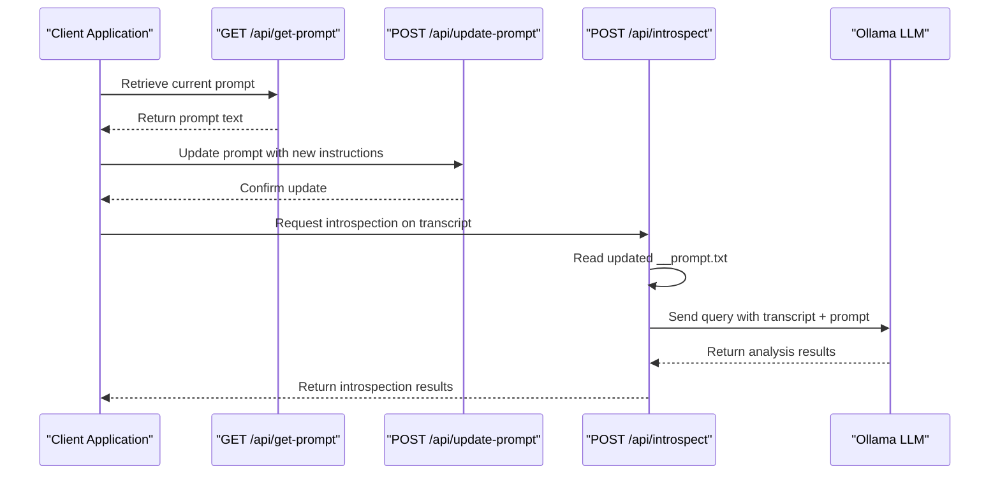

# Prompt Management API

<cite>
**Referenced Files in This Document**   
- [get-prompt.ts](file://pages/api/get-prompt.ts)
- [update-prompt.ts](file://pages/api/update-prompt.ts)
- [Application.tsx](file://components/Application.tsx)
- [introspect.ts](file://pages/api/introspect.ts)
- [constants.ts](file://common/constants.ts)
- [__prompt.txt](file://public/__prompt.txt)
</cite>

## Table of Contents
1. [Introduction](#introduction)
2. [GET /api/get-prompt](#get-apiget-prompt)
3. [POST /api/update-prompt](#post-apiupdate-prompt)
4. [Client-Side Usage](#client-side-usage)
5. [Integration with Introspection Workflow](#integration-with-introspection-workflow)
6. [Security Considerations](#security-considerations)
7. [Troubleshooting Guide](#troubleshooting-guide)
8. [Default Prompt Initialization](#default-prompt-initialization)
9. [Best Practices for Crafting Prompts](#best-practices-for-crafting-prompts)

## Introduction
The Prompt Management API provides endpoints for retrieving and updating the LLM instruction text used for audio introspection analysis. This documentation details the `GET /api/get-prompt` and `POST /api/update-prompt` endpoints, which enable users to access and modify the system's default prompt that guides the AI's analysis of transcribed audio content. The API integrates with the introspection workflow, where updated prompts directly influence subsequent AI analysis results. The system stores prompts in the file system, specifically in the `public/__prompt.txt` file, and implements validation to ensure prompt integrity.

## GET /api/get-prompt
Retrieves the current LLM instruction text used for introspection analysis.

### Request
```
GET /api/get-prompt
```

### Response
Returns the raw prompt text content in JSON format.

**Success Response (200)**
```json
{
  "success": true,
  "data": "- Produce 10 meaningful insights in as much detail as possible\n- Find some logical disconnect with the real world today\n- Speak as one of the world's best professors without referencing yourself"
}
```

**Error Responses**
- `404 Not Found`: Prompt file does not exist
- `500 Internal Server Error`: Failed to read the prompt file
- `409 Conflict`: Could not determine repository root

### curl Example
```bash
curl -X GET http://localhost:3000/api/get-prompt
```

**Section sources**
- [get-prompt.ts](file://pages/api/get-prompt.ts#L15-L42)

## POST /api/update-prompt
Updates the LLM instruction text used for introspection analysis.

### Request
```
POST /api/update-prompt
Content-Type: application/json
```

### Request Body
Accepts either plain text or JSON with a 'prompt' field.

**JSON Format**
```json
{
  "prompt": "- Produce 10 meaningful insights in as much detail as possible\n- Find some logical disconnect with the real world today\n- Speak as one of the world's best professors without referencing yourself"
}
```

**Plain Text Format**
```
- Produce 10 meaningful insights in as much detail as possible
- Find some logical disconnect with the real world today
- Speak as one of the world's best professors without referencing yourself
```

### Validation Rules
- Prompt content must not be empty or consist only of whitespace
- Input is validated using the `Utilities.isEmpty()` function
- The target prompt file must exist before update

### Response
Returns confirmation of the update with the saved prompt.

**Success Response (200)**
```json
{
  "success": true,
  "data": "[updated prompt text]",
  "out": "/path/to/public/__prompt.txt"
}
```

**Error Responses**
- `400 Bad Request`: Empty or invalid prompt provided
- `404 Not Found`: Prompt file does not exist
- `409 Conflict`: Could not determine repository root

### curl Examples
**Updating with JSON payload:**
```bash
curl -X POST http://localhost:3000/api/update-prompt \
  -H "Content-Type: application/json" \
  -d '{"prompt": "- Analyze the philosophical implications\\n- Identify emotional patterns\\n- Provide actionable insights"}'
```

**Updating with plain text:**
```bash
curl -X POST http://localhost:3000/api/update-prompt \
  -H "Content-Type: text/plain" \
  -d "- Analyze the philosophical implications
- Identify emotional patterns
- Provide actionable insights"
```

**Section sources**
- [update-prompt.ts](file://pages/api/update-prompt.ts#L15-L49)

## Client-Side Usage
The Application component provides a user interface for managing prompts, demonstrating the integration of both API endpoints.

### Component Structure
The prompt management UI consists of:
- A TextArea component for editing the prompt
- An "Update Default Prompt" action button
- State management for the current prompt value

### State Management
The component maintains prompt state using React.useState:
```javascript
const [prompt, setPrompt] = React.useState('');
```

### Initialization
On component mount, the application fetches the current prompt:
```javascript
const promptResponse = await Queries.getData({ route: '/api/get-prompt' });
if (promptResponse) {
  setPrompt(promptResponse.data);
}
```

### Update Flow
When the user clicks "Update Default Prompt", the application:
1. Sends the current prompt state to the update endpoint
2. Displays a confirmation alert on success

```javascript
const response = await Queries.getData({ route: '/api/update-prompt', body: { prompt } });
if (response) {
  alert('Your new prompt is saved.');
}
```

**Section sources**
- [Application.tsx](file://components/Application.tsx#L44-L44)
- [Application.tsx](file://components/Application.tsx#L74-L74)
- [Application.tsx](file://components/Application.tsx#L248-L254)

## Integration with Introspection Workflow
The prompt management system is tightly integrated with the AI introspection workflow, where the stored prompt directly influences analysis results.

### Workflow Sequence


**Diagram sources**
- [get-prompt.ts](file://pages/api/get-prompt.ts#L15-L42)
- [update-prompt.ts](file://pages/api/update-prompt.ts#L15-L49)
- [introspect.ts](file://pages/api/introspect.ts#L117-L124)

### File System Storage
The system stores prompts in the public directory:
- File path: `public/__prompt.txt`
- Location determined by searching for `global.scss` to identify repository root
- Read and written using Node.js fs/promises module

### Prompt Application
When processing introspection requests, the system:
1. Reads the current prompt from `__prompt.txt`
2. Combines it with the transcript and directives from `constants.ts`
3. Sends the complete query to the Ollama LLM

```javascript
const prompt = await fs.readFile(promptPath, 'utf-8');
const query = `<transcript>
"${normalizedTranscription}"
</transcript>

${prompt}
${Constants.Query.directives}`;
```

**Section sources**
- [introspect.ts](file://pages/api/introspect.ts#L117-L124)
- [constants.ts](file://common/constants.ts#L10-L12)

## Security Considerations
The prompt management system implements several security measures for text input handling and file storage.

### Input Validation
- Uses `Utilities.isEmpty()` to validate prompt content
- Rejects empty, null, or whitespace-only inputs
- Validates input before file system operations

### File System Security
- Stores prompts in the public directory with a predictable filename (`__prompt.txt`)
- Verifies file existence before read/write operations
- Uses UTF-8 encoding with explicit write flags
- Determines repository root by searching for `global.scss`

### API Security
- Implements CORS via `Server.cors(req, res)`
- Uses standard HTTP status codes for error conditions
- Returns minimal error information to clients

### Potential Risks
- No input sanitization for malicious content within valid prompts
- Predictable file path could be targeted by attackers
- No authentication or authorization checks on prompt endpoints

**Section sources**
- [update-prompt.ts](file://pages/api/update-prompt.ts#L18-L18)
- [get-prompt.ts](file://pages/api/get-prompt.ts#L20-L22)
- [update-prompt.ts](file://pages/api/update-prompt.ts#L35-L40)

## Troubleshooting Guide
This section addresses common issues with prompt persistence and functionality.

### Prompt Not Persisting
**Symptoms**: Changes to the prompt do not affect subsequent introspection results.

**Causes and Solutions**:
1. **File system permissions**: Ensure the application has write permissions to the `public` directory
   - Check: `ls -la public/`
   - Fix: `chmod 755 public/` and `chmod 644 public/__prompt.txt`

2. **Repository root detection failure**: The system cannot locate the repository root
   - Check: Verify `global.scss` exists in the project root
   - Fix: Ensure the marker file is present or modify root detection logic

3. **Caching issues**: Browser or server-side caching of API responses
   - Check: Test with curl to bypass browser cache
   - Fix: Clear application state and reload

### 404 Errors on Prompt Access
**Symptoms**: GET or POST requests return 404 Not Found.

**Causes and Solutions**:
1. **Missing prompt file**: The `__prompt.txt` file does not exist
   - Check: `ls public/__prompt.txt`
   - Fix: Create the file with default content or initialize through application

2. **Incorrect file path**: Repository root detection failed
   - Check: Verify the application can locate `global.scss`
   - Fix: Ensure proper project structure

### 400 Errors on Update
**Symptoms**: POST requests return 400 Bad Request.

**Causes and Solutions**:
1. **Empty prompt**: The prompt content is empty or whitespace
   - Check: Validate request body contains non-whitespace content
   - Fix: Ensure prompt has meaningful content before submission

2. **Invalid JSON**: Malformed JSON in request body
   - Check: Validate JSON structure with a JSON validator
   - Fix: Ensure proper JSON formatting with quoted keys and string values

**Section sources**
- [get-prompt.ts](file://pages/api/get-prompt.ts#L32-L35)
- [update-prompt.ts](file://pages/api/update-prompt.ts#L20-L22)
- [update-prompt.ts](file://pages/api/update-prompt.ts#L37-L39)

## Default Prompt Initialization
The system initializes with a default prompt stored in the file system.

### Default Prompt Content
The default prompt in `public/__prompt.txt` contains three core instructions:
```
- Produce 10 meaningful insights in as much detail as possible
- Find some logical disconnect with the real world today
- Speak as one of the world's best professors without referencing yourself
```

### Initialization Process
1. The file is created manually or by deployment scripts
2. The system expects this file to exist at the expected path
3. No automatic creation occurs if the file is missing
4. The application reads this file on startup to populate the UI

### Directives Extension
The system combines the stored prompt with additional directives from `constants.ts`:
```javascript
export const Query = {
  directives: `
- Return a response with <plain_text_response> and </plain_text_response> tags around the answer.`,
};
```

This creates a complete instruction set that guides the LLM to format responses appropriately.

**Section sources**
- [__prompt.txt](file://public/__prompt.txt#L1-L3)
- [constants.ts](file://common/constants.ts#L10-L12)

## Best Practices for Crafting Prompts
Effective introspection prompts should guide the LLM to produce high-quality, structured analysis.

### Prompt Structure
Follow the three-part structure of the default prompt:
1. **Output specification**: Define the format and quantity of insights
2. **Analytical focus**: Specify the type of analysis to perform
3. **Perspective guidance**: Define the voice and expertise level

### Recommended Prompt Elements
- Specify the number of insights or points to generate
- Define the analytical framework (e.g., philosophical, emotional, practical)
- Set the desired tone and expertise level
- Include formatting requirements for responses
- Focus on actionable or meaningful insights

### Example Effective Prompts
```
- Generate 7 comprehensive insights with supporting evidence
- Analyze the speaker's emotional journey and motivational techniques
- Provide practical applications for personal development
- Structure response with clear headings and bullet points
```

```
- Identify 5 key philosophical concepts in the discussion
- Compare these ideas to contemporary societal challenges
- Suggest 3 actionable steps for implementing these principles
- Write in an engaging, conversational academic style
```

### Testing and Iteration
- Test prompts with sample transcripts before widespread use
- Evaluate the quality and relevance of generated insights
- Refine prompts based on output quality
- Consider the balance between specificity and creative freedom

**Section sources**
- [__prompt.txt](file://public/__prompt.txt#L1-L3)
- [constants.ts](file://common/constants.ts#L10-L12)