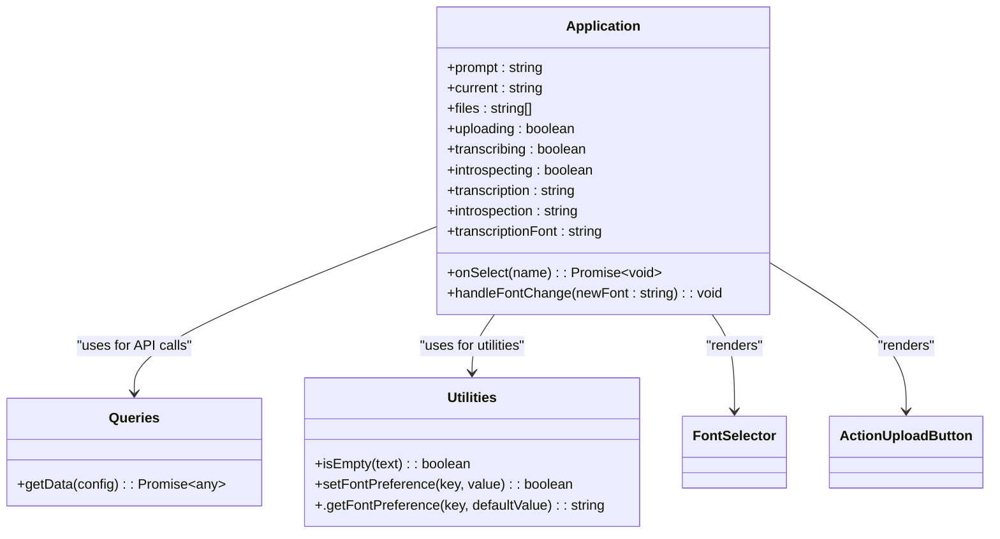

# Advanced Usage

<cite>
**Referenced Files in This Document**   
- [Application.tsx](file://components/Application.tsx)
- [run.js](file://scripts/run.js)
- [index.js](file://scripts/index.js)
- [transcribe.ts](file://pages/api/transcribe.ts)
- [introspect.ts](file://pages/api/introspect.ts)
- [constants.ts](file://common/constants.ts)
- [tsconfig.json](file://tsconfig.json)
- [package.json](file://package.json)
</cite>

## Table of Contents
1. [Introduction](#introduction)
2. [CLI Script Automation](#cli-script-automation)
3. [Advanced LLM Integration and Prompt Engineering](#advanced-llm-integration-and-prompt-engineering)
4. [UI Customization in Application.tsx](#ui-customization-in-applicationtsx)
5. [TypeScript Execution with ts-node](#typescript-execution-with-ts-node)
6. [Extension Possibilities](#extension-possibilities)
7. [Performance Optimization for Large Datasets](#performance-optimization-for-large-datasets)
8. [Conclusion](#conclusion)

## Introduction
This document provides comprehensive guidance on extending the functionality of the Next.js offline Whisper-to-LLM application beyond its basic capabilities. It covers advanced automation through CLI scripts, customization of the user interface, integration with local LLMs, and performance optimization techniques. The focus is on enabling batch processing, chaining analytical workflows, modifying UI behavior, and enhancing system scalability for large-scale audio transcription and introspection tasks.

## CLI Script Automation

The application includes two primary CLI scripts—`run.js` and `index.js`—located in the `scripts/` directory, which enable automated batch processing of audio files and execution of the transcription-introspection pipeline without user interaction.

The `run.js` script serves as a standalone automation tool that processes a predefined audio file (`the-motivation-mindset-with-risa-williams.mp3`) using the Whisper model for transcription, then sends the normalized transcript to a locally hosted Ollama instance running the `gemma3:27b` model for introspective analysis. The output is saved as a `.txt` file with the `.introspection.txt` suffix.

The `index.js` script acts as a dynamic loader that allows execution of any script within the `scripts/` directory via the `ts-node` command. This modular approach enables developers to create additional automation scripts and invoke them through a single entry point.

These scripts can be extended to support batch processing by iterating over multiple audio files in the `public/` directory, enabling scalable offline processing pipelines.

**Section sources**
- [run.js](file://scripts/run.js#L1-L247)
- [index.js](file://scripts/index.js#L1-L2)

## Advanced LLM Integration and Prompt Engineering

The system supports advanced integration with local LLMs through HTTP-based communication with Ollama. The `queryOllamaHTTP` function, implemented in both `run.js` and `introspect.ts`, sends prompts to the Ollama API endpoint (`http://localhost:11434/api/generate`) using the `gemma3:27b` model with streaming disabled.

The prompt engineering workflow is customizable through the `Constants.Query.directives` configuration in `constants.ts`, which enforces response formatting using `<plain_text_response>` tags. Developers can modify this directive or extend it with additional instructions to influence the LLM's output structure, tone, or analytical depth.

Chaining multiple LLM analyses is achievable by extending the introspection logic to perform sequential queries—for example, first summarizing the transcript, then extracting action items, and finally generating reflective insights. This can be implemented by modifying the `queryOllamaHTTP` call sequence in `run.js` or creating a new API route that orchestrates multi-stage LLM processing.

**Section sources**
- [run.js](file://scripts/run.js#L127-L155)
- [introspect.ts](file://pages/api/introspect.ts#L63-L86)
- [constants.ts](file://common/constants.ts#L70-L125)

## UI Customization in Application.tsx

The `Application.tsx` component serves as the central UI controller, managing state for file selection, transcription, introspection, and prompt editing. It uses React hooks (`useState`, `useEffect`) to maintain component state and interact with backend APIs via the `Queries.getData` utility.

Key extensibility points include:
- **Font Selection**: Users can change the transcription font via the `FontSelector` component, with preferences persisted in `localStorage` using the `setFontPreference` utility.
- **Prompt Editing**: The prompt displayed in the UI can be updated via the `/api/update-prompt` endpoint, allowing real-time customization of the introspection prompt.
- **File Management**: The component lists `.wav` files from the server via `/api/list` and enables selection for processing.

Custom enhancements could include adding export buttons, supporting drag-and-drop file uploads, or integrating real-time progress indicators for long-running transcription tasks.



**Diagram sources**
- [Application.tsx](file://components/Application.tsx#L36-L240)
- [queries.ts](file://common/queries.ts#L1-L201)
- [utilities.ts](file://common/utilities.ts#L1-L329)

**Section sources**
- [Application.tsx](file://components/Application.tsx#L1-L270)

## TypeScript Execution with ts-node

The `package.json` defines a `script` command that leverages `ts-node` to execute TypeScript scripts directly from the command line:

```json
"script": "ts-node -O '{\"module\":\"commonjs\"}' scripts/index.js"
```

This configuration allows running scripts without prior compilation by specifying the module system (`commonjs`) inline. To execute a specific script like `run.js`, use:

```bash
npm run script -- run
```

The `tsconfig.json` file configures the TypeScript compiler with paths mapping (e.g., `@common/*`, `@components/*`) that are resolved during execution. The `ts-node` setup respects these configurations, enabling seamless imports across the codebase.

Developers can customize the `ts-node` invocation by modifying the compiler options in the `package.json` script definition or by creating a separate `tsconfig.scripts.json` for CLI-specific settings.

**Section sources**
- [package.json](file://package.json#L1-L30)
- [tsconfig.json](file://tsconfig.json#L1-L37)

## Extension Possibilities

The application architecture supports several extension paths:

### Export Functionality
Add a new button in `Application.tsx` that triggers file downloads of transcription or introspection results using the `Blob` and `URL.createObjectURL` APIs. This would allow users to export processed text in `.txt` format.

### New Audio Formats
While the current implementation focuses on `.wav` and `.mp3` files, support for additional formats (e.g., `.flac`, `.m4a`) can be added by updating the file filter in the `list.ts` API route and ensuring Whisper model compatibility.

### Alternative Transcription Engines
The `nodewhisper` function is currently used for transcription. To integrate alternative engines (e.g., Vosk, DeepSpeech), replace the `nodewhisper` calls in `transcribe.ts`, `upload.ts`, and `run.js` with equivalent wrappers, maintaining the same output format (`.txt` file).

### Enhanced Prompt Management
Extend the prompt system to support multiple named prompts, versioning, or dynamic prompt templates based on content type, enabling more sophisticated introspection workflows.

**Section sources**
- [list.ts](file://pages/api/list.ts#L1-L39)
- [transcribe.ts](file://pages/api/transcribe.ts#L1-L64)
- [upload.ts](file://pages/api/upload.ts#L1-L106)

## Performance Optimization for Large Datasets

Handling large audio files or datasets requires careful memory and processing management:

- **Chunked Processing**: For very long audio files, implement audio segmentation before transcription to avoid memory overflow. Each segment can be processed independently and results merged afterward.
- **Memory Management**: The current implementation reads entire transcripts into memory. For large texts, consider streaming or pagination in the UI to reduce client-side load.
- **Concurrency Control**: When processing multiple files, limit concurrent executions to prevent system overload. Use worker queues or `Promise` throttling in batch scripts.
- **Caching**: Implement file-level caching to avoid reprocessing already transcribed or introspected files, checking for existing `.txt` and `.introspection.txt` files before starting.
- **Model Optimization**: Use smaller Whisper models (e.g., `small` or `medium`) for faster turnaround when high accuracy is not critical.

Running the Ollama server with extended timeouts (`OLLAMA_LOAD_TIMEOUT=30m`) and persistent context (`OLLAMA_KEEP_ALIVE=10m`) as defined in `package.json` ensures stability during prolonged introspection sessions.

**Section sources**
- [run.js](file://scripts/run.js#L157-L207)
- [package.json](file://package.json#L1-L30)
- [introspect.ts](file://pages/api/introspect.ts#L1-L149)

## Conclusion
The Next.js offline Whisper-to-LLM application provides a robust foundation for secure, local audio processing and introspective analysis. By leveraging the CLI scripts, customizing the UI, extending LLM workflows, and optimizing for performance, developers can significantly enhance its capabilities for batch processing, multi-stage analysis, and enterprise-scale deployment. The modular architecture and clear separation of concerns make it highly adaptable to a wide range of offline-first transcription and insight-generation use cases.