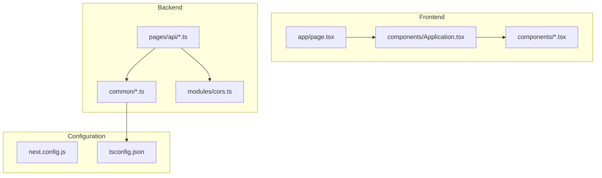
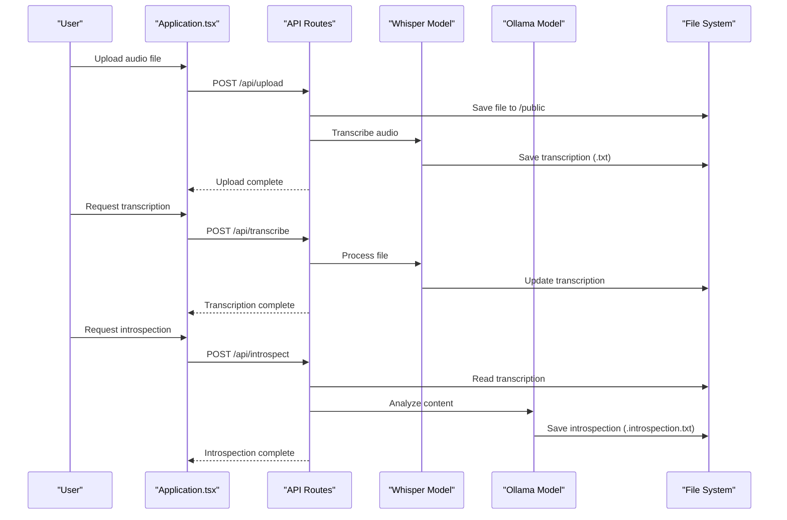
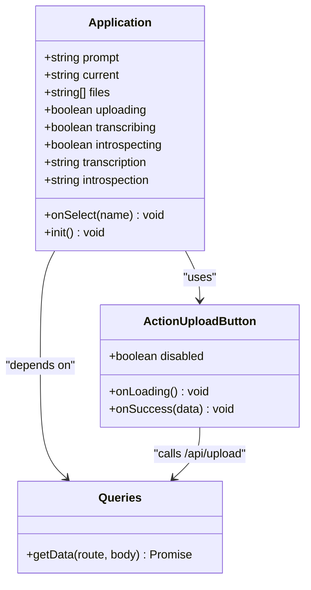
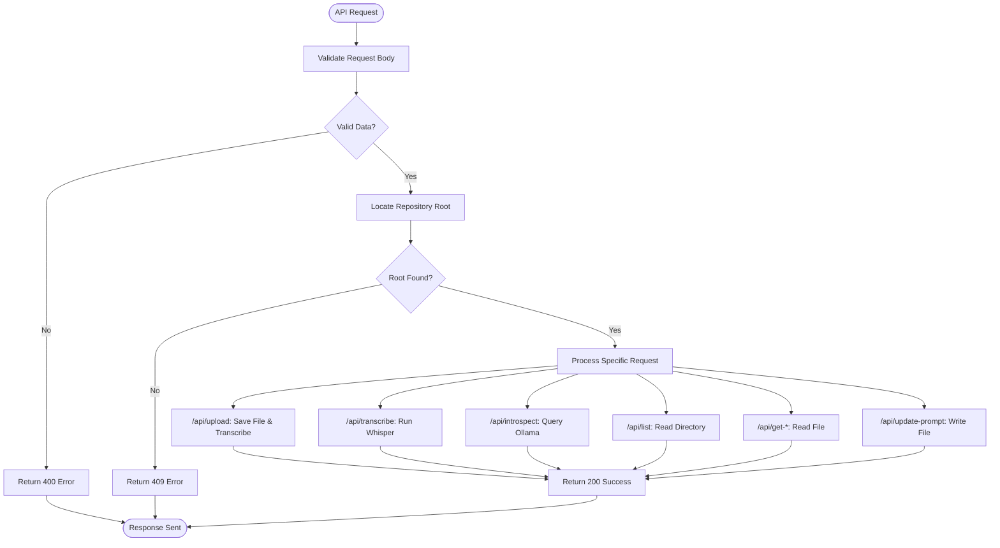
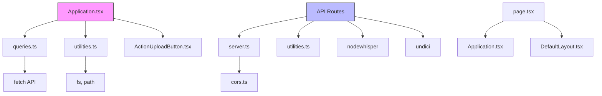
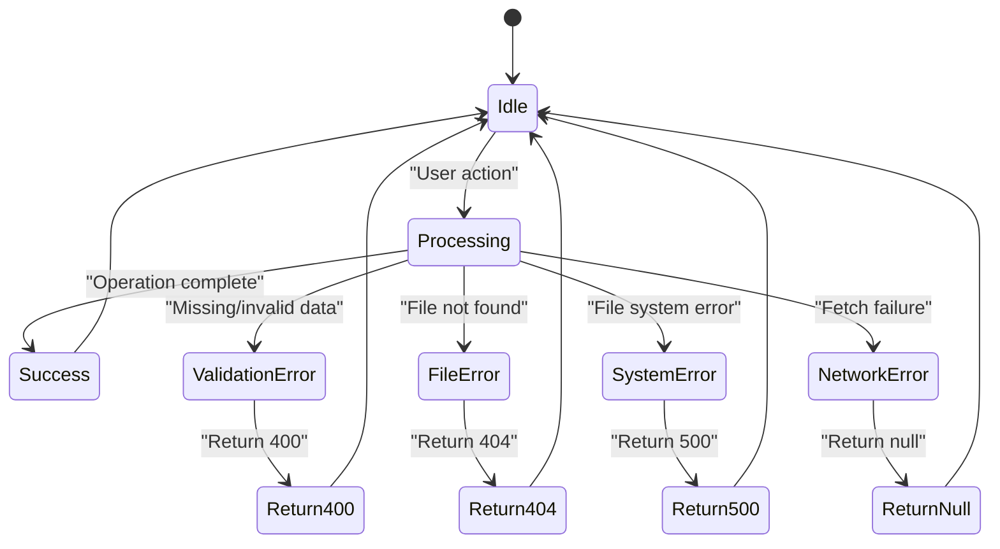

# Architecture

<cite>
**Referenced Files in This Document**   
- [Application.tsx](file://components/Application.tsx)
- [page.tsx](file://app/page.tsx)
- [transcribe.ts](file://pages/api/transcribe.ts)
- [upload.ts](file://pages/api/upload.ts)
- [get-transcription.ts](file://pages/api/get-transcription.ts)
- [get-introspection.ts](file://pages/api/get-introspection.ts)
- [get-prompt.ts](file://pages/api/get-prompt.ts)
- [update-prompt.ts](file://pages/api/update-prompt.ts)
- [list.ts](file://pages/api/list.ts)
- [introspect.ts](file://pages/api/introspect.ts)
- [server.ts](file://common/server.ts)
- [cors.ts](file://modules/cors.ts)
- [queries.ts](file://common/queries.ts)
- [utilities.ts](file://common/utilities.ts)
- [constants.ts](file://common/constants.ts)
</cite>

## Table of Contents
1. [Introduction](#introduction)
2. [Project Structure](#project-structure)
3. [Core Components](#core-components)
4. [Architecture Overview](#architecture-overview)
5. [Detailed Component Analysis](#detailed-component-analysis)
6. [Dependency Analysis](#dependency-analysis)
7. [Performance Considerations](#performance-considerations)
8. [Troubleshooting Guide](#troubleshooting-guide)
9. [Conclusion](#conclusion)

## Introduction
This document provides comprehensive architectural documentation for a Next.js application that enables offline audio transcription and introspection using local Whisper and Ollama models. The system follows a component-based React frontend with server-side API routes handling file operations, transcription, and AI processing. It supports offline-first operation with local file system storage and integrates with external authentication via api.internet.dev. The architecture emphasizes separation of concerns through modular directory organization and implements cross-cutting concerns like CORS and error handling.

## Project Structure

The application follows a hybrid Next.js structure combining App Router (app/) and Pages Router (pages/) patterns. Core components are organized by concern:

**Diagram sources**
- [page.tsx](file://app/page.tsx)
- [Application.tsx](file://components/Application.tsx)
- [transcribe.ts](file://pages/api/transcribe.ts)
- [server.ts](file://common/server.ts)

**Section sources**
- [page.tsx](file://app/page.tsx)
- [Application.tsx](file://components/Application.tsx)
- [next.config.js](file://next.config.js)

## Core Components

The application's core functionality revolves around audio file processing through Whisper for transcription and Ollama for introspection. The frontend is built with React components in the components/ directory, while backend processing occurs in API routes under pages/api/. Key components include Application.tsx for UI state management, API handlers for server-side operations, and utility modules for cross-cutting concerns. The system uses SCSS modules for scoped styling and environment variables for configuration.

**Section sources**
- [Application.tsx](file://components/Application.tsx)
- [queries.ts](file://common/queries.ts)
- [utilities.ts](file://common/utilities.ts)

## Architecture Overview

The application follows a client-server pattern with React components making API calls to Next.js server routes. User interactions in the frontend trigger API requests that process audio files locally using Whisper and Ollama. Transcription results and introspection outputs are stored in the public directory and retrieved as needed. The architecture supports offline operation by keeping all processing local and using the file system as persistent storage.

**Diagram sources**
- [Application.tsx](file://components/Application.tsx)
- [upload.ts](file://pages/api/upload.ts)
- [transcribe.ts](file://pages/api/transcribe.ts)
- [introspect.ts](file://pages/api/introspect.ts)
- [get-transcription.ts](file://pages/api/get-transcription.ts)
- [get-introspection.ts](file://pages/api/get-introspection.ts)

## Detailed Component Analysis

### Application State Management
The Application component manages the complete UI state for audio processing workflows, including file selection, upload status, transcription progress, and introspection results. It orchestrates interactions between UI elements and API endpoints.

**Diagram sources**
- [Application.tsx](file://components/Application.tsx)
- [ActionUploadButton.tsx](file://components/ActionUploadButton.tsx)
- [queries.ts](file://common/queries.ts)

### API Processing Pipeline
The server-side API routes implement a processing pipeline for audio files, from upload to transcription to introspection. Each route handles specific aspects of the workflow with consistent error handling and CORS support.

**Diagram sources**
- [upload.ts](file://pages/api/upload.ts)
- [transcribe.ts](file://pages/api/transcribe.ts)
- [introspect.ts](file://pages/api/introspect.ts)
- [list.ts](file://pages/api/list.ts)
- [get-transcription.ts](file://pages/api/get-transcription.ts)
- [get-introspection.ts](file://pages/api/get-introspection.ts)
- [get-prompt.ts](file://pages/api/get-prompt.ts)
- [update-prompt.ts](file://pages/api/update-prompt.ts)
- [server.ts](file://common/server.ts)

## Dependency Analysis

The application's dependencies follow a clear hierarchy from UI components to service layers to external integrations. The architecture minimizes coupling between components while maintaining cohesive functionality within feature domains.

**Diagram sources**
- [go.mod](file://package.json)
- [Application.tsx](file://components/Application.tsx)
- [server.ts](file://common/server.ts)
- [page.tsx](file://app/page.tsx)

**Section sources**
- [package.json](file://package.json)
- [server.ts](file://common/server.ts)

## Performance Considerations

The application faces significant performance challenges due to local processing requirements. Audio transcription with Whisper and introspection with Ollama can take over five minutes per file, as noted in confirmation dialogs. The architecture addresses this through:

1. Client-side state management to show loading states
2. Server-side configuration with responseLimit: false for long-running operations
3. Local file system storage to avoid reprocessing
4. Progressive enhancement with immediate feedback on user actions

Scalability is limited by the local processing model, making the application suitable for single-user, offline scenarios rather than multi-user deployments. The use of large language models (gemma3:27b) and speech recognition models (large-v3-turbo) requires substantial local resources.

## Troubleshooting Guide

The application implements several error handling patterns across frontend and backend components:

Key troubleshooting areas include:
- CORS configuration in modules/cors.ts for API route accessibility
- Environment variables API_AES_KEY and API_IV_KEY for authentication decryption
- File system permissions for reading/writing in the public directory
- Local service availability for Whisper (nodejs-whisper) and Ollama (localhost:11434)
- Network connectivity for external API calls to api.internet.dev

**Section sources**
- [server.ts](file://common/server.ts)
- [cors.ts](file://modules/cors.ts)
- [utilities.ts](file://common/utilities.ts)

## Conclusion

The application presents a robust architecture for offline audio processing using modern AI models. Its component-based React frontend provides an intuitive user interface, while Next.js API routes enable server-side processing without external dependencies. The clear separation of concerns through directory organization enhances maintainability, and the use of SCSS modules ensures scoped styling. While the local processing model limits scalability, it enables complete offline functionality. Future improvements could include Web Workers for non-blocking UI during processing and enhanced error recovery for failed operations.