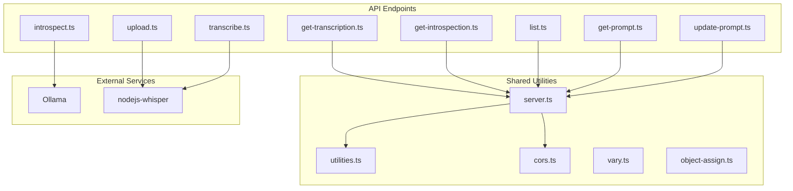
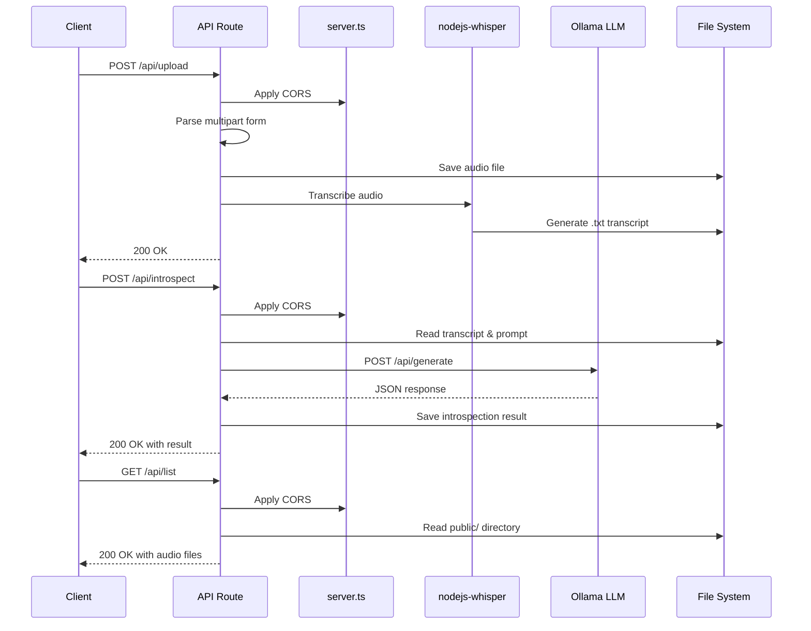
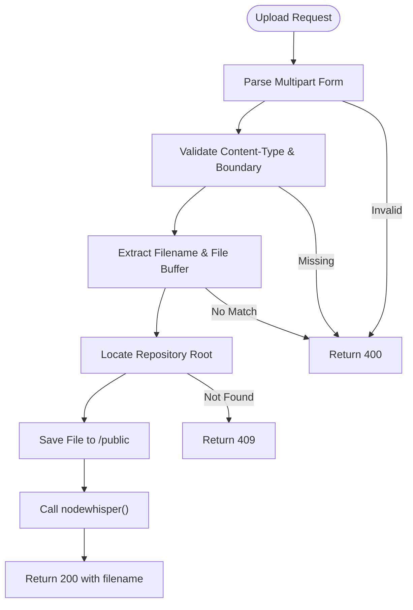
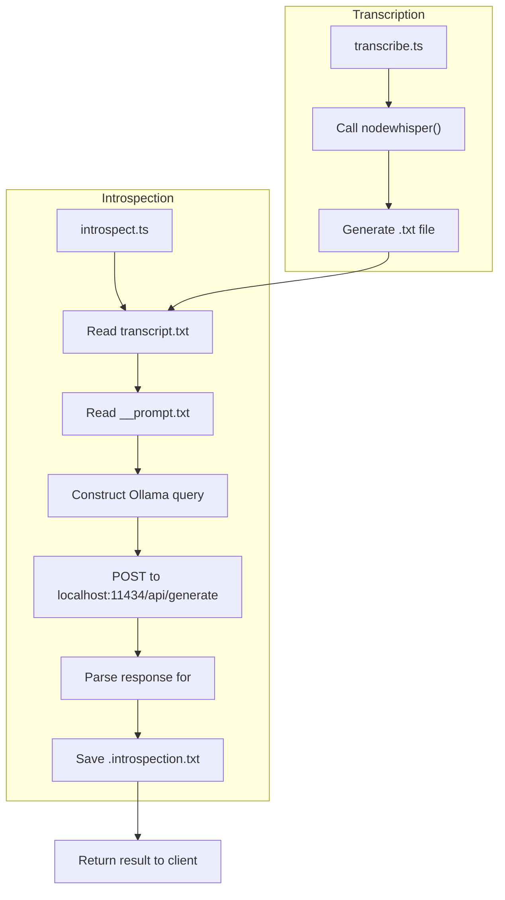
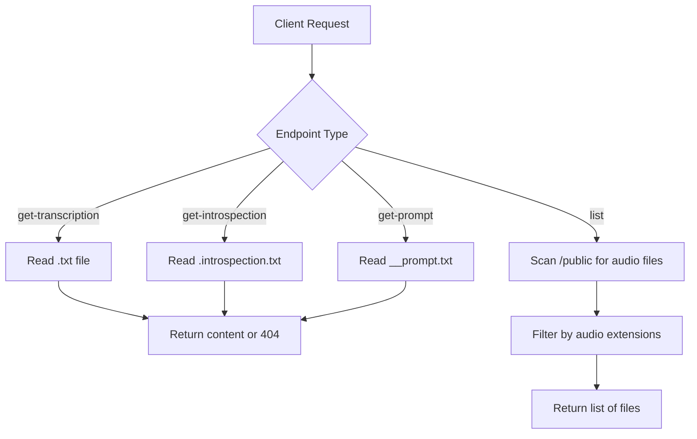
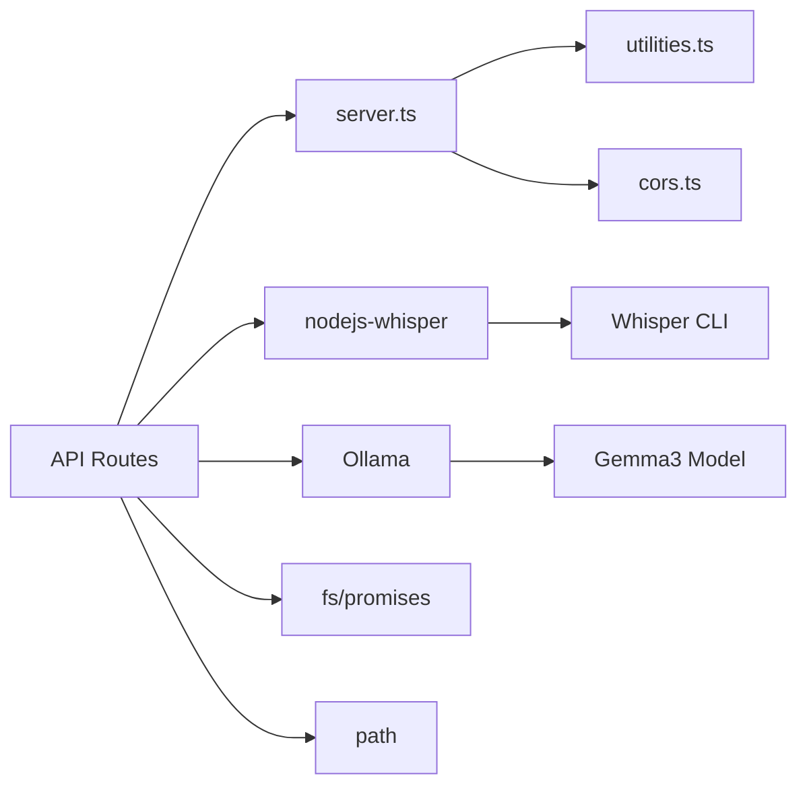

# Backend Architecture

<cite>
**Referenced Files in This Document**   
- [server.ts](file://common/server.ts)
- [upload.ts](file://pages/api/upload.ts)
- [transcribe.ts](file://pages/api/transcribe.ts)
- [introspect.ts](file://pages/api/introspect.ts)
- [get-transcription.ts](file://pages/api/get-transcription.ts)
- [get-introspection.ts](file://pages/api/get-introspection.ts)
- [list.ts](file://pages/api/list.ts)
- [get-prompt.ts](file://pages/api/get-prompt.ts)
- [update-prompt.ts](file://pages/api/update-prompt.ts)
- [cors.ts](file://modules/cors.ts)
- [utilities.ts](file://common/utilities.ts)
</cite>

## Table of Contents
1. [Introduction](#introduction)
2. [Project Structure](#project-structure)
3. [Core Components](#core-components)
4. [Architecture Overview](#architecture-overview)
5. [Detailed Component Analysis](#detailed-component-analysis)
6. [Dependency Analysis](#dependency-analysis)
7. [Performance Considerations](#performance-considerations)
8. [Troubleshooting Guide](#troubleshooting-guide)
9. [Conclusion](#conclusion)

## Introduction
This document provides a comprehensive architectural overview of the backend system for a Next.js-based offline audio transcription and introspection application. The system enables users to upload audio files, transcribe them locally using Whisper, and analyze the transcripts using a locally hosted LLM (Gemma3 via Ollama). All processing occurs client-side or on the local server, ensuring data privacy. The backend is built using Next.js API routes under `pages/api/`, with shared utilities in `common/server.ts`. The architecture emphasizes security, offline operation, and integration with local AI models.

## Project Structure



**Diagram sources**
- [pages/api/upload.ts](file://pages/api/upload.ts#L1-L108)
- [common/server.ts](file://common/server.ts#L1-L98)
- [modules/cors.ts](file://modules/cors.ts#L1-L203)

**Section sources**
- [pages/api](file://pages/api)
- [common](file://common)
- [modules](file://modules)

## Core Components

The backend system consists of multiple API endpoints that handle specific functionalities: file upload, transcription, introspection, listing, and prompt management. Each endpoint follows a consistent pattern of CORS enforcement, input validation, and response handling. Shared utilities in `server.ts` provide authentication and middleware setup, while external modules handle low-level HTTP concerns. The system integrates with `nodejs-whisper` for audio transcription and `Ollama` for LLM inference, both running locally.

**Section sources**
- [server.ts](file://common/server.ts#L1-L98)
- [upload.ts](file://pages/api/upload.ts#L1-L108)
- [introspect.ts](file://pages/api/introspect.ts#L1-L150)

## Architecture Overview



**Diagram sources**
- [upload.ts](file://pages/api/upload.ts#L1-L108)
- [introspect.ts](file://pages/api/introspect.ts#L1-L150)
- [list.ts](file://pages/api/list.ts#L1-L41)
- [server.ts](file://common/server.ts#L1-L98)

## Detailed Component Analysis

### API Endpoints Analysis

#### Upload Endpoint
Handles audio file uploads via multipart form data, saves the file to the public directory, and triggers immediate transcription using nodejs-whisper.



**Diagram sources**
- [upload.ts](file://pages/api/upload.ts#L1-L108)

**Section sources**
- [upload.ts](file://pages/api/upload.ts#L1-L108)

#### Transcription and Introspection Flow
Manages the transcription of audio files and subsequent LLM-based analysis of transcripts.



**Diagram sources**
- [transcribe.ts](file://pages/api/transcribe.ts#L1-L66)
- [introspect.ts](file://pages/api/introspect.ts#L1-L150)

**Section sources**
- [transcribe.ts](file://pages/api/transcribe.ts#L1-L66)
- [introspect.ts](file://pages/api/introspect.ts#L1-L150)

#### Data Retrieval Endpoints
Handles retrieval of processed data including transcripts, introspection results, and prompts.



**Diagram sources**
- [get-transcription.ts](file://pages/api/get-transcription.ts#L1-L49)
- [get-introspection.ts](file://pages/api/get-introspection.ts#L1-L49)
- [get-prompt.ts](file://pages/api/get-prompt.ts#L1-L44)
- [list.ts](file://pages/api/list.ts#L1-L41)

**Section sources**
- [get-transcription.ts](file://pages/api/get-transcription.ts#L1-L49)
- [get-introspection.ts](file://pages/api/get-introspection.ts#L1-L49)
- [get-prompt.ts](file://pages/api/get-prompt.ts#L1-L44)
- [list.ts](file://pages/api/list.ts#L1-L41)

### Shared Utilities Analysis

#### Authentication and Middleware
The `server.ts` file provides shared utilities for CORS enforcement and authentication via api.internet.dev.

```mermaid
classDiagram
class server {
+cors : Middleware
+setup(context) : Promise~{sessionKey, viewer}~
+tryKeyWithoutCookie(key) : Promise~{sessionKey, viewer}~
+decrypt(hex) : string
}
class Cors {
+initMiddleware(middleware) : Function
}
server --> Cors : uses
```

**Diagram sources**
- [server.ts](file://common/server.ts#L1-L98)
- [cors.ts](file://modules/cors.ts#L1-L203)

**Section sources**
- [server.ts](file://common/server.ts#L1-L98)

## Dependency Analysis



**Diagram sources**
- [server.ts](file://common/server.ts#L1-L98)
- [upload.ts](file://pages/api/upload.ts#L1-L108)
- [introspect.ts](file://pages/api/introspect.ts#L1-L150)

**Section sources**
- [server.ts](file://common/server.ts#L1-L98)
- [modules](file://modules)

## Performance Considerations

The backend architecture involves CPU-intensive operations that impact performance:
- Audio transcription using Whisper (large-v3-turbo model) is computationally expensive and synchronous
- LLM inference with Gemma3:27b requires significant memory and processing power
- File system operations for reading/writing large text files
- No streaming responses are used, leading to potential long response times
- The `noTimeoutAgent` in introspect.ts prevents request timeouts during long-running Ollama queries
- All operations are blocking, which may limit concurrent request handling
- Local execution ensures data privacy but limits scalability

**Section sources**
- [upload.ts](file://pages/api/upload.ts#L1-L108)
- [introspect.ts](file://pages/api/introspect.ts#L1-L150)
- [transcribe.ts](file://pages/api/transcribe.ts#L1-L66)

## Troubleshooting Guide

Common issues and their solutions:
- **Whisper not found**: Ensure whisper-cli is installed via `npx nodejs-whisper download`
- **Ollama connection refused**: Verify Ollama is running via `npm run llm`
- **Model not found**: Pull required model with `ollama pull gemma3:27b`
- **File not found errors**: Check that audio files are uploaded to the public directory
- **CORS errors**: Ensure proper origin headers are set in requests
- **Authentication failures**: Verify API_AES_KEY and API_IV_KEY environment variables
- **Memory issues**: The Gemma3:27b model requires substantial RAM; consider smaller models for low-memory systems
- **Transcription quality**: The large-v3-turbo model provides high accuracy but is resource-intensive

**Section sources**
- [server.ts](file://common/server.ts#L1-L98)
- [upload.ts](file://pages/api/upload.ts#L1-L108)
- [introspect.ts](file://pages/api/introspect.ts#L1-L150)

## Conclusion

The backend architecture effectively enables offline audio processing and analysis through a well-structured Next.js API layer. Key strengths include local data processing for privacy, modular endpoint design, and integration with powerful local AI models. The system leverages shared utilities for consistent CORS and authentication handling across endpoints. Performance considerations are significant due to CPU-intensive transcription and LLM operations, but the local execution model prioritizes data security over scalability. The architecture demonstrates a practical approach to client-side AI applications with sensitive data requirements.