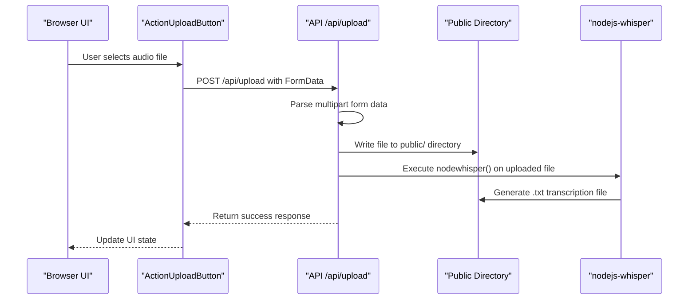
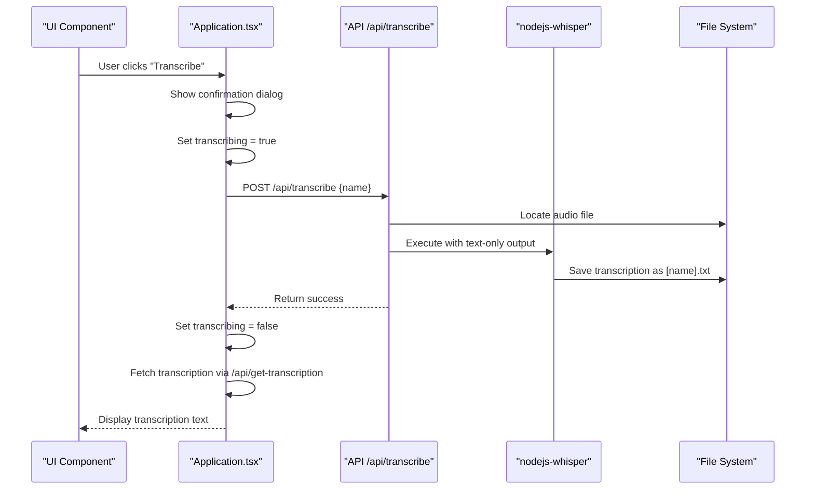
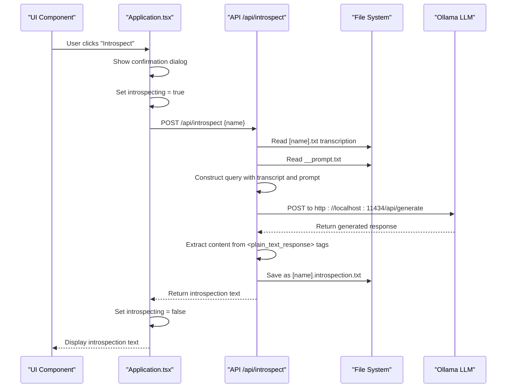
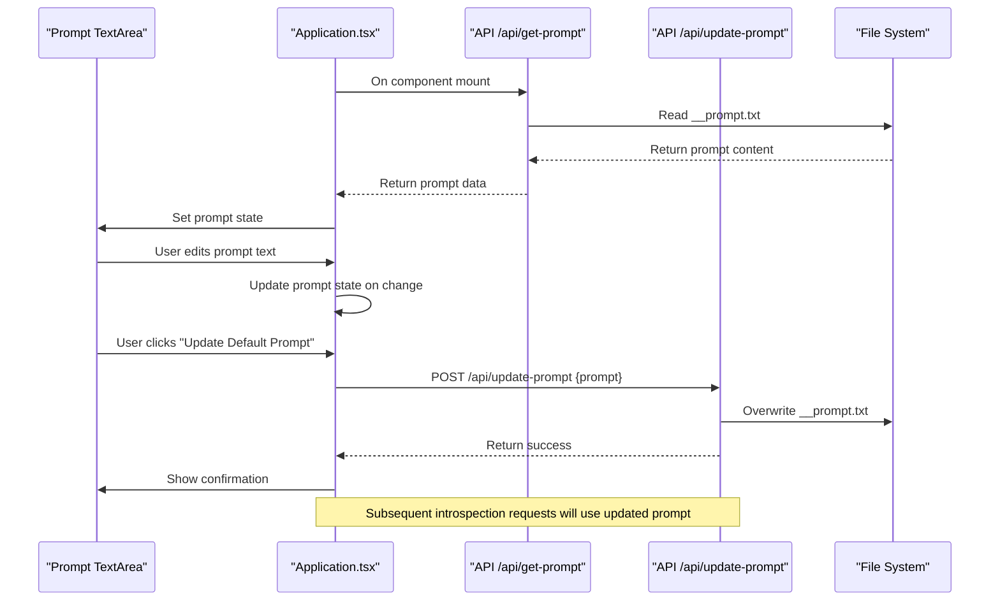
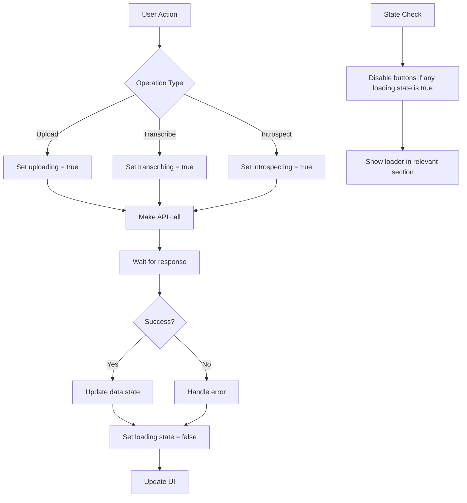

# Data Flow

<cite>
**Referenced Files in This Document**   
- [Application.tsx](file://components/Application.tsx)
- [queries.ts](file://common/queries.ts)
- [upload.ts](file://pages/api/upload.ts)
- [transcribe.ts](file://pages/api/transcribe.ts)
- [introspect.ts](file://pages/api/introspect.ts)
- [update-prompt.ts](file://pages/api/update-prompt.ts)
- [get-transcription.ts](file://pages/api/get-transcription.ts)
- [get-introspection.ts](file://pages/api/get-introspection.ts)
- [get-prompt.ts](file://pages/api/get-prompt.ts)
- [list.ts](file://pages/api/list.ts)
- [constants.ts](file://common/constants.ts)
- [utilities.ts](file://common/utilities.ts)
</cite>

## Table of Contents
1. [Introduction](#introduction)
2. [File Upload Flow](#file-upload-flow)
3. [Transcription Flow](#transcription-flow)
4. [Introspection Flow](#introspection-flow)
5. [Prompt Management Flow](#prompt-management-flow)
6. [Asynchronous Operations and Loading States](#asynchronous-operations-and-loading-states)
7. [API Communication Abstraction](#api-communication-abstraction)
8. [File Naming and State Synchronization](#file-naming-and-state-synchronization)
9. [Race Conditions and Error Recovery](#race-conditions-and-error-recovery)
10. [Public Directory Role](#public-directory-role)
11. [Data Payload Examples](#data-payload-examples)
12. [Conclusion](#conclusion)

## Introduction
This document provides comprehensive data flow documentation for the Next.js offline Whisper-to-LLM application. The system enables users to upload audio files, transcribe them locally using Whisper, and process the transcripts with a locally hosted LLM (Ollama) for introspective analysis. The application maintains an offline-first architecture, ensuring data privacy by keeping all processing local. The data flows through several key stages: file upload, transcription, introspection, and prompt management, with careful state management to handle asynchronous operations and maintain data consistency.

## File Upload Flow
The file upload flow begins with user interaction in the browser and concludes with storage in the public directory. When a user selects an audio file through the upload interface, the ActionUploadButton component captures the file input and creates a FormData object containing the audio file. This data is then sent via a POST request to the /api/upload endpoint.

The server-side upload handler processes the multipart form data, extracting the filename and file buffer from the request. After validating the content type and boundary, the handler writes the file directly to the public directory, which serves as shared storage between frontend and backend processes. Immediately after storage, the handler invokes the nodewhisper library to begin transcription of the uploaded audio file.



**Diagram sources**
- [ActionUploadButton.tsx](file://components/ActionUploadButton.tsx#L5-L59)
- [upload.ts](file://pages/api/upload.ts#L16-L106)

**Section sources**
- [ActionUploadButton.tsx](file://components/ActionUploadButton.tsx#L5-L59)
- [upload.ts](file://pages/api/upload.ts#L16-L106)

## Transcription Flow
The transcription flow initiates when a user clicks the "Transcribe" button after selecting an audio file. This action triggers a sequence that processes the audio file through the Whisper transcription engine and displays the resulting text in the UI.

When the user selects an audio file from the list, the Application component calls the onSelect function, which retrieves existing transcription and introspection data if available. The "Transcribe" button, when clicked, first confirms the user's intent (as the process may take over 5 minutes) and validates that a file is selected. It then sets the transcribing state to true, which displays a loading indicator in the UI.

The component then calls the /api/transcribe API endpoint with the selected filename. The server-side handler locates the audio file in the public directory and executes the nodewhisper library with specific configuration options: generating only text output (outputInText: true) while disabling other formats like JSON, SRT, or VTT. The transcription process runs asynchronously, and upon completion, the text file is saved alongside the original audio file.



**Diagram sources**
- [Application.tsx](file://components/Application.tsx#L34-L37)
- [transcribe.ts](file://pages/api/transcribe.ts#L16-L64)
- [get-transcription.ts](file://pages/api/get-transcription.ts#L14-L47)

**Section sources**
- [Application.tsx](file://components/Application.tsx#L34-L37)
- [transcribe.ts](file://pages/api/transcribe.ts#L16-L64)

## Introspection Flow
The introspection flow processes transcription text through a locally hosted LLM (Ollama) to generate insightful analysis. This flow begins after a successful transcription and concludes with the display of introspective content in the UI.

When the user clicks the "Introspect" button, the Application component validates that a file is selected and confirms the user's intent, as the process may take over 5 minutes. It then sets the introspecting state to true, which triggers the display of a loading indicator. The component calls the /api/introspect endpoint with the selected filename.

The server-side handler retrieves both the transcription text from the .txt file and the current prompt from the __prompt.txt file in the public directory. It combines these with directive instructions from constants to form a query for the LLM. The query structure includes the transcript wrapped in <transcript> tags, followed by the custom prompt and system directives.

The application makes an HTTP request to the local Ollama server (http://localhost:11434/api/generate) with the gemma3:27b model. The response is processed to extract content between <plain_text_response> tags, ensuring clean output. The resulting introspection text is saved as a .introspection.txt file, overwriting any previous version, and returned to the client.



**Diagram sources**
- [Application.tsx](file://components/Application.tsx#L51-L51)
- [introspect.ts](file://pages/api/introspect.ts#L81-L148)
- [get-introspection.ts](file://pages/api/get-introspection.ts#L14-L47)

**Section sources**
- [Application.tsx](file://components/Application.tsx#L51-L51)
- [introspect.ts](file://pages/api/introspect.ts#L81-L148)

## Prompt Management Flow
The prompt management flow allows users to edit and update the default prompt used in the introspection process. This flow ensures that subsequent introspection requests use the updated prompt while maintaining persistence across sessions.

When the user edits the prompt in the text area and clicks "Update Default Prompt," the Application component calls the /api/update-prompt endpoint with the new prompt text. The server-side handler validates that the prompt is not empty and locates the __prompt.txt file in the public directory. It then overwrites this file with the new prompt content, ensuring that all future introspection requests will use the updated prompt.

The prompt text area in the UI is controlled, meaning its value is tied directly to the component's state. When the component initializes, it fetches the current prompt from the /api/get-prompt endpoint, ensuring the UI displays the most recent saved prompt. This creates a complete cycle: display current prompt → user edits → save updated prompt → subsequent introspections use new prompt.



**Diagram sources**
- [Application.tsx](file://components/Application.tsx#L39-L41)
- [update-prompt.ts](file://pages/api/update-prompt.ts#L15-L49)
- [get-prompt.ts](file://pages/api/get-prompt.ts#L15-L42)

**Section sources**
- [Application.tsx](file://components/Application.tsx#L39-L41)
- [update-prompt.ts](file://pages/api/update-prompt.ts#L15-L49)

## Asynchronous Operations and Loading States
The Application.tsx component manages asynchronous operations and loading states through React state variables that control UI visibility and interactivity. The component maintains several boolean states: uploading, transcribing, and introspecting, which correspond to the three main processing phases.

When any of these states is true, the UI displays a CircularLoader component and a "PLEASE WAIT" caption in the relevant section. Additionally, action buttons and file selection are disabled during processing to prevent race conditions and conflicting operations. This is implemented through the disabled prop on Action and ActionUploadButton components, which check the combined state of all processing flags.

The state management follows a consistent pattern: set the appropriate loading state to true before making an API call, await the response, then set the state back to false. This ensures that only one operation can occur at a time and provides clear visual feedback to the user. The useEffect hook initializes the prompt state on component mount by fetching the current prompt, and another useEffect handles font preference persistence using localStorage.



**Diagram sources**
- [Application.tsx](file://components/Application.tsx#L47-L49)
- [Application.tsx](file://components/Application.tsx#L34-L37)

**Section sources**
- [Application.tsx](file://components/Application.tsx#L47-L49)

## API Communication Abstraction
The queries.ts file abstracts API communication through a set of utility functions that standardize request handling across the application. The core function, getData, provides a consistent interface for making POST requests to API endpoints with proper error handling and response validation.

All API interactions follow the same pattern: specify a route, optional API key, and request body. The getData function handles fetch operations, JSON parsing, and error checking, returning null for failed requests or invalid responses. Higher-level functions like onUserListData and onUserDeleteData wrap getData with specific route configurations, creating a clean separation between API concerns and component logic.

The abstraction ensures consistent headers (Content-Type: application/json) and error handling across all API calls. It also provides type safety through TypeScript interfaces and handles the X-API-KEY header when authentication is required. This centralized approach makes it easy to modify request behavior globally, such as adding logging, retry logic, or request monitoring.

```mermaid
classDiagram
class Queries {
+getData(config, qualifier) : Promise<any>
+onUserListData(key) : Promise<any>
+onUserDeleteData(id, key) : Promise<any>
+onRefreshDocuments(key, type, domain) : Promise<any>
+onGetDocumentById(id) : Promise<any>
+onUserCreateDocument(key, type, domain) : Promise<any>
+onDeleteDocumentById(id, key) : Promise<any>
+onUpdateDocumentById(id, key, data) : Promise<any>
}
class Application {
-prompt : string
-current : string
-files : array
-uploading : boolean
-transcribing : boolean
-introspecting : boolean
-transcription : string
-introspection : string
}
Queries --> Application : "used by"
Application --> Queries : "calls getData()"
note right of Queries
Centralized API abstraction
Standardized error handling
Consistent request patterns
Type-safe interfaces
end note
```

**Diagram sources**
- [queries.ts](file://common/queries.ts#L3-L29)
- [Application.tsx](file://components/Application.tsx#L44-L44)

**Section sources**
- [queries.ts](file://common/queries.ts#L3-L29)

## File Naming and State Synchronization
The application uses a consistent file naming convention and state synchronization strategy to maintain data integrity across the UI and file system. Audio files are stored in the public directory with their original filenames. Transcription files are created with the same base name as the audio file but with a .txt extension. Introspection results are saved with the pattern [filename].introspection.txt.

The Application component maintains synchronized state between the file list, transcription content, and introspection content. When a user selects a file, the component fetches both the transcription and introspection data if they exist. The file list is refreshed after uploads to reflect new files, and the current selection is preserved through the current state variable.

Font preferences for transcription display are stored in localStorage using the key defined in constants.ts (transcription-font-preference), with a default value of SF Mono. This preference is loaded on component mount and updated when the user selects a new font, ensuring consistency across sessions.

```mermaid
erDiagram
AUDIO_FILE {
string filename PK
string extension "wav, mp3, etc."
datetime upload_date
string original_name
}
TRANSCRIPTION_FILE {
string filename PK
string base_name FK
string extension "txt"
datetime generation_date
text content
}
INTROSPECTION_FILE {
string filename PK
string base_name FK
string extension "introspection.txt"
datetime generation_date
text content
}
PROMPT_FILE {
string filename PK "__prompt.txt"
datetime last_modified
text content
string author "user-defined"
}
AUDIO_FILE ||--o{ TRANSCRIPTION_FILE : "generates"
AUDIO_FILE ||--o{ INTROSPECTION_FILE : "generates"
PROMPT_FILE }o--o{ INTROSPECTION_FILE : "used_in"
note as FileNaming
Naming Conventions:
- Audio: [original].wav
- Transcription: [original].txt
- Introspection: [original].introspection.txt
- Prompt: __prompt.txt (single file)
end note
```

**Diagram sources**
- [constants.ts](file://common/constants.ts#L124-L125)
- [utilities.ts](file://common/utilities.ts#L302-L314)
- [list.ts](file://pages/api/list.ts#L15-L40)

**Section sources**
- [constants.ts](file://common/constants.ts#L124-L125)

## Race Conditions and Error Recovery
The application implements several mechanisms to prevent race conditions and ensure error recovery throughout the data flow. The primary defense against race conditions is the use of mutually exclusive loading states: uploading, transcribing, and introspecting. When any of these states is active, all action buttons are disabled, preventing users from initiating conflicting operations.

Error recovery is implemented at multiple levels. API routes include comprehensive error handling, returning appropriate HTTP status codes (400 for bad requests, 404 for not found, 500 for server errors). Client-side code checks for null responses from API calls and handles them gracefully without crashing. The nodewhisper library operations are wrapped in try-catch blocks, though this is handled internally by the library.

File system operations include existence checks before reading files and attempt to handle missing files gracefully. For example, the get-transcription and get-introspection endpoints return 404 if the requested file does not exist, allowing the client to handle the absence of data appropriately. The introspect endpoint attempts to delete an existing introspection file before writing a new one, preventing file locking issues.

```mermaid
flowchart TD
A[User Action] --> B{Any operation in progress?}
B --> |Yes| C[Show alert: "Wait for current task"]
B --> |No| D[Proceed with operation]
D --> E[Set loading state]
E --> F[Make API call]
F --> G{Response successful?}
G --> |Yes| H[Update data state]
G --> |No| I{Error type?}
I --> |404 Not Found| J[Handle missing file gracefully]
I --> |400 Bad Request| K[Validate inputs]
I --> |500 Server Error| L[Show generic error]
I --> |Network Error| M[Check connectivity]
H --> N[Set loading state = false]
J --> N
K --> N
L --> N
M --> N
N --> O[Update UI]
P[File Operation] --> Q{File exists?}
Q --> |No| R[Return 404]
Q --> |Yes| S[Proceed with operation]
```

**Diagram sources**
- [Application.tsx](file://components/Application.tsx#L47-L49)
- [upload.ts](file://pages/api/upload.ts#L16-L106)
- [get-transcription.ts](file://pages/api/get-transcription.ts#L14-L47)

**Section sources**
- [Application.tsx](file://components/Application.tsx#L47-L49)

## Public Directory Role
The public directory serves as the central shared storage location between frontend and backend processes in this application. It functions as a persistence layer that both the Next.js server and client can access, enabling the offline-first architecture. All user-uploaded audio files are stored directly in this directory, making them immediately accessible for processing.

The directory also stores all generated files: transcription outputs (.txt), introspection results (.introspection.txt), and the global prompt file (__prompt.txt). This shared storage model simplifies file management by eliminating the need for database storage or complex file transfer mechanisms. The server-side API routes locate the repository root by searching for global.scss, then construct paths relative to this root, ensuring consistent file access regardless of execution context.

Security is maintained through file naming conventions and location: all files are stored in a predictable structure within the public directory, and no user data is exposed through API endpoints beyond what is explicitly requested. The directory structure is scanned by the list endpoint to populate the file selection UI, creating a direct mapping between filesystem contents and user-visible options.

```mermaid
graph TB
A[Public Directory] --> B[User Uploaded Files]
A --> C[Generated Transcriptions]
A --> D[Generated Introspections]
A --> E[Global Prompt File]
B --> F[.wav, .mp3, .ogg files]
C --> G[[filename].txt]
D --> H[[filename].introspection.txt]
E --> I[__prompt.txt]
subgraph "Backend Access"
J[API Routes]
K[nodejs-whisper]
L[Ollama Integration]
end
subgraph "Frontend Access"
M[Static File Serving]
N[File List UI]
end
J --> A
K --> A
L --> A
M --> A
N --> A
note right of A
Shared storage between
frontend and backend
No database required
Direct file access
Predictable naming
Local persistence
end note
```

**Diagram sources**
- [upload.ts](file://pages/api/upload.ts#L16-L106)
- [list.ts](file://pages/api/list.ts#L15-L40)
- [constants.ts](file://common/constants.ts#L124-L125)

**Section sources**
- [upload.ts](file://pages/api/upload.ts#L16-L106)

## Data Payload Examples
The application processes several types of data payloads throughout its workflow, each with specific structures and transformations. API requests typically follow a consistent pattern: a JSON object with a name or prompt property, sent via POST to the appropriate endpoint.

For file upload, the payload is a FormData object containing a file field with the audio file. The server responds with a JSON object containing a success flag and the filename. Transcription requests send a JSON body with the name of the audio file, and the server returns the full path to the generated transcription file.

Introspection requests send the filename, and the server returns the generated introspection text. The prompt management flow sends a JSON object with a prompt property, and the server echoes back the saved prompt text. All successful responses follow the pattern { success: true, data: [payload] }, while errors return { error: true, data: null }.

Typical data transformations include: audio file → plain text transcription, transcription text + prompt → introspective analysis, and user input → persisted prompt file. The text content undergoes normalization to remove extra whitespace and handle hyphenated words appropriately before LLM processing.

**Section sources**
- [upload.ts](file://pages/api/upload.ts#L16-L106)
- [transcribe.ts](file://pages/api/transcribe.ts#L16-L64)
- [introspect.ts](file://pages/api/introspect.ts#L81-L148)

## Conclusion
The Next.js offline Whisper-to-LLM application demonstrates a robust data flow architecture that prioritizes user privacy through local processing. The system effectively manages the lifecycle of data from user interaction to persistent storage and AI processing, with well-defined flows for upload, transcription, introspection, and prompt management. Key strengths include the use of the public directory as shared storage, comprehensive state management to prevent race conditions, and consistent API abstractions that simplify client-server communication. The application's offline-first design ensures that sensitive audio content and generated insights remain on the user's device, while the modular architecture allows for easy maintenance and potential enhancements.