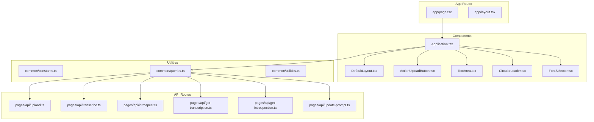
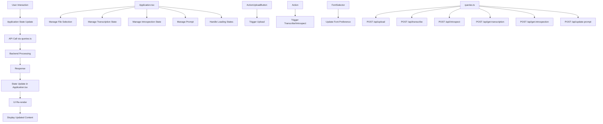
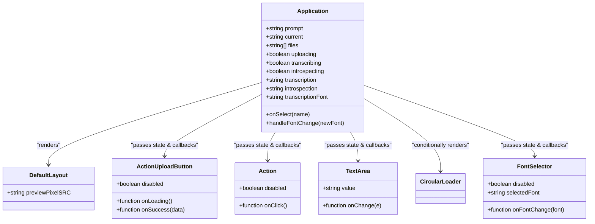
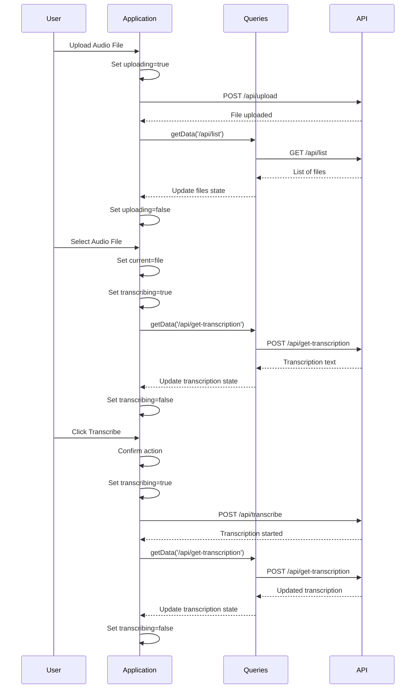
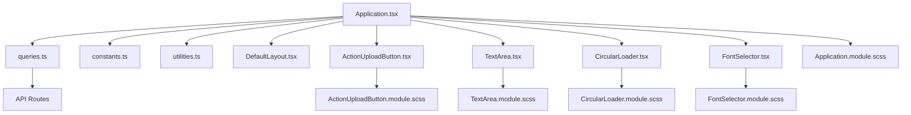

# Frontend Architecture

<cite>
**Referenced Files in This Document**   
- [Application.tsx](file://components/Application.tsx)
- [queries.ts](file://common/queries.ts)
- [DefaultLayout.tsx](file://components/DefaultLayout.tsx)
- [ActionUploadButton.tsx](file://components/ActionUploadButton.tsx)
- [ActionUploadButton.module.scss](file://components/ActionUploadButton.module.scss)
- [TextArea.tsx](file://components/TextArea.tsx)
- [CircularLoader.tsx](file://components/CircularLoader.tsx)
- [constants.ts](file://common/constants.ts)
- [upload.ts](file://pages/api/upload.ts)
- [transcribe.ts](file://pages/api/transcribe.ts)
- [introspect.ts](file://pages/api/introspect.ts)
- [get-transcription.ts](file://pages/api/get-transcription.ts)
- [get-introspection.ts](file://pages/api/get-introspection.ts)
- [update-prompt.ts](file://pages/api/update-prompt.ts)
</cite>

## Table of Contents
1. [Introduction](#introduction)
2. [Project Structure](#project-structure)
3. [Core Components](#core-components)
4. [Architecture Overview](#architecture-overview)
5. [Detailed Component Analysis](#detailed-component-analysis)
6. [Dependency Analysis](#dependency-analysis)
7. [Performance Considerations](#performance-considerations)
8. [Troubleshooting Guide](#troubleshooting-guide)
9. [Conclusion](#conclusion)

## Introduction
This document provides a comprehensive architectural overview of the frontend system in the Next.js application designed for audio transcription and introspection. The system leverages React with the App Router pattern, utilizing a centralized state management approach within the `Application.tsx` component. It features a modular UI structure with reusable components such as `ActionUploadButton`, `TextArea`, and `CircularLoader`, styled using SCSS modules for encapsulation. The frontend integrates with backend APIs through a utility layer (`queries.ts`) to handle file uploads, transcriptions, and AI-driven introspection. This documentation details the component hierarchy, state flow, data fetching mechanisms, and design decisions that enable a responsive and accessible user experience.

## Project Structure
The project follows a standard Next.js App Router structure with clear separation of concerns. The `app` directory contains route handlers and layout definitions, while reusable UI components are organized under the `components` directory with corresponding SCSS module files. Shared utilities and constants are located in the `common` folder, and API routes are defined in `pages/api`. This modular organization supports maintainability and scalability.

**Diagram sources**
- [app/page.tsx](file://app/page.tsx)
- [components/Application.tsx](file://components/Application.tsx)
- [common/queries.ts](file://common/queries.ts)
- [pages/api/upload.ts](file://pages/api/upload.ts)

**Section sources**
- [app/page.tsx](file://app/page.tsx)
- [components/Application.tsx](file://components/Application.tsx)
- [common/queries.ts](file://common/queries.ts)

## Core Components
The frontend architecture centers around the `Application.tsx` component, which manages global state including file selection, transcription status, introspection results, and user preferences. It orchestrates interactions between UI controls and backend services, maintaining a single source of truth for the application state. Supporting components such as `ActionUploadButton`, `TextArea`, and `CircularLoader` provide specialized functionality with encapsulated styling via SCSS modules. The `queries.ts` utility abstracts API communication, enabling consistent data fetching across the application.

**Section sources**
- [Application.tsx](file://components/Application.tsx)
- [queries.ts](file://common/queries.ts)
- [TextArea.tsx](file://components/TextArea.tsx)

## Architecture Overview
The frontend implements a component-based React architecture using Next.js App Router, where the `Application.tsx` component serves as the central state container. It manages state for file selection, transcription, introspection, and prompt editing, while coordinating loading states to prevent conflicting operations. UI components are organized into a hierarchical structure with `DefaultLayout` providing the base layout, and interactive elements like `ActionUploadButton` and `Action` enabling user control. Data flows from user interactions through React state updates to API calls via the `queries.ts` utility, with responses updating the component state and re-rendering the UI.

**Diagram sources**
- [Application.tsx](file://components/Application.tsx)
- [queries.ts](file://common/queries.ts)
- [ActionUploadButton.tsx](file://components/ActionUploadButton.tsx)

## Detailed Component Analysis

### Application Component Analysis
The `Application.tsx` component serves as the central state manager for the entire frontend application. It maintains state variables for the current audio file selection, transcription content, introspection results, and user interface preferences such as font selection. The component uses React hooks (`useState` and `useEffect`) to manage state and side effects, initializing data on mount by fetching the default prompt and available audio files. It implements a centralized state pattern where child components receive state and callbacks as props, ensuring consistent data flow and preventing prop drilling.

**Diagram sources**
- [Application.tsx](file://components/Application.tsx)
- [DefaultLayout.tsx](file://components/DefaultLayout.tsx)
- [ActionUploadButton.tsx](file://components/ActionUploadButton.tsx)
- [TextArea.tsx](file://components/TextArea.tsx)
- [CircularLoader.tsx](file://components/CircularLoader.tsx)
- [FontSelector.tsx](file://components/FontSelector.tsx)

**Section sources**
- [Application.tsx](file://components/Application.tsx)

### UI Component Hierarchy and Data Flow
The UI component hierarchy is structured to support a clear data flow from the central `Application` component down to presentational elements. The `DefaultLayout` provides the outer container, while three main columns organize functionality: file management, transcription display, and introspection/prompt editing. Interactive controls like `ActionUploadButton` and `Action` trigger state changes and API calls, with loading states managed through boolean flags that conditionally render the `CircularLoader` component. The `TextArea` component implements auto-resizing behavior using `useEffect` hooks to respond to content changes and window resizing events.

**Diagram sources**
- [Application.tsx](file://components/Application.tsx)
- [queries.ts](file://common/queries.ts)
- [pages/api/upload.ts](file://pages/api/upload.ts)
- [pages/api/transcribe.ts](file://pages/api/transcribe.ts)
- [pages/api/get-transcription.ts](file://pages/api/get-transcription.ts)

**Section sources**
- [Application.tsx](file://components/Application.tsx)
- [queries.ts](file://common/queries.ts)

### State Management and Side Effects
The application uses React's `useState` hook to manage multiple state variables that track the application's operational status and user data. The `useEffect` hook initializes the component by fetching the default prompt and available audio files when the component mounts. A second `useEffect` handles font preference persistence by reading from `localStorage` on initialization and providing a callback to update storage when the user changes the font. The state management pattern ensures that all UI elements reflect the current application state, with loading indicators preventing concurrent operations that could lead to race conditions.

**Section sources**
- [Application.tsx](file://components/Application.tsx)
- [constants.ts](file://common/constants.ts)

### Styling and Responsive Design
The application uses SCSS modules to provide scoped styling for each component, preventing style conflicts and enabling maintainable CSS. Each component has a corresponding `.module.scss` file that defines styles accessible only within that component. The design is responsive, adapting to different screen sizes through CSS layout techniques. The `TextArea` component implements dynamic resizing using JavaScript to adjust its height based on content, ensuring that all text remains visible without requiring manual scrollbar interaction. Accessibility is considered through proper labeling and keyboard navigation support in interactive elements.

**Section sources**
- [Application.module.scss](file://components/Application.module.scss)
- [ActionUploadButton.module.scss](file://components/ActionUploadButton.module.scss)
- [TextArea.tsx](file://components/TextArea.tsx)

## Dependency Analysis
The frontend components have well-defined dependencies that follow a unidirectional data flow pattern. The `Application` component depends on utility modules for data fetching and constants, while UI components depend only on their own SCSS modules and shared constants. The `queries.ts` utility serves as an abstraction layer between the components and API routes, reducing coupling and enabling easier maintenance. This dependency structure supports the application's scalability and testability, with clear boundaries between presentation, state management, and data access concerns.

**Diagram sources**
- [Application.tsx](file://components/Application.tsx)
- [queries.ts](file://common/queries.ts)
- [constants.ts](file://common/constants.ts)
- [components/*.module.scss](file://components/)

**Section sources**
- [Application.tsx](file://components/Application.tsx)
- [queries.ts](file://common/queries.ts)
- [constants.ts](file://common/constants.ts)

## Performance Considerations
The application implements several performance optimizations to ensure a responsive user experience. The `TextArea` component uses `useEffect` hooks efficiently, with dependencies specified to prevent unnecessary re-execution. The font selection state is persisted in `localStorage` to avoid refetching user preferences on subsequent visits. API calls are consolidated where possible, with the file selection handler fetching both transcription and introspection data in sequence. Loading states are managed to provide immediate visual feedback, and the `CircularLoader` component is conditionally rendered only when necessary to minimize DOM complexity.

**Section sources**
- [Application.tsx](file://components/Application.tsx)
- [TextArea.tsx](file://components/TextArea.tsx)

## Troubleshooting Guide
Common issues in the frontend typically relate to API connectivity, file handling, or state synchronization. The application includes error handling in the `queries.ts` utility, which returns null for failed requests, allowing components to handle errors gracefully. When debugging, verify that API routes are accessible and that file paths are correctly resolved in server-side functions. Check browser developer tools for network request failures and console errors. Ensure that required files like `__prompt.txt` exist in the public directory, as their absence can cause 404 errors during introspection. The use of `localStorage` for font preferences means that clearing browser storage will reset this setting to the default.

**Section sources**
- [queries.ts](file://common/queries.ts)
- [Application.tsx](file://components/Application.tsx)
- [pages/api/*.ts](file://pages/api/)

## Conclusion
The frontend architecture of this Next.js application demonstrates a well-structured component-based design with centralized state management in the `Application.tsx` component. By leveraging React hooks, SCSS modules, and a utility-based API integration pattern, the system provides a maintainable and scalable foundation for audio transcription and AI introspection workflows. The clear separation of concerns, responsive design, and thoughtful state management create a robust user interface that effectively bridges user interactions with backend processing capabilities. Future enhancements could include more sophisticated error recovery, enhanced accessibility features, and additional user preferences to further customize the experience.