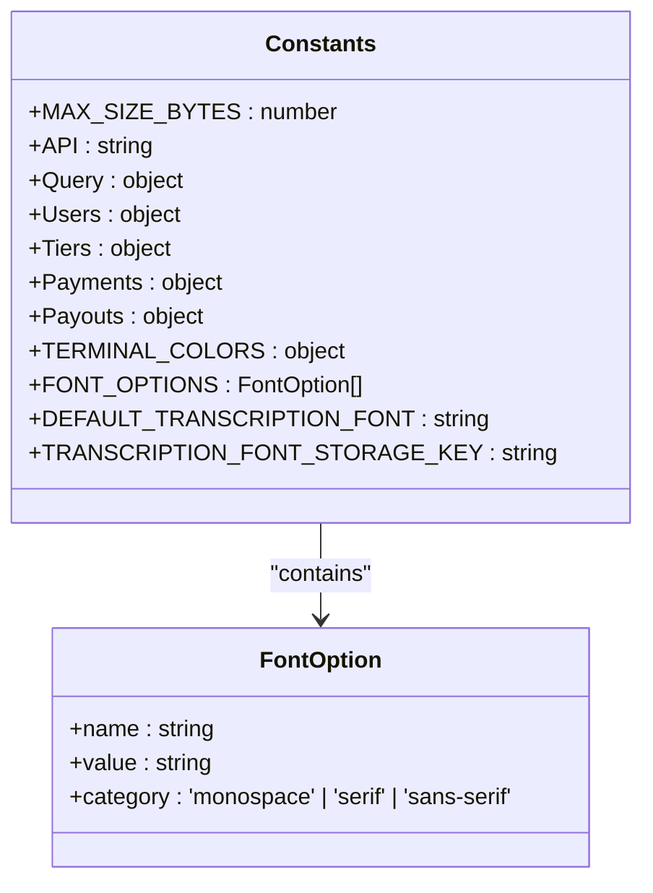
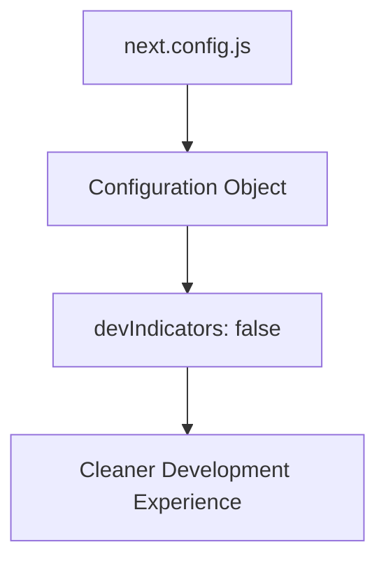
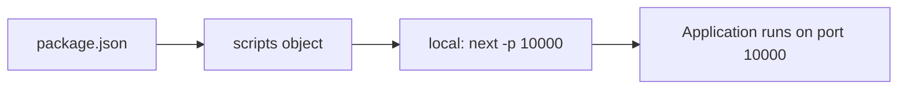
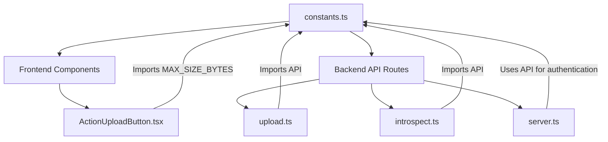
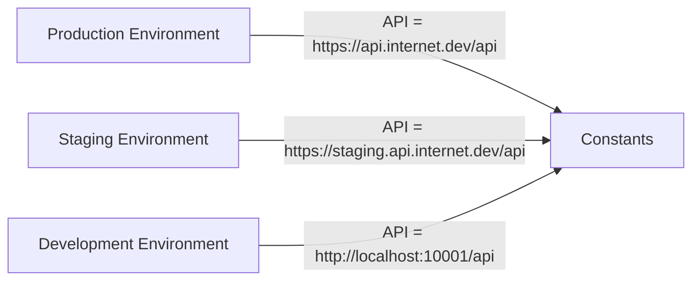
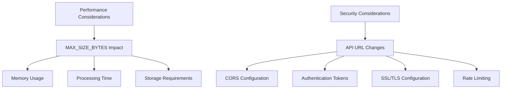
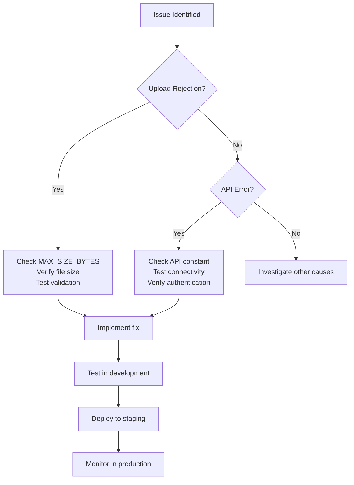

# Application Settings

<cite>
**Referenced Files in This Document**   
- [constants.ts](file://common/constants.ts)
- [next.config.js](file://next.config.js)
- [package.json](file://package.json)
- [upload.ts](file://pages/api/upload.ts)
- [ActionUploadButton.tsx](file://components/ActionUploadButton.tsx)
- [server.ts](file://common/server.ts)
- [introspect.ts](file://pages/api/introspect.ts)
</cite>

## Table of Contents
1. [Introduction](#introduction)
2. [Static Configuration in constants.ts](#static-configuration-in-constantsts)
3. [Next.js Framework Configuration](#nextjs-framework-configuration)
4. [Port Configuration and Execution](#port-configuration-and-execution)
5. [Usage Across Components](#usage-across-components)
6. [Environment-Specific Configuration](#environment-specific-configuration)
7. [Performance and Security Considerations](#performance-and-security-considerations)
8. [Troubleshooting Common Issues](#troubleshooting-common-issues)

## Introduction
This document details the application settings configuration for the Next.js offline Whisper-to-LLM application. It focuses on static configuration values, framework-level settings, and their implementation across frontend and backend components. The analysis covers centralized constants, Next.js-specific configurations, port settings, and practical considerations for modification and troubleshooting.

**Section sources**
- [constants.ts](file://common/constants.ts)
- [next.config.js](file://next.config.js)
- [package.json](file://package.json)

## Static Configuration in constants.ts

The `constants.ts` file serves as the central repository for static configuration values used throughout the application. This approach ensures consistency and simplifies maintenance by providing a single source of truth for critical application parameters.

The file defines several key constants:
- `MAX_SIZE_BYTES`: Set to 15,728,640 bytes (15MB), this constant governs the maximum file size for uploads
- `API`: The base URL for API endpoints, currently configured to `https://api.internet.dev/api`
- User tier definitions used for access control and feature gating
- Payment and payout configurations
- Terminal color codes and font options for UI rendering

These constants are organized in a modular structure that separates concerns and enhances readability. The user tier system implements a hierarchical access model with increasing privilege levels from UNVERIFIED (0) to ADMIN (100).



**Diagram sources**
- [constants.ts](file://common/constants.ts#L1-L126)

**Section sources**
- [constants.ts](file://common/constants.ts#L1-L126)

## Next.js Framework Configuration

The Next.js framework configuration is managed through the `next.config.js` file, which contains minimal but essential settings for the development experience. The configuration object disables development indicators, providing a cleaner interface during development.

The current configuration focuses on developer experience rather than performance or build optimizations. By setting `devIndicators: false`, the application suppresses visual indicators that might otherwise appear during development, creating a more production-like environment for testing and debugging.

This minimalist approach to framework configuration suggests that the application relies on Next.js defaults for most settings, focusing customization only on aspects that directly impact the development workflow.



**Diagram sources**
- [next.config.js](file://next.config.js#L1-L5)

**Section sources**
- [next.config.js](file://next.config.js#L1-L5)

## Port Configuration and Execution

Port configuration for the application is handled externally through the `package.json` scripts rather than within configuration files. The `local` script specifies port 10000 using the Next.js `-p` flag: `next -p 10000`.

This approach provides flexibility in deployment scenarios, allowing different environments to use different ports without modifying configuration files. The port setting is isolated to the execution context, making it easy to override for testing or production deployments.

The separation of port configuration from application code follows the principle of environment-specific settings being managed at the execution level rather than being hardcoded in configuration files.



**Diagram sources**
- [package.json](file://package.json#L10-L15)

**Section sources**
- [package.json](file://package.json#L1-L30)

## Usage Across Components

The centralized constants are imported and utilized across both frontend and backend components through module imports. The application uses a consistent import pattern with aliases (`@common/constants`) to reference the constants file.

On the frontend, components like `ActionUploadButton.tsx` import `MAX_SIZE_BYTES` to validate file sizes before upload. The upload component uses client-side validation to provide immediate feedback to users when files exceed the size limit.

On the backend, API routes such as `upload.ts` and `introspect.ts` import the `API` constant for server-side operations and authentication. The `server.ts` file uses the API constant when making requests to external services for user authentication and data retrieval.

This pattern of centralized configuration with widespread usage ensures consistency across the application and simplifies updates when configuration values need to change.



**Diagram sources**
- [constants.ts](file://common/constants.ts#L1-L126)
- [ActionUploadButton.tsx](file://components/ActionUploadButton.tsx#L1-L60)
- [upload.ts](file://pages/api/upload.ts#L1-L107)
- [introspect.ts](file://pages/api/introspect.ts#L1-L149)
- [server.ts](file://common/server.ts#L1-L98)

**Section sources**
- [constants.ts](file://common/constants.ts#L1-L126)
- [ActionUploadButton.tsx](file://components/ActionUploadButton.tsx#L1-L60)
- [upload.ts](file://pages/api/upload.ts#L1-L107)

## Environment-Specific Configuration

The application can be adapted for different environments through configuration modifications. To change the API endpoint for staging environments, developers can modify the `API` constant in `constants.ts` to point to a staging server URL.

For example, switching to a staging environment would involve changing:
```typescript
export const API = `https://staging.api.internet.dev/api`;
```

Modifying the upload size limit requires updating the `MAX_SIZE_BYTES` constant. Increasing the limit to 25MB would involve:
```typescript
export const MAX_SIZE_BYTES = 26214400; // 25MB
```

When making these changes, developers must consider the implications on server resources, client performance, and user experience. Larger file sizes require more memory and processing power, while different API endpoints may have varying authentication requirements and response times.



**Diagram sources**
- [constants.ts](file://common/constants.ts#L1-L126)

**Section sources**
- [constants.ts](file://common/constants.ts#L1-L126)

## Performance and Security Considerations

Adjusting the `MAX_SIZE_BYTES` constant has significant performance implications. Increasing the upload limit requires careful consideration of server memory, processing time, and storage capacity. Larger audio files result in longer transcription times and increased resource consumption.

The current 15MB limit represents a balance between functionality and performance, accommodating most audio files while preventing excessive resource usage. When increasing this limit, developers should implement additional safeguards such as:

- Server-side validation to enforce the limit regardless of client behavior
- Progress indicators for long-running uploads and processing
- Memory management strategies to handle large file buffers
- Timeout configurations for extended operations

Changing API URLs introduces security considerations, particularly regarding CORS (Cross-Origin Resource Sharing) and authentication. The `server.ts` file implements CORS configuration that must align with the target API's domain. When switching to a different API endpoint, developers must ensure that:

- The new endpoint supports the required CORS headers
- Authentication tokens are valid for the target environment
- SSL/TLS certificates are properly configured
- Rate limiting and usage quotas are understood and accounted for



**Diagram sources**
- [constants.ts](file://common/constants.ts#L1-L126)
- [server.ts](file://common/server.ts#L1-L98)

**Section sources**
- [constants.ts](file://common/constants.ts#L1-L126)
- [server.ts](file://common/server.ts#L1-L98)

## Troubleshooting Common Issues

Common issues related to application settings typically fall into two categories: file upload rejections and API connectivity errors.

File upload rejections are often caused by files exceeding the `MAX_SIZE_BYTES` limit. When this occurs, the application should provide clear feedback to users. Developers can troubleshoot by:

- Verifying the file size against the 15MB limit
- Checking client-side validation in `ActionUploadButton.tsx`
- Ensuring server-side validation in `upload.ts` is functioning correctly
- Confirming that the `MAX_SIZE_BYTES` constant has not been inadvertently modified

API connectivity errors may result from incorrect API URLs, network issues, or authentication problems. Troubleshooting steps include:

- Verifying the `API` constant value in `constants.ts`
- Checking network connectivity to the API endpoint
- Validating authentication tokens in cookies or headers
- Reviewing CORS configuration in `server.ts`
- Testing the API endpoint independently using tools like curl or Postman

When implementing changes to configuration values, developers should follow a systematic approach:

1. Update the relevant constant in `constants.ts`
2. Test the change in a development environment
3. Verify functionality across affected components
4. Deploy to staging for further testing
5. Monitor performance and error logs after production deployment



**Diagram sources**
- [constants.ts](file://common/constants.ts#L1-L126)
- [ActionUploadButton.tsx](file://components/ActionUploadButton.tsx#L1-L60)
- [upload.ts](file://pages/api/upload.ts#L1-L107)
- [server.ts](file://common/server.ts#L1-L98)

**Section sources**
- [constants.ts](file://common/constants.ts#L1-L126)
- [ActionUploadButton.tsx](file://components/ActionUploadButton.tsx#L1-L60)
- [upload.ts](file://pages/api/upload.ts#L1-L107)
- [server.ts](file://common/server.ts#L1-L98)