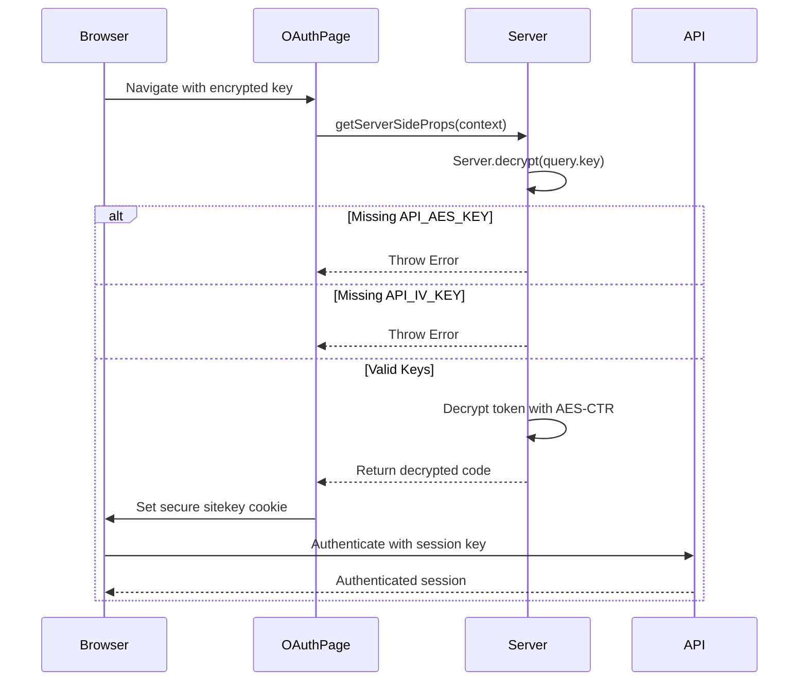

# Environment Variables

<cite>
**Referenced Files in This Document**  
- [server.ts](file://common/server.ts)
- [oauth.tsx](file://pages/oauth.tsx)
- [constants.ts](file://common/constants.ts)
</cite>

## Table of Contents
1. [Introduction](#introduction)
2. [Critical Environment Variables](#critical-environment-variables)
3. [Runtime Configuration and Consumption](#runtime-configuration-and-consumption)
4. [Security Implications](#security-implications)
5. [Setup Instructions](#setup-instructions)
6. [Troubleshooting Guide](#troubleshooting-guide)
7. [Best Practices](#best-practices)

## Introduction
This document details the runtime configuration requirements for the Next.js application, with a focus on critical environment variables used for decrypting authentication tokens from api.internet.dev. These variables enable essential features such as password recovery and Google OAuth authentication. The documentation covers the purpose, implementation, security considerations, and operational guidance for managing these sensitive configuration values.

## Critical Environment Variables

The application requires two critical environment variables for server-side decryption of authentication tokens:

- **API_AES_KEY**: The AES encryption key used for decrypting authentication tokens received from api.internet.dev
- **API_IV_KEY**: The initialization vector (IV) key in Base64 format, used in conjunction with the AES key for secure decryption

These variables are essential for enabling password recovery functionality and Google OAuth integration. Without properly configured values, the application cannot decrypt authentication tokens, resulting in failed authentication flows and restricted access to protected endpoints.

**Section sources**
- [server.ts](file://common/server.ts#L15-L40)

## Runtime Configuration and Consumption

The environment variables are consumed within the `decrypt()` utility function in server.ts, which handles the decryption of authentication tokens passed through the OAuth flow. When a user authenticates via Google OAuth, the encrypted token is passed as a query parameter and processed through this decryption function.

The decryption process follows these steps:
1. Validate the presence of both API_AES_KEY and API_IV_KEY environment variables
2. Convert the AES key from UTF-8 to byte array format
3. Decode the Base64-encoded IV key and convert to hex bytes
4. Initialize AES-CTR mode with the key and IV
5. Decrypt the incoming hex-encoded token
6. Return the decrypted plaintext result

The decrypted value is then used as a session key, stored in a secure cookie, and used for subsequent authentication requests to api.internet.dev.



**Diagram sources**
- [server.ts](file://common/server.ts#L15-L40)
- [oauth.tsx](file://pages/oauth.tsx#L25-L35)

**Section sources**
- [server.ts](file://common/server.ts#L15-L40)
- [oauth.tsx](file://pages/oauth.tsx#L25-L35)

## Security Implications

Exposing the API_AES_KEY and API_IV_KEY environment variables poses significant security risks:

1. **Authentication Bypass**: Attackers with access to these keys can decrypt authentication tokens and impersonate users
2. **Session Hijacking**: Compromised keys enable the creation of valid session tokens without proper authentication
3. **Service Abuse**: Attackers can generate unlimited authenticated requests to api.internet.dev, potentially exceeding rate limits or incurring costs
4. **Data Exposure**: Decrypted tokens may contain sensitive user information or permissions

The application implements validation checks that throw explicit errors when either key is missing, preventing silent failures that could lead to security vulnerabilities. However, the presence of these keys in the codebase comments (as placeholders) highlights the importance of proper .env file management and gitignore configuration to prevent accidental exposure.

**Section sources**
- [server.ts](file://common/server.ts#L15-L30)

## Setup Instructions

To configure the environment variables for development:

1. **Establish Partnership**: Contact the service provider (api.internet.dev) to establish a partnership and obtain valid API_AES_KEY and API_IV_KEY values
2. **Create .env File**: In the project root directory, create a `.env` file
3. **Add Configuration**: Populate the .env file with the provided keys:
   ```
   API_AES_KEY=your_provided_aes_key_value
   API_IV_KEY=your_provided_base64_iv_value
   ```
4. **Environment Validation**: Restart the development server to ensure the variables are properly loaded
5. **Test Authentication**: Navigate through the OAuth flow to verify successful token decryption

The application will throw descriptive errors if either environment variable is missing or invalid, guiding developers through the setup process.

**Section sources**
- [server.ts](file://common/server.ts#L15-L30)

## Troubleshooting Guide

### Decryption Failures
**Symptoms**: Application throws "process.env.API_AES_KEY" or "process.env.API_IV_KEY" errors
**Causes**: 
- Environment variables not defined in .env file
- .env file not present in project root
- Invalid file permissions preventing access
- Syntax errors in .env file

**Solutions**:
1. Verify .env file exists in project root
2. Check that API_AES_KEY and API_IV_KEY are properly defined
3. Ensure no trailing spaces or special characters in key values
4. Restart the development server after making changes

### Invalid Session Keys
**Symptoms**: Authentication succeeds but subsequent requests fail
**Causes**:
- Incorrect AES key or IV values
- Corrupted Base64 encoding of IV
- Mismatched encryption parameters

**Solutions**:
1. Verify key values with service provider
2. Check that API_IV_KEY is properly Base64-encoded
3. Ensure no modifications to the decryption logic

### Authentication Timeouts
**Symptoms**: OAuth flow redirects but authentication fails
**Causes**:
- Delayed cookie setting due to decryption errors
- Secure flag issues in development environment

**Solutions**:
1. Verify decryption completes successfully
2. Check browser developer tools for cookie setting
3. Ensure development environment supports secure cookies

**Section sources**
- [server.ts](file://common/server.ts#L15-L40)
- [oauth.tsx](file://pages/oauth.tsx#L10-L25)

## Best Practices

### Production Security
1. **Secret Management**: Use dedicated secret management tools (AWS Secrets Manager, Hashicorp Vault, or similar) rather than .env files in production
2. **Access Control**: Restrict access to environment variables to authorized personnel only
3. **Rotation Policy**: Implement regular key rotation procedures in coordination with the service provider
4. **Audit Logging**: Monitor and log access to decryption functionality

### Development Workflow
1. **Git Safety**: Add `.env` to .gitignore to prevent accidental commits
2. **Template File**: Create `.env.example` with placeholder values for team reference
3. **Validation**: Implement pre-commit hooks to scan for accidental secret exposure
4. **Environment Isolation**: Use different key sets for development, staging, and production environments

### Error Handling
The current implementation provides clear error messages for missing environment variables, which is appropriate for development but should be handled more discreetly in production to avoid information leakage. Consider implementing a more generic error response in production environments while maintaining detailed logging for debugging purposes.

**Section sources**
- [server.ts](file://common/server.ts#L15-L40)