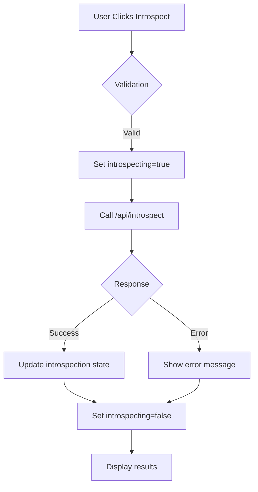
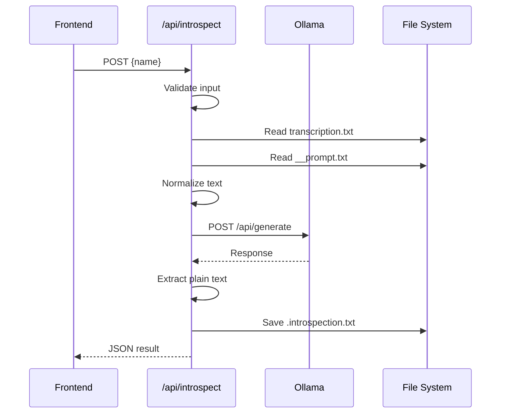
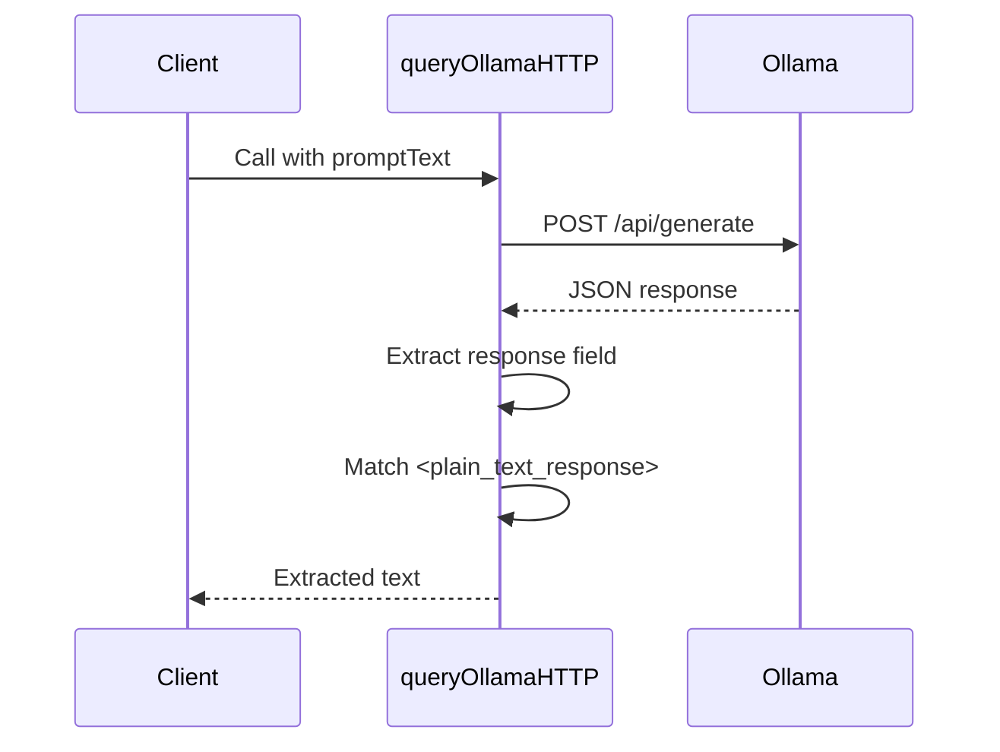

# AI Introspection with Ollama

<cite>
**Referenced Files in This Document**   
- [Application.tsx](file://components/Application.tsx)
- [introspect.ts](file://pages/api/introspect.ts)
- [get-introspection.ts](file://pages/api/get-introspection.ts)
- [constants.ts](file://common/constants.ts)
- [queries.ts](file://common/queries.ts)
</cite>

## Table of Contents
1. [Introduction](#introduction)
2. [Core Components](#core-components)
3. [Architecture Overview](#architecture-overview)
4. [Detailed Component Analysis](#detailed-component-analysis)
5. [Dependency Analysis](#dependency-analysis)
6. [Performance Considerations](#performance-considerations)
7. [Troubleshooting Guide](#troubleshooting-guide)
8. [Conclusion](#conclusion)

## Introduction
The AI Introspection feature enables users to gain deep insights from audio transcriptions by leveraging a locally running Ollama instance. This system processes transcribed text through a large language model (LLM) to generate thoughtful analysis based on a predefined prompt structure. The feature is accessible through a web interface where users can upload audio files, generate transcriptions, and initiate introspection analysis. The architecture integrates frontend components with backend API endpoints that communicate directly with Ollama's API at localhost:11434, enabling offline, privacy-preserving AI analysis.

## Core Components

The AI Introspection system consists of several key components that work together to provide insight generation capabilities. The frontend Application component manages user interaction and state, while backend API endpoints handle the processing pipeline. The system integrates with Ollama for LLM inference, using a specific prompt structure to guide the analysis. Two primary API endpoints facilitate the introspection workflow: one to initiate analysis and another to retrieve results. The system also includes utility functions for text normalization and HTTP communication with the Ollama server.

**Section sources**
- [Application.tsx](file://components/Application.tsx#L43-L269)
- [introspect.ts](file://pages/api/introspect.ts#L94-L148)
- [get-introspection.ts](file://pages/api/get-introspection.ts#L14-L47)

## Architecture Overview

The AI Introspection architecture follows a client-server pattern with clear separation between frontend presentation and backend processing. The system begins with user interaction through the Application component, which coordinates state management for uploading, transcribing, and introspecting audio content. When a user requests introspection, the frontend calls the /api/introspect endpoint, which retrieves the transcription and combines it with a default prompt. This combined input is sent to the locally running Ollama instance for analysis. The results are stored as text files and can be retrieved via the /api/get-introspection endpoint. The architecture ensures offline operation by hosting the LLM locally and storing all data on the user's machine.

```mermaid
graph TB
A[User Interface] --> B[/api/introspect]
A --> C[/api/get-introspection]
B --> D[Ollama Instance]
D --> E[Analysis Result]
E --> F[Store .introspection.txt]
F --> C
C --> A
G[Transcription.txt] --> B
H[__prompt.txt] --> B
```

**Diagram sources **
- [Application.tsx](file://components/Application.tsx#L43-L269)
- [introspect.ts](file://pages/api/introspect.ts#L94-L148)
- [get-introspection.ts](file://pages/api/get-introspection.ts#L14-L47)

## Detailed Component Analysis

### Frontend Integration Analysis

The Application component serves as the central interface for the AI Introspection feature, managing all user interactions and state transitions. It maintains several state variables including introspecting, which controls the loading state during analysis, and introspection, which stores the results for display. The component renders an "Introspect" button that triggers the analysis process when clicked, with appropriate disabled states to prevent concurrent operations.



**Diagram sources **
- [Application.tsx](file://components/Application.tsx#L43-L269)

**Section sources**
- [Application.tsx](file://components/Application.tsx#L43-L269)

### API Endpoint Analysis

#### Introspection Processing Endpoint
The /api/introspect endpoint handles the core processing of introspection requests. It first validates the input, then locates the repository root by searching for global.scss. The endpoint reads the transcription file and the default prompt, normalizes the text, and constructs a query by combining these elements with directive instructions. This query is sent to Ollama's API, and the response is extracted and saved to a file with the .introspection.txt extension.



**Diagram sources **
- [introspect.ts](file://pages/api/introspect.ts#L94-L148)

#### Introspection Retrieval Endpoint
The /api/get-introspection endpoint provides access to previously generated introspection results. It follows a similar pattern to the processing endpoint by validating input and locating the repository root. The endpoint constructs the expected filename by replacing the .wav extension with .wav.introspection.txt, checks if the file exists, and returns its contents if found. This design ensures that introspection results are stored alongside their source audio files for easy management.

```mermaid
flowchart TD
A[/api/get-introspection] --> B{Validate name}
B --> |Invalid| C[Return 400]
B --> |Valid| D[Find repo root]
D --> E[Construct file path]
E --> F{File exists?}
F --> |No| G[Return 404]
F --> |Yes| H[Read file]
H --> I[Return JSON]
```

**Diagram sources **
- [get-introspection.ts](file://pages/api/get-introspection.ts#L14-L47)

**Section sources**
- [introspect.ts](file://pages/api/introspect.ts#L94-L148)
- [get-introspection.ts](file://pages/api/get-introspection.ts#L14-L47)

### Ollama Integration Analysis

The integration with Ollama occurs through direct HTTP requests to the local server at localhost:11434. The queryOllamaHTTP function formats requests according to Ollama's API specification, using the gemma3:27b model with streaming disabled. The request includes the combined prompt and transcription, and the response is processed to extract content wrapped in <plain_text_response> tags as specified in the constants. The integration uses an undici Agent with disabled timeouts to accommodate potentially long inference times.



**Diagram sources **
- [introspect.ts](file://pages/api/introspect.ts#L63-L86)

**Section sources**
- [introspect.ts](file://pages/api/introspect.ts#L63-L86)
- [constants.ts](file://common/constants.ts#L10-L13)

## Dependency Analysis

The AI Introspection feature has a well-defined dependency structure that connects frontend components with backend services. The Application component depends on the queries module to make API calls, which in turn relies on constants for configuration values. The API endpoints depend on server utilities for CORS handling and file system operations. A critical dependency is the connection to the local Ollama instance, which must be running for introspection to work. The system also depends on specific file naming conventions and directory structure to locate transcription and prompt files.

```mermaid
graph LR
A[Application.tsx] --> B[queries.ts]
B --> C[constants.ts]
A --> D[/api/introspect]
A --> E[/api/get-introspection]
D --> F[Ollama]
E --> G[File System]
D --> G
D --> C
```

**Diagram sources **
- [Application.tsx](file://components/Application.tsx#L43-L269)
- [queries.ts](file://common/queries.ts#L3-L29)
- [constants.ts](file://common/constants.ts#L10-L13)
- [introspect.ts](file://pages/api/introspect.ts#L94-L148)
- [get-introspection.ts](file://pages/api/get-introspection.ts#L14-L47)

**Section sources**
- [Application.tsx](file://components/Application.tsx#L43-L269)
- [queries.ts](file://common/queries.ts#L3-L29)
- [constants.ts](file://common/constants.ts#L10-L13)

## Performance Considerations

The performance of the AI Introspection feature is primarily determined by the Ollama inference time, which depends on the model size (gemma3:27b) and the user's hardware capabilities. The 27-billion parameter model requires significant computational resources, leading to potentially long processing times (over 5 minutes as noted in confirmation dialogs). Network latency is minimal since communication occurs locally via localhost. The system handles large responses by disabling Next.js API response limits. Text normalization is performed efficiently with linear time complexity relative to input size. For optimal performance, users should have adequate RAM and a capable GPU to accelerate inference. The frontend manages user experience by displaying loading indicators and preventing concurrent operations that could overwhelm system resources.

**Section sources**
- [Application.tsx](file://components/Application.tsx#L43-L269)
- [introspect.ts](file://pages/api/introspect.ts#L94-L148)
- [constants.ts](file://common/constants.ts#L10-L13)

## Troubleshooting Guide

Common issues with the AI Introspection feature typically relate to Ollama availability, file system access, or prompt effectiveness. If introspection fails, first verify that Ollama is running and accessible at localhost:11434. Check that the required files (__prompt.txt and transcription files) exist in the public directory. Ensure the Ollama model gemma3:27b is properly downloaded and available. For prompt effectiveness, verify that the prompt structure includes the required <plain_text_response> tags in the output. The system may fail silently if the transcription file is empty or if there are permission issues writing to the file system. Users experiencing long delays should ensure their hardware meets the requirements for running large language models locally.

**Section sources**
- [introspect.ts](file://pages/api/introspect.ts#L63-L86)
- [get-introspection.ts](file://pages/api/get-introspection.ts#L14-L47)
- [constants.ts](file://common/constants.ts#L10-L13)

## Conclusion

The AI Introspection feature provides a powerful capability for generating insights from audio content using a locally hosted LLM. The system demonstrates a clean architecture with well-separated concerns between frontend presentation and backend processing. By leveraging Ollama, it enables offline, privacy-preserving AI analysis that can be customized through prompt engineering. The implementation shows attention to user experience with proper state management and error handling. Future improvements could include support for multiple models, enhanced prompt customization, and progress tracking for long-running inference tasks.