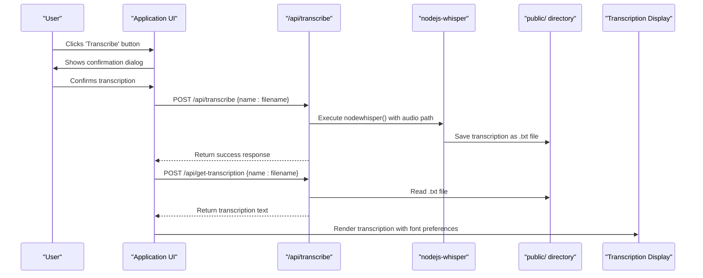
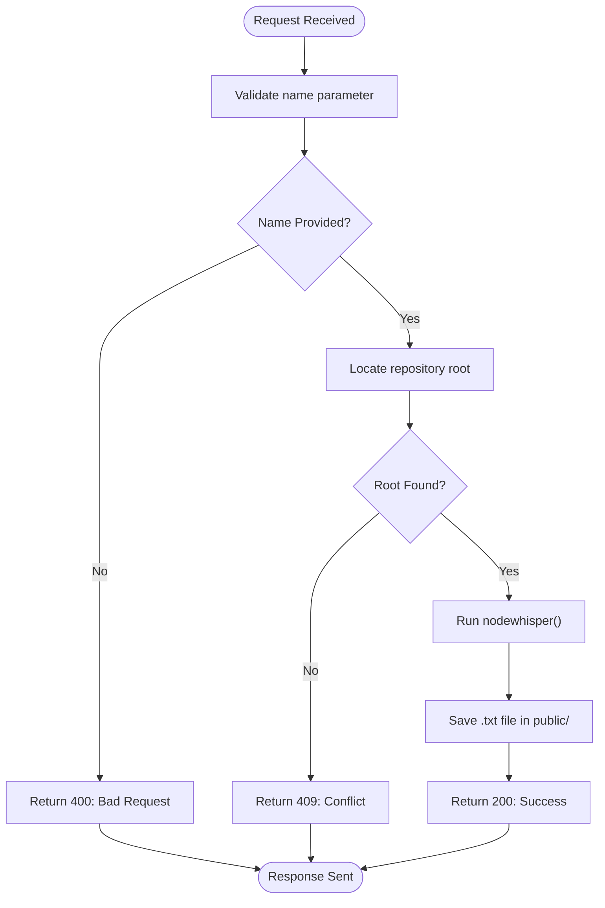
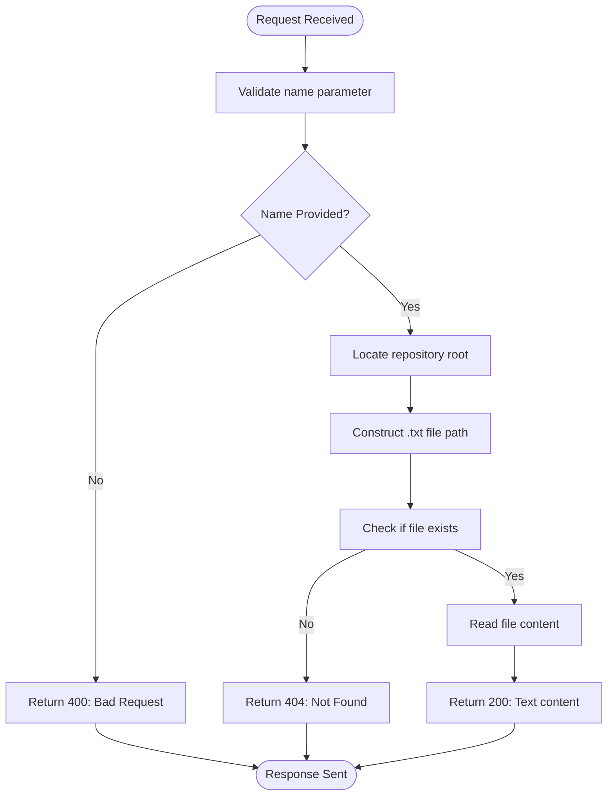

# Audio Transcription with Whisper

<cite>
**Referenced Files in This Document**   
- [Application.tsx](file://components/Application.tsx)
- [transcribe.ts](file://pages/api/transcribe.ts)
- [get-transcription.ts](file://pages/api/get-transcription.ts)
- [queries.ts](file://common/queries.ts)
- [constants.ts](file://common/constants.ts)
- [utilities.ts](file://common/utilities.ts)
</cite>

## Table of Contents
1. [Introduction](#introduction)
2. [Transcription Process Flow](#transcription-process-flow)
3. [Core Components](#core-components)
4. [API Endpoints](#api-endpoints)
5. [State Management](#state-management)
6. [Performance Considerations](#performance-considerations)
7. [Error Handling](#error-handling)
8. [Common Issues](#common-issues)

## Introduction
The Audio Transcription feature enables users to convert audio files to text using the Whisper model locally. The process begins when a user selects an audio file and clicks the 'Transcribe' button in the UI, triggering a sequence of operations that result in a plain-text transcription stored in the public directory. This document details the end-to-end workflow, component interactions, API design, and performance characteristics of the transcription system.

## Transcription Process Flow
The transcription process follows a sequential workflow from user interaction to result display:

1. User selects a .wav audio file from the file list
2. User clicks the 'Transcribe' button, triggering confirmation dialog
3. Frontend sends POST request to `/api/transcribe` endpoint
4. Server executes nodejs-whisper to process audio file
5. Transcription result saved as .txt file in public directory
6. Frontend retrieves transcription via `/api/get-transcription`
7. Result displayed in UI with current font preferences



**Diagram sources**
- [Application.tsx](file://components/Application.tsx#L175-L212)
- [transcribe.ts](file://pages/api/transcribe.ts#L16-L64)
- [get-transcription.ts](file://pages/api/get-transcription.ts#L14-L47)

## Core Components

The transcription feature relies on several key components working together to provide a seamless user experience.

**Section sources**
- [Application.tsx](file://components/Application.tsx#L39-L70)
- [transcribe.ts](file://pages/api/transcribe.ts#L16-L64)
- [queries.ts](file://common/queries.ts#L3-L29)

## API Endpoints

### /api/transcribe Endpoint
This endpoint handles the transcription request by processing the specified audio file using the Whisper model.



**Diagram sources**
- [transcribe.ts](file://pages/api/transcribe.ts#L16-L64)

### /api/get-transcription Endpoint
This endpoint retrieves the transcription text for a specified audio file.



**Diagram sources**
- [get-transcription.ts](file://pages/api/get-transcription.ts#L14-L47)

## State Management

The Application component manages transcription state through React hooks, coordinating UI updates with backend operations.

```mermaid
classDiagram
class Application {
+string prompt
+string current
+string[] files
+boolean uploading
+boolean transcribing
+boolean introspecting
+string transcription
+string introspection
+string transcriptionFont
-onSelect(name)
-handleFontChange(newFont)
}
class Queries {
+getData(route, key, body, qualifier)
}
Application --> Queries : "uses"
Application --> "localStorage" : "persists font preference"
```

**Diagram sources**
- [Application.tsx](file://components/Application.tsx#L39-L70)
- [queries.ts](file://common/queries.ts#L3-L29)

**Section sources**
- [Application.tsx](file://components/Application.tsx#L39-L70)
- [queries.ts](file://common/queries.ts#L3-L29)
- [utilities.ts](file://common/utilities.ts#L302-L314)
- [constants.ts](file://common/constants.ts#L124-L125)

## Performance Considerations

The transcription process has significant performance implications due to the computational intensity of speech-to-text processing.

### Processing Time Estimates
- **1 minute audio**: ~1-2 minutes processing time
- **5 minutes audio**: ~5-10 minutes processing time  
- **10 minutes audio**: ~10-20 minutes processing time
- **20 minutes audio**: ~20-40 minutes processing time

### Resource Requirements
- **CPU Usage**: High (80-100% during processing)
- **Memory**: 4-8GB RAM recommended
- **Disk Space**: Model files require ~3-5GB storage
- **Processing Model**: Single-threaded operation

The system uses the 'large-v3-turbo' Whisper model with CUDA disabled, making it CPU-intensive. Processing time scales approximately linearly with audio duration, with additional overhead for model loading and file I/O operations.

**Section sources**
- [transcribe.ts](file://pages/api/transcribe.ts#L16-L64)
- [Application.tsx](file://components/Application.tsx#L175-L212)

## Error Handling

The system implements comprehensive error handling at multiple levels to ensure robust operation.

### API Error Responses
- **400 Bad Request**: Missing or invalid name parameter
- **404 Not Found**: Transcription file does not exist
- **409 Conflict**: Unable to locate repository root
- **500 Internal Server**: File read/write failure

### Client-Side Error Management
The frontend gracefully handles various error scenarios:
- Disabled UI during processing to prevent concurrent operations
- Confirmation dialogs for long-running processes
- Alert messages for validation errors
- Null safety in API response handling

```mermaid
flowchart TD
A[User Action] --> B{System Busy?}
B --> |Yes| C[Show Alert: "Wait for current task"]
B --> |No| D{Valid Selection?}
D --> |No| E[Show Alert: "Select audio file"]
D --> |Yes| F[Confirm Long Process]
F --> G{Confirmed?}
G --> |No| H[Cancel Operation]
G --> |Yes| I[Start Transcription]
I --> J{Success?}
J --> |No| K[Handle API Error]
J --> |Yes| L[Display Result]
```

**Diagram sources**
- [Application.tsx](file://components/Application.tsx#L137-L173)
- [transcribe.ts](file://pages/api/transcribe.ts#L16-L64)
- [get-transcription.ts](file://pages/api/get-transcription.ts#L14-L47)

**Section sources**
- [Application.tsx](file://components/Application.tsx#L137-L173)
- [transcribe.ts](file://pages/api/transcribe.ts#L16-L64)
- [get-transcription.ts](file://pages/api/get-transcription.ts#L14-L47)

## Common Issues

### Transcription Accuracy
Accuracy depends on several factors:
- **Audio Quality**: Clear recordings yield better results
- **Background Noise**: Minimal noise improves accuracy
- **Speaker Clarity**: Distinct pronunciation enhances transcription
- **Model Limitations**: 'large-v3-turbo' model has inherent accuracy boundaries

### Long Processing Times
Large audio files result in extended processing durations due to:
- Computational complexity of speech recognition
- CPU-bound processing without GPU acceleration
- Sequential processing nature of Whisper model

### Failed Transcriptions
Transcription failures can occur due to:
- Insufficient system resources (memory, disk space)
- Corrupted audio files
- File permission issues in public directory
- Model loading failures

**Section sources**
- [transcribe.ts](file://pages/api/transcribe.ts#L16-L64)
- [Application.tsx](file://components/Application.tsx#L175-L212)
- [utilities.ts](file://common/utilities.ts#L17-L32)