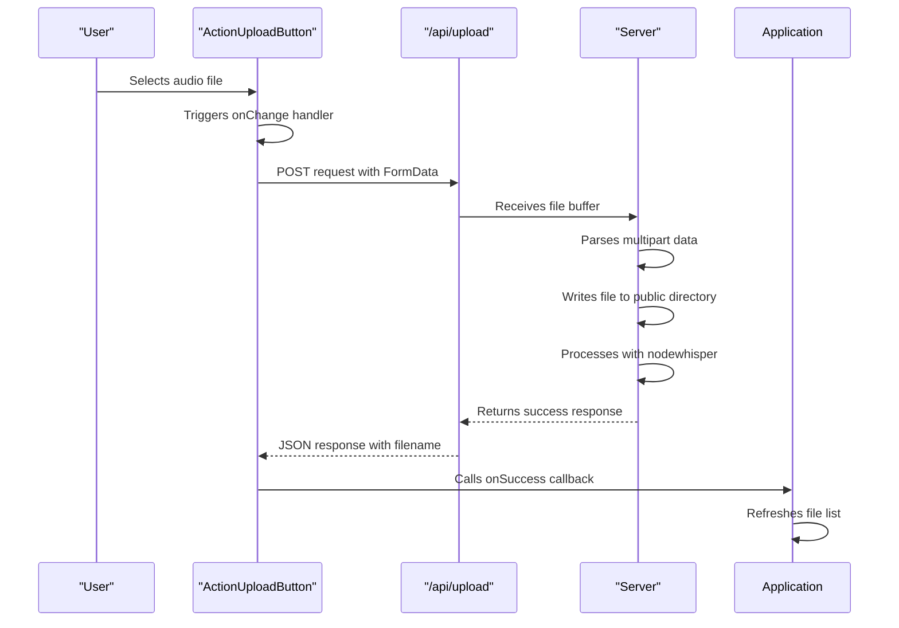
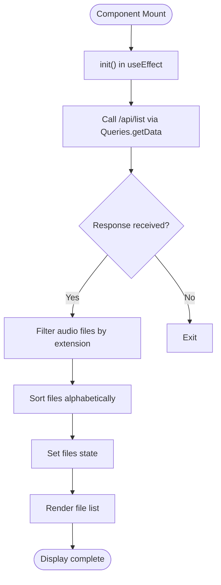
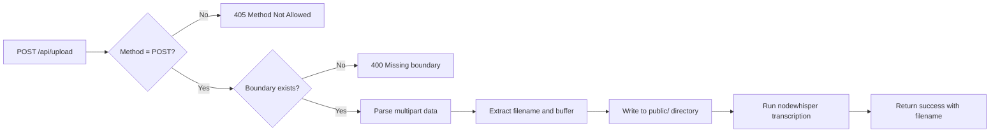
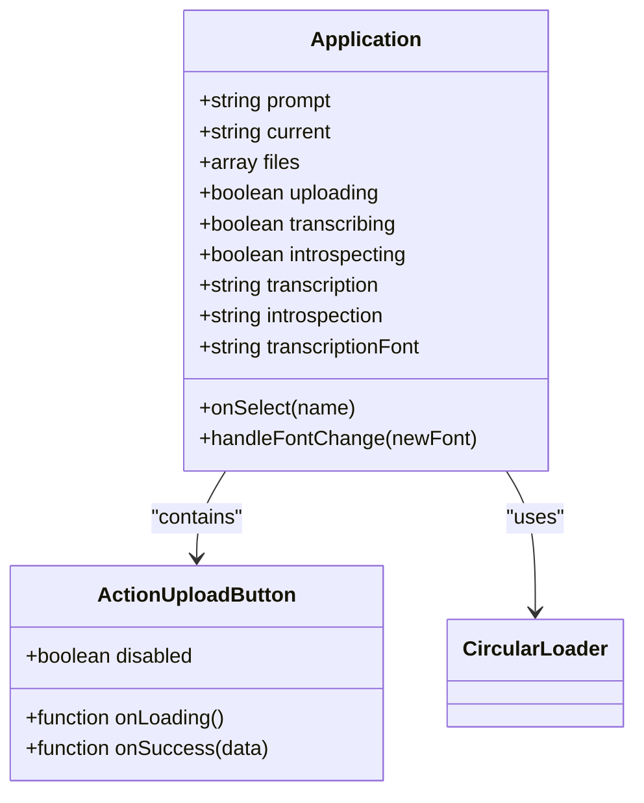

# Audio Upload and Management

<cite>
**Referenced Files in This Document**   
- [Application.tsx](file://components/Application.tsx)
- [ActionUploadButton.tsx](file://components/ActionUploadButton.tsx)
- [upload.ts](file://pages/api/upload.ts)
- [list.ts](file://pages/api/list.ts)
- [constants.ts](file://common/constants.ts)
- [queries.ts](file://common/queries.ts)
- [utilities.ts](file://common/utilities.ts)
</cite>

## Table of Contents
1. [Introduction](#introduction)
2. [File Upload Process](#file-upload-process)
3. [File List Retrieval and Display](#file-list-retrieval-and-display)
4. [API Endpoints](#api-endpoints)
5. [UI State Management](#ui-state-management)
6. [Error Handling and Common Issues](#error-handling-and-common-issues)
7. [Performance Considerations](#performance-considerations)
8. [Best Practices for User Feedback](#best-practices-for-user-feedback)

## Introduction
The Audio Upload and Management feature enables users to upload audio files, manage their availability, and initiate transcription processes within the application. This system integrates frontend components with backend API endpoints to handle file ingestion, storage, listing, and state synchronization. The primary interaction points include the `ActionUploadButton` component for uploading files and the file list display in `Application.tsx` that shows available audio files.

**Section sources**
- [Application.tsx](file://components/Application.tsx#L43-L269)
- [ActionUploadButton.tsx](file://components/ActionUploadButton.tsx#L1-L60)

## File Upload Process
Users can upload audio files through the `ActionUploadButton` component, which renders a file input field accepting audio files via the `accept="audio/*"` attribute. When a user selects a file, the `onChange` handler in `ActionUploadButton.tsx` captures the file, constructs a `FormData` object, and sends it to the `/api/upload` endpoint using the Fetch API.

During upload, the `onLoading` callback is triggered, setting relevant UI states to indicate processing. Upon successful upload, the `onSuccess` callback executes, refreshing the file list by calling the `/api/list` endpoint and updating component state accordingly.

**Diagram sources**
- [ActionUploadButton.tsx](file://components/ActionUploadButton.tsx#L25-L55)
- [upload.ts](file://pages/api/upload.ts#L40-L106)

**Section sources**
- [ActionUploadButton.tsx](file://components/ActionUploadButton.tsx#L25-L55)
- [upload.ts](file://pages/api/upload.ts#L40-L106)

## File List Retrieval and Display
The file list is retrieved during component initialization in `Application.tsx` using the `useEffect` hook, which calls the `/api/list` endpoint via `Queries.getData`. The response contains a list of audio files stored in the `public` directory, filtered by common audio extensions (WAV, MP3, OGG, FLAC, M4A).

The retrieved files are stored in the `files` state variable and rendered conditionally based on the `uploading` state. Only files with `.wav` extension are displayed, sorted alphabetically. Each file entry is interactive, allowing selection for transcription.

**Diagram sources**
- [Application.tsx](file://components/Application.tsx#L65-L85)
- [list.ts](file://pages/api/list.ts#L20-L40)

**Section sources**
- [Application.tsx](file://components/Application.tsx#L65-L85)
- [list.ts](file://pages/api/list.ts#L20-L40)

## API Endpoints

### /api/upload Endpoint
Handles file ingestion and storage. It disables Next.js body parsing to manually process multipart form data. The endpoint:
- Validates request method (POST only)
- Parses boundary from content-type header
- Concatenates stream chunks into a buffer
- Extracts filename and file data from multipart payload
- Determines repository root dynamically using `global.scss` presence
- Writes file to `public` directory
- Initiates transcription via `nodewhisper` with predefined options
- Returns uploaded filename on success

**Diagram sources**
- [upload.ts](file://pages/api/upload.ts#L10-L106)

**Section sources**
- [upload.ts](file://pages/api/upload.ts#L10-L106)

### /api/list Endpoint
Retrieves available audio files from the `public` directory:
- Resolves repository root dynamically
- Reads directory contents
- Filters files by audio extensions using regex
- Returns filtered list in JSON response

This endpoint supports client-side file listing without requiring full server-side scanning on every request.

**Section sources**
- [list.ts](file://pages/api/list.ts#L1-L40)

## UI State Management
The `Application` component manages several states related to audio operations:
- `uploading`: Indicates active upload or initialization
- `transcribing`: Shows transcription in progress
- `introspecting`: Indicates introspection process
- `files`: Stores list of available audio files
- `current`: Tracks selected audio file

File selection is handled through the `onSelect` function, which updates the current file and fetches associated transcription and introspection data. The `onSuccess` callback in `ActionUploadButton` refreshes the file list after upload, ensuring UI consistency.

**Diagram sources**
- [Application.tsx](file://components/Application.tsx#L43-L85)
- [ActionUploadButton.tsx](file://components/ActionUploadButton.tsx#L1-L60)

**Section sources**
- [Application.tsx](file://components/Application.tsx#L43-L85)
- [ActionUploadButton.tsx](file://components/ActionUploadButton.tsx#L1-L60)

## Error Handling and Common Issues

### File Format Restrictions
While the input accepts all audio types (`accept="audio/*"`), the UI only displays `.wav` files due to the filter `.filter((each) => each.toLowerCase().endsWith('.wav'))`. This creates a discrepancy between accepted and displayed formats.

### Upload Failures
Potential failure points include:
- Missing boundary in multipart request
- Invalid or missing filename in headers
- File system write errors
- Repository root resolution failure

Error responses use standard HTTP status codes (400, 405, 409, 500) with JSON payloads containing error flags.

### Race Conditions
Multiple simultaneous operations are prevented through state-based disabling:
- Upload button disabled during upload, transcription, or introspection
- File selection blocked during active processes via alert
- Confirmation dialogs for long-running operations

However, no explicit locking mechanism exists for concurrent requests to the same file, potentially leading to race conditions during transcription.

**Section sources**
- [Application.tsx](file://components/Application.tsx#L137-L150)
- [upload.ts](file://pages/api/upload.ts#L15-L45)
- [utilities.ts](file://common/utilities.ts#L280-L290)

## Performance Considerations
The system handles large audio files through several mechanisms:
- Disabling response limits in API configuration (`responseLimit: false`)
- Streaming request processing to avoid memory exhaustion
- Direct file buffer writing without intermediate transformations
- Asynchronous processing with `nodewhisper`

However, client-side memory usage may spike during large file uploads due to `Buffer.concat(chunks)` in `/api/upload`, which accumulates all incoming chunks in memory before processing.

For very large files, consider implementing:
- Chunked upload support
- Progress tracking
- Server-side streaming to disk
- Memory-efficient parsing

**Section sources**
- [upload.ts](file://pages/api/upload.ts#L5-L10)
- [list.ts](file://pages/api/list.ts#L5-L10)

## Best Practices for User Feedback
The application provides feedback through:
- Visual loading indicators (`CircularLoader`)
- Status captions ("PLEASE WAIT")
- Disabled interactive elements during processing
- Confirmation dialogs for long operations (~5 minutes)
- Alert messages for validation errors

Recommended improvements:
- Add upload progress percentage
- Implement error-specific messages
- Provide estimated processing time
- Enable cancellation for long operations
- Use toast notifications instead of alerts

The current implementation effectively prevents user actions during processing but could enhance transparency about operation status and duration.

**Section sources**
- [Application.tsx](file://components/Application.tsx#L107-L135)
- [ActionUploadButton.tsx](file://components/ActionUploadButton.tsx#L35-L45)