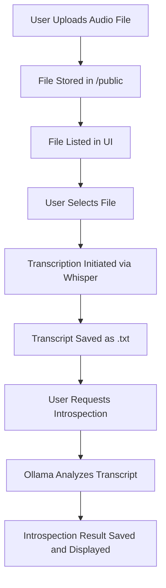
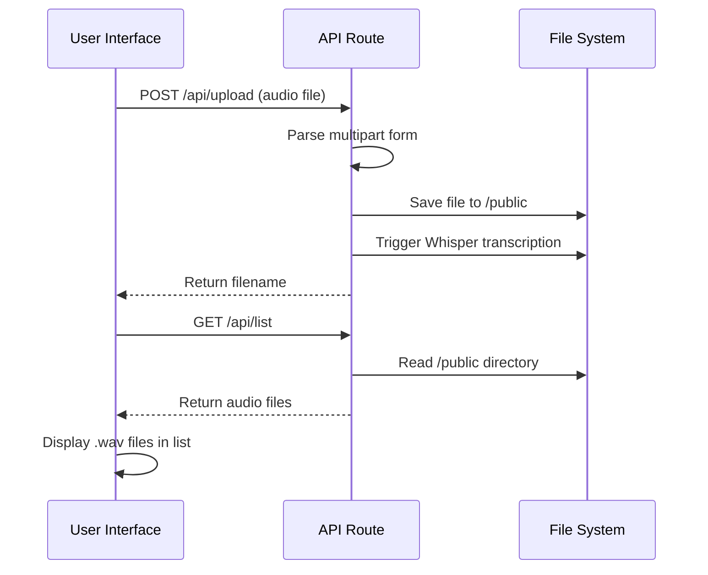
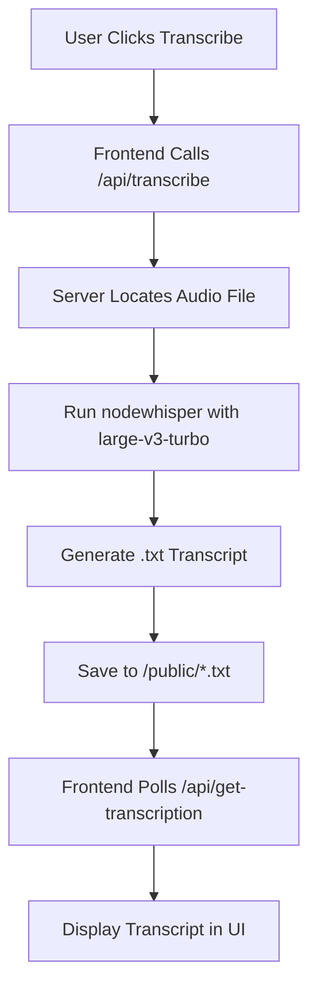
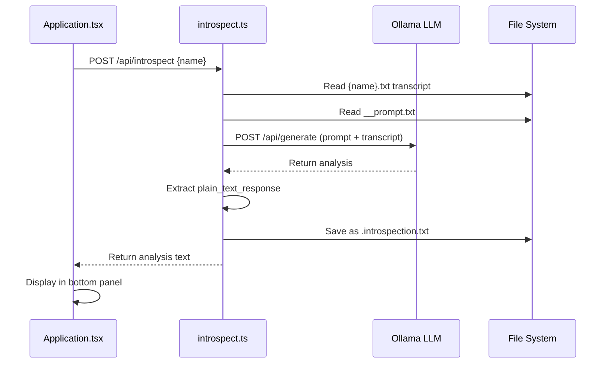
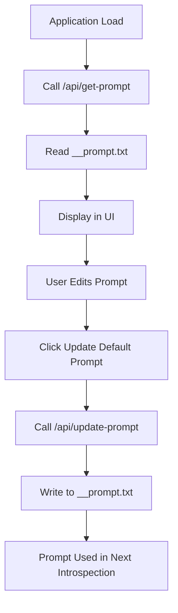
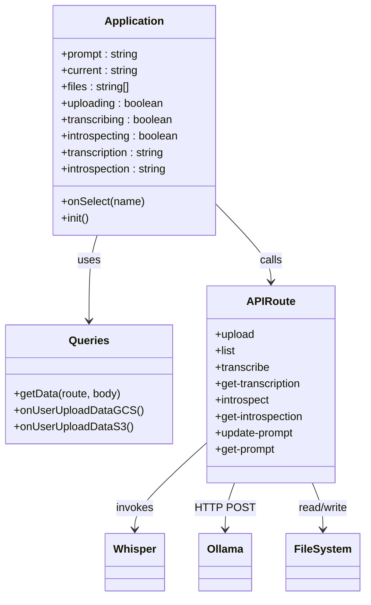

# Core Features

<cite>
**Referenced Files in This Document**   
- [Application.tsx](file://components/Application.tsx)
- [upload.ts](file://pages/api/upload.ts)
- [list.ts](file://pages/api/list.ts)
- [transcribe.ts](file://pages/api/transcribe.ts)
- [get-transcription.ts](file://pages/api/get-transcription.ts)
- [introspect.ts](file://pages/api/introspect.ts)
- [get-introspection.ts](file://pages/api/get-introspection.ts)
- [update-prompt.ts](file://pages/api/update-prompt.ts)
- [get-prompt.ts](file://pages/api/get-prompt.ts)
- [constants.ts](file://common/constants.ts)
</cite>

## Table of Contents
1. [End-to-End Workflow Overview](#end-to-end-workflow-overview)
2. [File Upload and Listing](#file-upload-and-listing)
3. [Transcription Processing](#transcription-processing)
4. [Transcript Introspection](#transcript-introspection)
5. [Prompt Customization](#prompt-customization)
6. [Integration Between Frontend and Backend](#integration-between-frontend-and-backend)
7. [Common Issues and Limitations](#common-issues-and-limitations)
8. [Performance Considerations](#performance-considerations)

## End-to-End Workflow Overview

The application enables users to upload audio files, transcribe them using Whisper, and analyze the resulting transcripts with Ollama. The workflow begins with file upload through the UI, where audio files are stored in the `public` directory. Once uploaded, users can select a file to initiate transcription. After transcription completes, the resulting text is displayed and can be further analyzed through introspection using a locally running LLM (Gemma3). Users can also customize the prompt used during introspection to influence the analysis output.

The frontend, built with React, manages application state and user interactions through the `Application.tsx` component, while API routes in the `pages/api` directory handle server-side operations including file management, transcription, and LLM communication.

**Diagram sources**
- [Application.tsx](file://components/Application.tsx#L36-L240)
- [upload.ts](file://pages/api/upload.ts#L1-L107)
- [transcribe.ts](file://pages/api/transcribe.ts#L1-L65)
- [introspect.ts](file://pages/api/introspect.ts#L1-L149)

**Section sources**
- [Application.tsx](file://components/Application.tsx#L36-L240)
- [upload.ts](file://pages/api/upload.ts#L1-L107)

## File Upload and Listing

The file upload functionality allows users to submit audio files through the UI, which are then stored in the `public` directory for processing. The `upload.ts` API route handles the multipart form data, extracts the file, and saves it to disk. Supported formats include WAV, MP3, OGG, FLAC, and M4A, as verified by the regex pattern in `list.ts`.

After upload, the `list.ts` API route scans the `public` directory and returns a filtered list of audio files. The frontend component `Application.tsx` displays only `.wav` files in the UI, sorted alphabetically. During initialization, the component fetches both the prompt and file list to populate the interface.

**Diagram sources**
- [upload.ts](file://pages/api/upload.ts#L1-L107)
- [list.ts](file://pages/api/list.ts#L1-L40)
- [Application.tsx](file://components/Application.tsx#L36-L240)

**Section sources**
- [upload.ts](file://pages/api/upload.ts#L1-L107)
- [list.ts](file://pages/api/list.ts#L1-L40)
- [Application.tsx](file://components/Application.tsx#L36-L240)

## Transcription Processing

Transcription is handled by the `transcribe.ts` API route, which invokes the `nodewhisper` library to process audio files using the `large-v3-turbo` Whisper model. When a user clicks the "Transcribe" button, the frontend sends a request to `/api/transcribe` with the selected filename. The server locates the file in the `public` directory and initiates transcription with specific output options: plain text output is enabled, while CSV, JSON, SRT, and other formats are disabled.

After transcription completes, the resulting text is saved as a `.txt` file in the same directory with the same base name. The `get-transcription.ts` route allows the frontend to retrieve this transcript for display. The process is stateful, with the UI showing a loading indicator during transcription to prevent concurrent operations.

**Diagram sources**
- [transcribe.ts](file://pages/api/transcribe.ts#L1-L65)
- [get-transcription.ts](file://pages/api/get-transcription.ts#L1-L48)
- [Application.tsx](file://components/Application.tsx#L36-L240)

**Section sources**
- [transcribe.ts](file://pages/api/transcribe.ts#L1-L65)
- [get-transcription.ts](file://pages/api/get-transcription.ts#L1-L48)

## Transcript Introspection

The introspection feature enables users to analyze transcribed text using the Ollama LLM (specifically the `gemma3:27b` model). When a user clicks "Introspect", the frontend calls `/api/introspect`, which reads both the transcript and the current prompt from the `public` directory. The system constructs a query combining the transcript and prompt, then sends it to the local Ollama API at `http://localhost:11434/api/generate`.

The response is processed to extract content between `<plain_text_response>` tags, normalized to handle line breaks and hyphenation, and saved as a `.introspection.txt` file. The `get-introspection.ts` route allows retrieval of this analysis. The frontend displays the result in the wide panel alongside the prompt editor.

**Diagram sources**
- [introspect.ts](file://pages/api/introspect.ts#L1-L149)
- [get-introspection.ts](file://pages/api/get-introspection.ts#L1-L48)
- [Application.tsx](file://components/Application.tsx#L36-L240)

**Section sources**
- [introspect.ts](file://pages/api/introspect.ts#L1-L149)
- [get-introspection.ts](file://pages/api/get-introspection.ts#L1-L48)

## Prompt Customization

Users can customize the prompt used during introspection through a dedicated text area in the UI. The current prompt is loaded on application initialization via `/api/get-prompt`, which reads the `__prompt.txt` file from the `public` directory. When the user clicks "Update Default Prompt", the `update-prompt.ts` route writes the new prompt text to the same file.

This prompt customization directly influences the LLM's analysis of transcripts, allowing users to tailor the introspection output to their specific needs. The prompt is combined with the transcript and directive tags when constructing queries to Ollama, as defined in the `Query.directives` constant in `constants.ts`.

**Diagram sources**
- [get-prompt.ts](file://pages/api/get-prompt.ts#L1-L43)
- [update-prompt.ts](file://pages/api/update-prompt.ts#L1-L50)
- [constants.ts](file://common/constants.ts#L1-L69)
- [Application.tsx](file://components/Application.tsx#L36-L240)

**Section sources**
- [get-prompt.ts](file://pages/api/get-prompt.ts#L1-L43)
- [update-prompt.ts](file://pages/api/update-prompt.ts#L1-L50)
- [constants.ts](file://common/constants.ts#L1-L69)

## Integration Between Frontend and Backend

The application integrates frontend components with backend API routes through a consistent pattern of state management and API calls. The `Application.tsx` component maintains state for files, current selection, transcription, introspection, and prompt using React hooks. It uses the `Queries.getData` utility to communicate with API routes, passing route paths and optional body parameters.

Each major operation (upload, transcribe, introspect, update prompt) follows the same pattern: UI interaction triggers a state change, an API call is made, and upon completion, relevant data is refreshed. The UI prevents concurrent operations by disabling buttons when `uploading`, `transcribing`, or `introspecting` states are active.

**Diagram sources**
- [Application.tsx](file://components/Application.tsx#L36-L240)
- [queries.ts](file://common/queries.ts#L1-L201)
- [upload.ts](file://pages/api/upload.ts#L1-L107)
- [introspect.ts](file://pages/api/introspect.ts#L1-L149)

**Section sources**
- [Application.tsx](file://components/Application.tsx#L36-L240)
- [queries.ts](file://common/queries.ts#L1-L201)

## Common Issues and Limitations

The application faces several common issues related to file handling, transcription accuracy, and LLM performance. Only specific audio formats are supported, with the system filtering for WAV, MP3, OGG, FLAC, and M4A files. While the upload interface accepts various formats, the transcription process may fail with unsupported codecs or sample rates.

Transcription accuracy depends on the Whisper model's capabilities and the audio quality. Background noise, overlapping speech, or technical terminology may reduce accuracy. The system uses the `large-v3-turbo` model, which balances quality and speed but may still produce errors in challenging audio conditions.

LLM response delays are significant due to the local execution of `gemma3:27b`, which requires substantial computational resources. The system uses an agent with no timeout to handle long-running requests, but users may experience waits exceeding five minutes for complex analyses. Network configuration issues may also prevent communication with the Ollama server if it's not running on `localhost:11434`.

**Section sources**
- [upload.ts](file://pages/api/upload.ts#L1-L107)
- [list.ts](file://pages/api/list.ts#L1-L40)
- [introspect.ts](file://pages/api/introspect.ts#L1-L149)
- [constants.ts](file://common/constants.ts#L1-L69)

## Performance Considerations

Performance is a critical factor in this application due to the computationally intensive nature of audio transcription and LLM inference. Large audio files significantly increase processing time, with transcription duration roughly proportional to audio length. The system does not impose file size limits beyond the 15MB default in `constants.ts`, but larger files will require more memory and processing time.

The Whisper transcription process runs synchronously in the API route, blocking other requests until completion. Similarly, Ollama inference occurs in a single-threaded manner, preventing concurrent introspection requests. The frontend mitigates this by disabling controls during processing to prevent race conditions.

Model loading time affects initial performance, as the `large-v3-turbo` model must be loaded into memory before transcription can begin. Subsequent transcriptions may be faster if the model remains loaded. For optimal performance, the system should run on hardware with sufficient RAM and a GPU to accelerate both Whisper and Ollama operations, though the current configuration runs on CPU only.

**Section sources**
- [upload.ts](file://pages/api/upload.ts#L1-L107)
- [transcribe.ts](file://pages/api/transcribe.ts#L1-L65)
- [introspect.ts](file://pages/api/introspect.ts#L1-L149)
- [constants.ts](file://common/constants.ts#L1-L69)