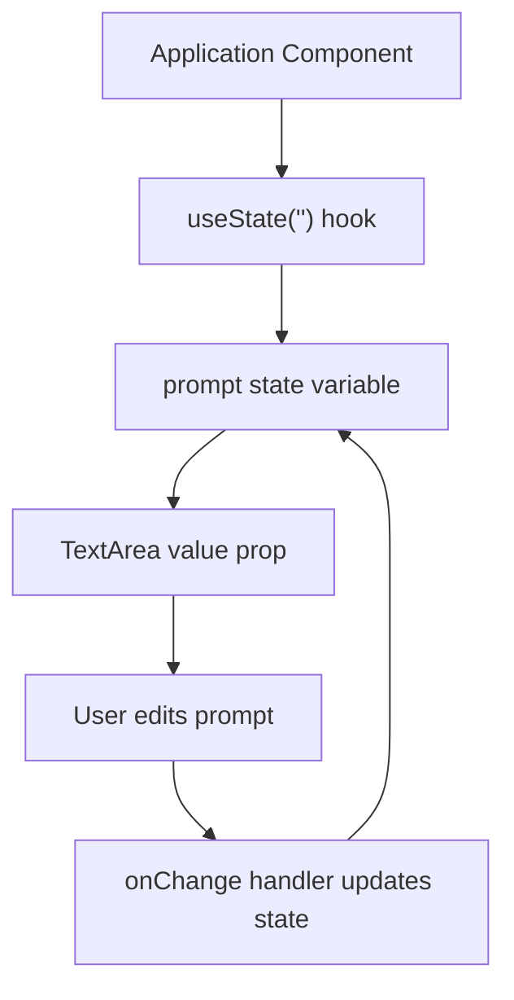
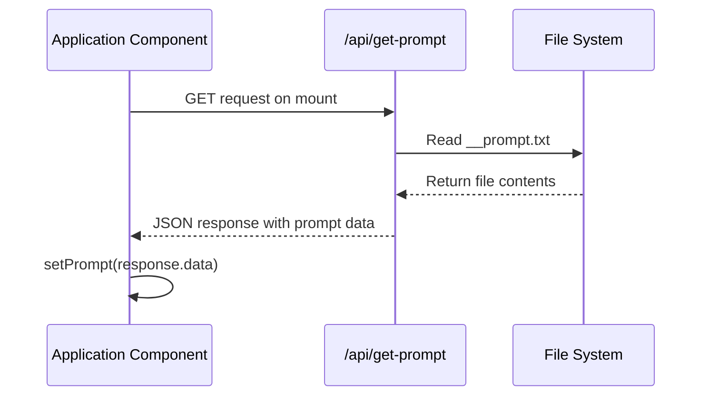
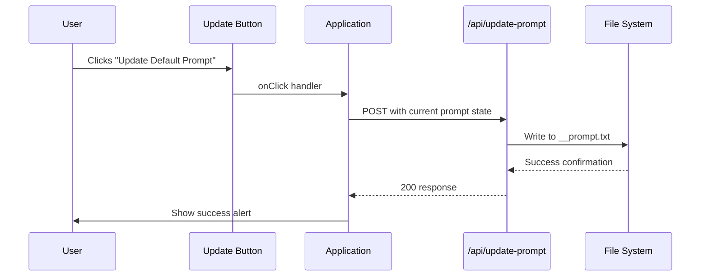
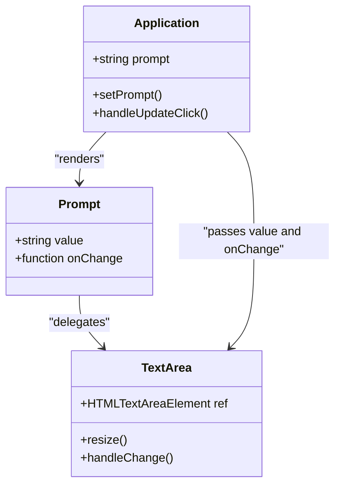
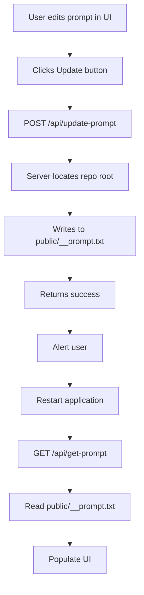
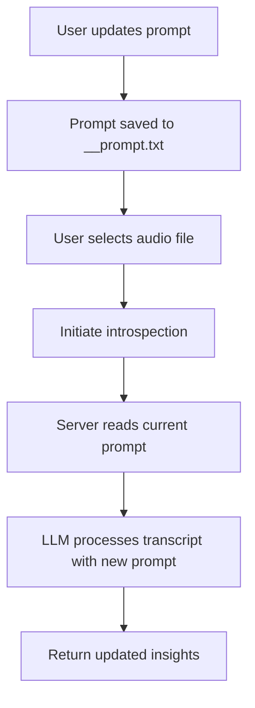

# Prompt Management

<cite>
**Referenced Files in This Document**   
- [Application.tsx](file://components/Application.tsx)
- [get-prompt.ts](file://pages/api/get-prompt.ts)
- [update-prompt.ts](file://pages/api/update-prompt.ts)
- [TextArea.tsx](file://components/TextArea.tsx)
- [queries.ts](file://common/queries.ts)
- [__prompt.txt](file://public/__prompt.txt)
</cite>

## Table of Contents
1. [Introduction](#introduction)
2. [Prompt State Management](#prompt-state-management)
3. [Prompt Retrieval on Startup](#prompt-retrieval-on-startup)
4. [Prompt Update Workflow](#prompt-update-workflow)
5. [UI Component Integration](#ui-component-integration)
6. [File System Persistence](#file-system-persistence)
7. [Common Issues and Troubleshooting](#common-issues-and-troubleshooting)
8. [Best Practices for Prompt Design](#best-practices-for-prompt-design)
9. [Impact on LLM Analysis](#impact-on-llm-analysis)
10. [Conclusion](#conclusion)

## Introduction
The Prompt Management feature enables users to customize the behavior of the Large Language Model (LLM) by editing and persisting prompts through the application interface. This documentation details the complete workflow from UI interaction to file system persistence, covering the React state management, API endpoints, and file operations that enable prompt customization. The system allows users to modify the default prompt that guides the LLM's introspection analysis, with changes persisted across application restarts.

## Prompt State Management
The application maintains prompt state using React's useState hook within the Application component. The prompt value is stored in component state and synchronized with both the UI input field and the backend file system.



**Diagram sources**
- [Application.tsx](file://components/Application.tsx#L43-L44)

**Section sources**
- [Application.tsx](file://components/Application.tsx#L43-L44)

## Prompt Retrieval on Startup
When the application initializes, it automatically fetches the current prompt from the server and populates the UI. This ensures users see the most recent prompt configuration upon loading the application.



**Diagram sources**
- [Application.tsx](file://components/Application.tsx#L109-L114)
- [get-prompt.ts](file://pages/api/get-prompt.ts#L25-L43)

**Section sources**
- [Application.tsx](file://components/Application.tsx#L109-L114)
- [get-prompt.ts](file://pages/api/get-prompt.ts#L25-L43)

## Prompt Update Workflow
The prompt update process involves user interaction with the UI, state updates, and API communication to persist changes to the file system.



**Diagram sources**
- [Application.tsx](file://components/Application.tsx#L243-L251)
- [update-prompt.ts](file://pages/api/update-prompt.ts#L25-L50)

**Section sources**
- [Application.tsx](file://components/Application.tsx#L243-L251)
- [update-prompt.ts](file://pages/api/update-prompt.ts#L25-L50)

## UI Component Integration
The prompt editing interface consists of a TextArea component bound to the application state, with a dedicated button to trigger the update process.



**Diagram sources**
- [Application.tsx](file://components/Application.tsx#L248-L249)
- [TextArea.tsx](file://components/TextArea.tsx#L6-L33)

**Section sources**
- [Application.tsx](file://components/Application.tsx#L248-L249)
- [TextArea.tsx](file://components/TextArea.tsx#L6-L33)

## File System Persistence
Prompt data is persisted in the public directory as __prompt.txt, ensuring accessibility and persistence across application restarts.



**Diagram sources**
- [update-prompt.ts](file://pages/api/update-prompt.ts#L38-L47)
- [get-prompt.ts](file://pages/api/get-prompt.ts#L32-L39)

**Section sources**
- [update-prompt.ts](file://pages/api/update-prompt.ts#L38-L47)
- [get-prompt.ts](file://pages/api/get-prompt.ts#L32-L39)

## Common Issues and Troubleshooting
This section addresses frequent challenges encountered when managing prompts.

### Prompt Persistence Issues
If prompts are not persisting across restarts, verify:
- The __prompt.txt file exists in the public directory
- The server has write permissions to the public directory
- The file path resolution in the API endpoints is correct

### Special Character Handling
The system uses UTF-8 encoding for prompt files, supporting most special characters. However, ensure:
- JSON serialization in API requests properly escapes special characters
- The file system encoding matches UTF-8
- No BOM (Byte Order Mark) is present in the text file

### File Format Requirements
The prompt file must:
- Be plain text format (.txt)
- Use UTF-8 encoding
- Not exceed reasonable size limits
- Contain valid JSON-serializable content

**Section sources**
- [update-prompt.ts](file://pages/api/update-prompt.ts#L42-L45)
- [get-prompt.ts](file://pages/api/get-prompt.ts#L36-L38)
- [__prompt.txt](file://public/__prompt.txt)

## Best Practices for Prompt Design
Effective prompts for introspection tasks should follow these guidelines:

### Structure and Clarity
- Use clear, imperative statements
- Number items for better parsing
- Keep instructions concise but comprehensive
- Avoid ambiguous language

### Example Effective Prompt
```
- Produce 10 meaningful insights in as much detail as possible
- Find some logical disconnect with the real world today
- Speak as one of the world's best professors without referencing yourself
```

### Content Guidelines
- Focus on analytical rather than creative tasks
- Specify output format requirements
- Include constraints to guide response length and depth
- Prioritize depth over breadth when requesting insights

**Section sources**
- [__prompt.txt](file://public/__prompt.txt)

## Impact on LLM Analysis
Changing the prompt directly affects subsequent LLM analyses by altering the instructions provided to the model.

### Immediate Effects
- The updated prompt is used in the next introspection request
- All future analyses use the new prompt until changed
- Previous analyses remain unchanged

### Analysis Workflow


**Diagram sources**
- [Application.tsx](file://components/Application.tsx#L158-L168)
- [update-prompt.ts](file://pages/api/update-prompt.ts#L42-L47)

**Section sources**
- [Application.tsx](file://components/Application.tsx#L158-L168)

## Conclusion
The Prompt Management system provides a complete solution for customizing LLM behavior through a user-friendly interface. By combining React state management, API endpoints, and file system persistence, users can effectively tailor the introspection process to their specific needs. The architecture ensures prompt persistence across sessions while providing immediate feedback on changes. Following best practices for prompt design will yield the most valuable insights from the LLM analysis process.