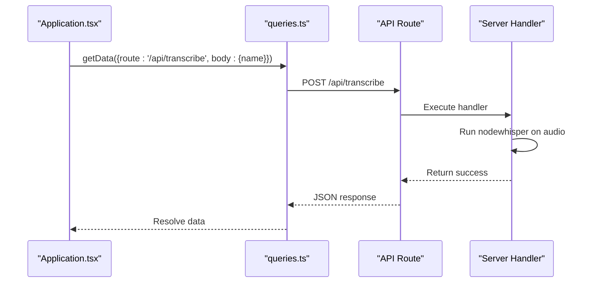

# Code Structure

<cite>
**Referenced Files in This Document**   
- [Application.tsx](file://components/Application.tsx)
- [queries.ts](file://common/queries.ts)
- [server.ts](file://common/server.ts)
- [upload.ts](file://pages/api/upload.ts)
- [transcribe.ts](file://pages/api/transcribe.ts)
- [introspect.ts](file://pages/api/introspect.ts)
- [get-transcription.ts](file://pages/api/get-transcription.ts)
- [get-introspection.ts](file://pages/api/get-introspection.ts)
- [get-prompt.ts](file://pages/api/get-prompt.ts)
- [update-prompt.ts](file://pages/api/update-prompt.ts)
- [list.ts](file://pages/api/list.ts)
</cite>

## Table of Contents
1. [Directory Organization](#directory-organization)
2. [Core Files and Their Roles](#core-files-and-their-roles)
3. [Client-Server Interaction Flow](#client-server-interaction-flow)
4. [Structural Anti-Patterns to Avoid](#structural-anti-patterns-to-avoid)
5. [Guidance for Adding New Features](#guidance-for-adding-new-features)

## Directory Organization

The project follows a modular structure that separates concerns between frontend components, API routes, shared utilities, and low-level Node.js modules. This organization supports a clean separation of client and server logic, which is essential for a Next.js full-stack application.

- **app/**: Contains the Next.js App Router components. This directory includes layout.tsx for global layout, page.tsx as the main entry point, and metadata files like manifest.ts, robots.ts, and sitemap.ts for SEO and PWA support.
- **pages/**: Houses the API routes under pages/api/ and legacy page components such as _app.tsx and _document.tsx. The API handlers manage file uploads, transcription, introspection, and prompt management.
- **components/**: Stores reusable UI components with SCSS modules for scoped styling. Components like Application.tsx orchestrate the main UI, while others like ActionUploadButton and TextArea provide interactive elements.
- **common/**: Contains shared utilities, hooks, and query functions used across both client and server. This includes constants, server utilities, and the queries.ts file for API communication.
- **modules/**: Includes low-level Node.js utilities such as CORS handling, object assignment, and HTTP header variation. These are imported by server-side logic for cross-origin and request processing.
- **scripts/**: Contains Node.js processing scripts for automation tasks, though specific use cases are not detailed in the current codebase.

**Section sources**
- [layout.tsx](file://app/layout.tsx)
- [page.tsx](file://app/page.tsx)
- [manifest.ts](file://app/manifest.ts)
- [_app.tsx](file://pages/_app.tsx)
- [_document.tsx](file://pages/_document.tsx)

## Core Files and Their Roles

### Application.tsx (Main Application State and UI Orchestration)

This file defines the primary user interface and manages application state, including file selection, transcription, introspection, and prompt editing. It uses React hooks to maintain state and invokes API routes via query functions from common/queries.ts. The component renders three main sections: file management, transcription display, and introspection output.

**Section sources**
- [Application.tsx](file://components/Application.tsx#L43-L269)

### queries.ts (Client-Side API Communication)

Located in common/queries.ts, this module exports functions that enable the frontend to communicate with API routes. The getData function is a generic POST utility that handles JSON requests with API key headers. Specific functions like onUserUploadDataGCS and onRefreshPosts abstract endpoint calls, promoting reusability and type safety.

**Section sources**
- [queries.ts](file://common/queries.ts#L1-L202)

### server.ts (CORS, Authentication, File Handling Utilities)

The server.ts file in common/ provides server-side utilities such as CORS middleware initialization, AES decryption for secure data handling, and session setup. It uses the Cors module from modules/cors to configure allowed methods and integrates with external APIs for viewer authentication.

**Section sources**
- [server.ts](file://common/server.ts#L1-L98)

### API Route Handlers

Each API route in pages/api/ corresponds to a specific backend operation:

- **upload.ts**: Handles multipart file uploads, saves audio files to the public directory, and triggers Whisper transcription.
- **transcribe.ts**: Re-runs transcription on an uploaded audio file using the Whisper model.
- **introspect.ts**: Sends the transcribed text to a local Ollama instance for introspective analysis using a prompt.
- **get-transcription.ts** and **get-introspection.ts**: Retrieve the respective text outputs from the filesystem.
- **get-prompt.ts** and **update-prompt.ts**: Read and write the default prompt stored in __prompt.txt.
- **list.ts**: Lists all audio files in the public directory for user selection.

These handlers use a consistent pattern: validate input, resolve the repository root, read/write files, and return JSON responses.

**Section sources**
- [upload.ts](file://pages/api/upload.ts#L1-L107)
- [transcribe.ts](file://pages/api/transcribe.ts#L1-L65)
- [introspect.ts](file://pages/api/introspect.ts#L1-L149)
- [get-transcription.ts](file://pages/api/get-transcription.ts#L1-L48)
- [get-introspection.ts](file://pages/api/get-introspection.ts#L1-L48)
- [get-prompt.ts](file://pages/api/get-prompt.ts#L1-L43)
- [update-prompt.ts](file://pages/api/update-prompt.ts#L1-L50)
- [list.ts](file://pages/api/list.ts#L1-L40)

## Client-Server Interaction Flow

The application demonstrates a clear separation between client and server logic. Frontend components invoke API routes through query functions, which abstract the fetch calls. For example, when a user clicks "Transcribe", the Application component calls Queries.getData with the /api/transcribe route, which triggers the server-side handler to process the audio file.

**Diagram sources**
- [Application.tsx](file://components/Application.tsx#L130-L145)
- [queries.ts](file://common/queries.ts#L1-L20)
- [transcribe.ts](file://pages/api/transcribe.ts#L1-L65)

## Structural Anti-Patterns to Avoid

When extending the codebase, avoid the following anti-patterns:

- **Placing business logic in components**: The Application component should only manage UI state and orchestrate API calls. Complex logic (e.g., transcription processing) must remain in API handlers.
- **Duplicating utility functions**: Shared logic like file path resolution or environment detection should be centralized in common/ rather than repeated across API routes.
- **Hardcoding paths or URLs**: Use utility functions to resolve the repository root dynamically, as seen in the API handlers.
- **Mixing client and server code in the same file**: Keep client-side hooks and server-side fetch logic separated to maintain clarity and testability.

## Guidance for Adding New Features

When introducing new functionality, follow these placement guidelines:

- **UI Component**: Add to components/ with a corresponding SCSS module. Use hooks from common/hooks.ts if needed.
- **API Endpoint**: Create a new file in pages/api/ with proper CORS and error handling. Use utilities from common/server.ts.
- **Shared Utility**: Place in common/ if used by both client and server. For server-only utilities, consider modules/.
- **Configuration or Constants**: Add to common/constants.ts for global values.
- **Node.js Script**: Place in scripts/ for automation tasks like data migration or batch processing.

This structure ensures maintainability and scalability as the application evolves.