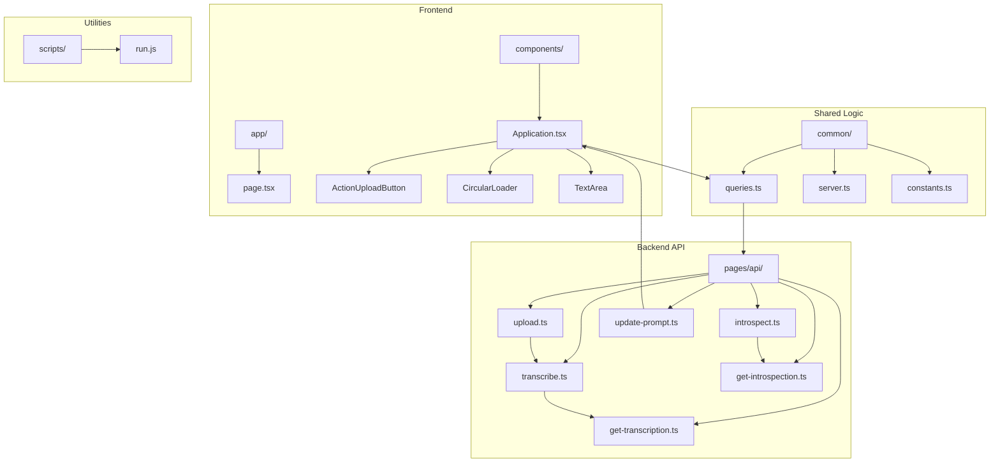
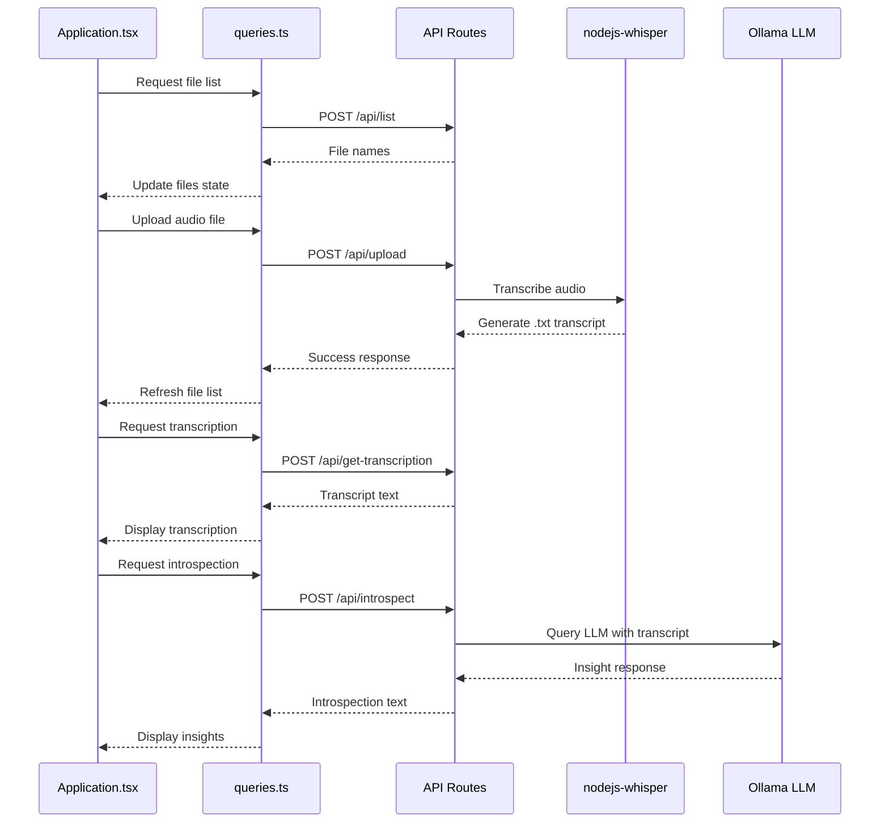
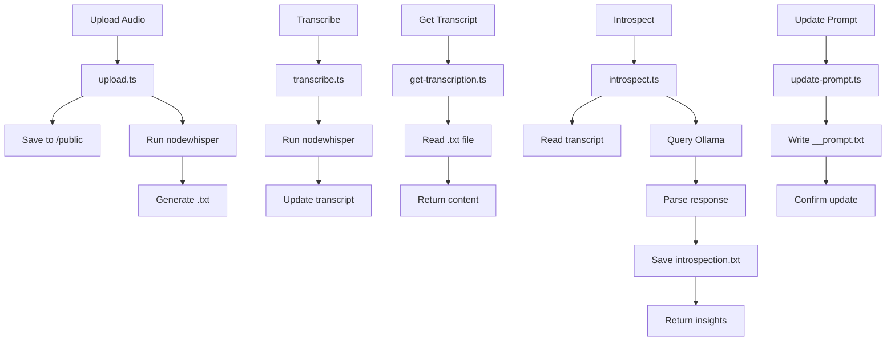
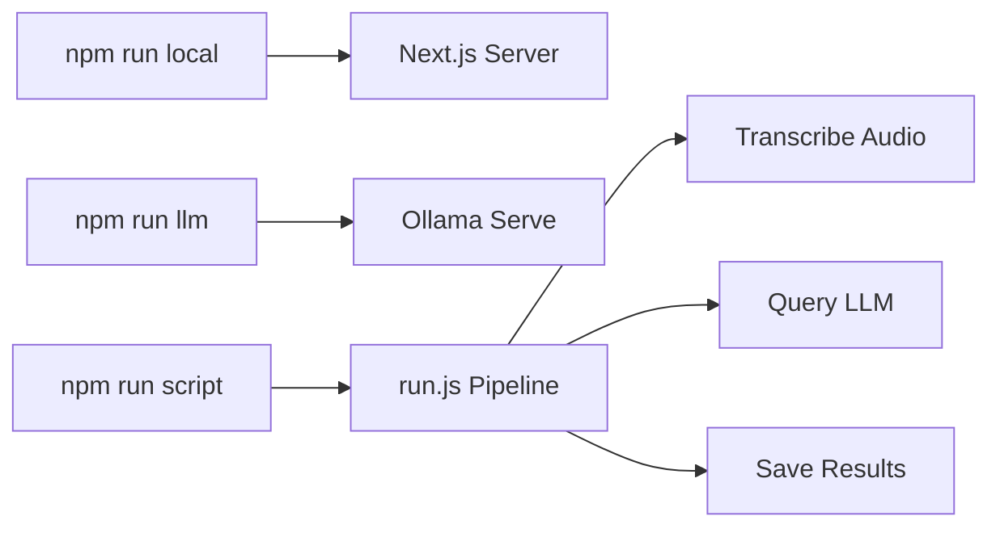

# Development Guide

<cite>
**Referenced Files in This Document**   
- [Application.tsx](file://components/Application.tsx)
- [queries.ts](file://common/queries.ts)
- [server.ts](file://common/server.ts)
- [constants.ts](file://common/constants.ts)
- [upload.ts](file://pages/api/upload.ts)
- [transcribe.ts](file://pages/api/transcribe.ts)
- [introspect.ts](file://pages/api/introspect.ts)
- [get-transcription.ts](file://pages/api/get-transcription.ts)
- [get-introspection.ts](file://pages/api/get-introspection.ts)
- [update-prompt.ts](file://pages/api/update-prompt.ts)
- [package.json](file://package.json)
- [run.js](file://scripts/run.js)
</cite>

## Table of Contents
1. [Project Structure](#project-structure)
2. [Core Components](#core-components)
3. [API Routes and Backend Processing](#api-routes-and-backend-processing)
4. [Adding New Features](#adding-new-features)
5. [Contribution Process](#contribution-process)
6. [Development Scripts](#development-scripts)
7. [Debugging API Routes](#debugging-api-routes)
8. [Testing UI Components](#testing-ui-components)
9. [Common Development Issues](#common-development-issues)
10. [Performance Optimization Tips](#performance-optimization-tips)

## Project Structure

The project follows a modular structure designed for separation of concerns and ease of maintenance. Key directories include:

- **app/**: Contains Next.js App Router components including layout, metadata, and routing configurations.
- **common/**: Houses shared utilities, constants, server utilities, and API query functions used across the application.
- **components/**: Contains reusable React components with associated SCSS modules for styling.
- **pages/api/**: Implements API routes for handling file uploads, transcription, introspection, and prompt management.
- **scripts/**: Includes Node.js scripts for testing and development automation.

**Diagram sources**
- [app/page.tsx](file://app/page.tsx)
- [components/Application.tsx](file://components/Application.tsx)
- [common/queries.ts](file://common/queries.ts)
- [pages/api/upload.ts](file://pages/api/upload.ts)

**Section sources**
- [app/page.tsx](file://app/page.tsx)
- [components/Application.tsx](file://components/Application.tsx)
- [common/queries.ts](file://common/queries.ts)
- [pages/api/upload.ts](file://pages/api/upload.ts)

## Core Components

The **Application.tsx** component serves as the main UI controller, managing state for file selection, transcription, and introspection processes. It orchestrates interactions between UI elements and backend services through API calls.

The **queries.ts** file in the common directory contains all client-side API interaction logic, abstracting fetch operations and error handling for consistent data retrieval patterns. These functions are consumed by the Application component to manage audio processing workflows.

The **server.ts** utility provides server-side middleware initialization, CORS configuration, and decryption capabilities for secure API communications.

**Diagram sources**
- [components/Application.tsx](file://components/Application.tsx#L1-L242)
- [common/queries.ts](file://common/queries.ts#L1-L202)
- [pages/api/upload.ts](file://pages/api/upload.ts#L1-L108)
- [pages/api/transcribe.ts](file://pages/api/transcribe.ts#L1-L66)
- [pages/api/introspect.ts](file://pages/api/introspect.ts#L1-L150)

**Section sources**
- [components/Application.tsx](file://components/Application.tsx#L1-L242)
- [common/queries.ts](file://common/queries.ts#L1-L202)
- [common/server.ts](file://common/server.ts#L1-L99)

## API Routes and Backend Processing

The **pages/api/** directory contains the backend logic for all audio processing operations. Each route handles specific functionality:

- **upload.ts**: Receives audio files, saves them to the public directory, and initiates transcription using nodejs-whisper.
- **transcribe.ts**: Triggers the Whisper transcription process for a specified audio file.
- **get-transcription.ts**: Retrieves the transcribed text content from the filesystem.
- **introspect.ts**: Sends transcripts to the locally hosted Ollama LLM (gemma3:27b) for insight generation.
- **get-introspection.ts**: Retrieves the processed insights from the filesystem.
- **update-prompt.ts**: Updates the default prompt used for LLM queries.

All API routes implement CORS configuration through the common server utility and handle file system operations with proper error handling.

**Diagram sources**
- [pages/api/upload.ts](file://pages/api/upload.ts#L1-L108)
- [pages/api/transcribe.ts](file://pages/api/transcribe.ts#L1-L66)
- [pages/api/get-transcription.ts](file://pages/api/get-transcription.ts#L1-L49)
- [pages/api/introspect.ts](file://pages/api/introspect.ts#L1-L150)
- [pages/api/get-introspection.ts](file://pages/api/get-introspection.ts#L1-L49)
- [pages/api/update-prompt.ts](file://pages/api/update-prompt.ts#L1-L51)

**Section sources**
- [pages/api/upload.ts](file://pages/api/upload.ts#L1-L108)
- [pages/api/transcribe.ts](file://pages/api/transcribe.ts#L1-L66)
- [pages/api/introspect.ts](file://pages/api/introspect.ts#L1-L150)

## Adding New Features

To add new API routes, create a new TypeScript file in **pages/api/** following the existing pattern. The route should:

1. Import necessary utilities from **@common/server** and **@common/constants**
2. Configure API options (responseLimit, bodyParser) as needed
3. Implement CORS handling
4. Validate input parameters
5. Perform the required operation with proper error handling
6. Return appropriate JSON responses

For UI enhancements, create new components in the **components/** directory with corresponding SCSS modules. Integrate them into **Application.tsx** by importing and adding to the appropriate section of the UI.

To extend functionality, you can:
- Add new query functions in **common/queries.ts** for client-server communication
- Create additional utilities in **common/utilities.ts**
- Modify the prompt directives in **common/constants.ts**

**Section sources**
- [pages/api/upload.ts](file://pages/api/upload.ts#L1-L108)
- [components/Application.tsx](file://components/Application.tsx#L1-L242)
- [common/queries.ts](file://common/queries.ts#L1-L202)
- [common/constants.ts](file://common/constants.ts#L1-L127)

## Contribution Process

Contributions are welcome through GitHub pull requests. The process involves:

1. Forking the repository
2. Creating a feature branch
3. Implementing changes with proper testing
4. Submitting a pull request with detailed description

Before submitting, ensure your changes:
- Follow the existing code style and patterns
- Include necessary error handling
- Maintain TypeScript type safety
- Do not introduce external dependencies without justification
- Work with the offline-first architecture

Proposals for significant changes should be discussed in a GitHub issue first.

**Section sources**
- [README.md](file://README.md#L1-L65)

## Development Scripts

The project includes several npm scripts for development:

- **npm run local**: Starts the Next.js development server on port 10000
- **npm run llm**: Starts the Ollama service with required environment variables
- **npm run script**: Executes the test script in scripts/index.js (currently runs run.js)

The **run.js** script demonstrates the complete processing pipeline, including audio transcription and LLM introspection, serving as both a test and example implementation.

**Diagram sources**
- [package.json](file://package.json#L1-L31)
- [scripts/run.js](file://scripts/run.js#L1-L248)

**Section sources**
- [package.json](file://package.json#L1-L31)
- [scripts/run.js](file://scripts/run.js#L1-L248)

## Debugging API Routes

To debug API routes:

1. Add console.log statements in the API route files to trace execution flow
2. Check the Next.js development server output for error messages
3. Verify file paths and existence using existsSync checks
4. Test routes directly with curl or Postman

Common debugging scenarios:
- File upload issues: Check content-type parsing and buffer handling in upload.ts
- Transcription failures: Verify Whisper model installation and file permissions
- LLM connection problems: Ensure Ollama is running and accessible on localhost:11434
- CORS issues: Confirm server.cors middleware is properly applied

Use the run.js script as a standalone test to isolate backend processing issues from frontend concerns.

**Section sources**
- [pages/api/upload.ts](file://pages/api/upload.ts#L1-L108)
- [pages/api/introspect.ts](file://pages/api/introspect.ts#L1-L150)
- [scripts/run.js](file://scripts/run.js#L1-L248)

## Testing UI Components

UI components can be tested by:

1. Using the development server (npm run local) to interact with the interface
2. Simulating different states by modifying component state variables
3. Testing error conditions by temporarily modifying validation logic
4. Verifying responsive behavior across different screen sizes

Key test cases:
- File upload with various audio formats and sizes
- Transcription of long audio files (up to 20 minutes)
- Introspection processing time and output quality
- Prompt update persistence
- Loading state transitions and user feedback

The ActionUploadButton, CircularLoader, and TextArea components should be verified for proper styling and interaction behavior.

**Section sources**
- [components/Application.tsx](file://components/Application.tsx#L1-L242)
- [components/ActionUploadButton.tsx](file://components/ActionUploadButton.tsx)
- [components/CircularLoader.tsx](file://components/CircularLoader.tsx)
- [components/TextArea.tsx](file://components/TextArea.tsx)

## Common Development Issues

**Hot-reload failures**: 
- Ensure Next.js development server has sufficient memory
- Clear .next cache directory if reloading stops working
- Restart the development server after significant configuration changes

**TypeScript errors**:
- Verify all imported modules have proper type definitions
- Check for version compatibility between TypeScript and dependencies
- Ensure tsconfig.json is properly configured for the project

**Whisper installation issues**:
- Run `npx nodejs-whisper download` to ensure the model is properly installed
- Verify ffmpeg and cmake are installed on the system
- Check that the large-v3-turbo model is available

**Ollama connectivity problems**:
- Confirm Ollama service is running via `npm run llm`
- Verify the gemma3:27b model is pulled with `ollama pull gemma3:27b`
- Check that the Ollama API is accessible at http://localhost:11434

**File system permissions**:
- Ensure the public directory is writable for audio uploads and transcript generation
- Verify the application has read/write access to necessary files

**Section sources**
- [README.md](file://README.md#L1-L65)
- [package.json](file://package.json#L1-L31)
- [pages/api/upload.ts](file://pages/api/upload.ts#L1-L108)

## Performance Optimization Tips

**Frontend rendering**:
- Minimize re-renders by using React.memo for components
- Optimize state updates to avoid unnecessary renders
- Use CSS modules for efficient styling
- Implement loading states to improve perceived performance

**Backend processing**:
- Cache frequently accessed files in memory when appropriate
- Optimize file I/O operations by batching reads/writes
- Use streaming responses for large data transfers
- Implement proper error boundaries to prevent cascading failures

**Audio processing**:
- Pre-process audio files to optimal format before upload
- Consider chunking very long audio files for incremental processing
- Monitor memory usage during transcription of large files

**LLM interactions**:
- Optimize prompt engineering to reduce response length
- Implement response caching for repeated queries
- Monitor Ollama resource usage and adjust model parameters as needed

The application is designed for offline-first operation, so network optimization is less critical than local processing efficiency.

**Section sources**
- [components/Application.tsx](file://components/Application.tsx#L1-L242)
- [pages/api/upload.ts](file://pages/api/upload.ts#L1-L108)
- [pages/api/introspect.ts](file://pages/api/introspect.ts#L1-L150)
- [scripts/run.js](file://scripts/run.js#L1-L248)