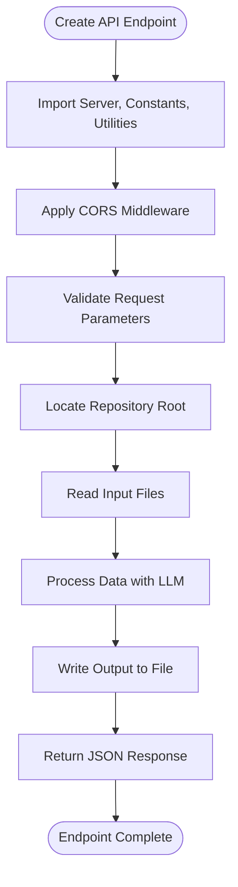
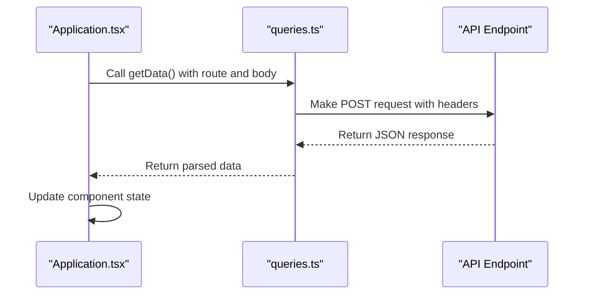
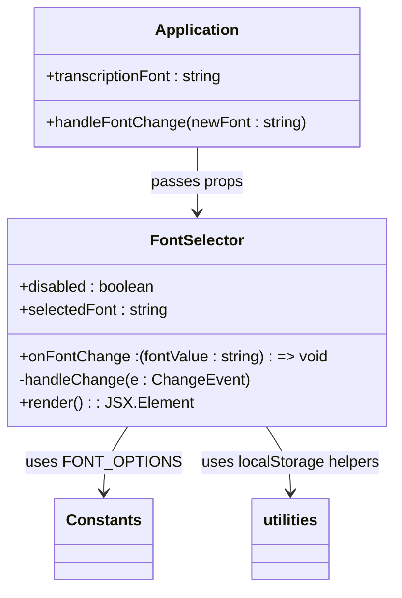
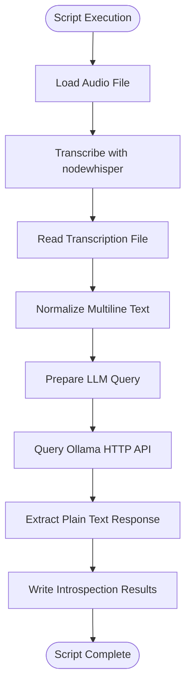
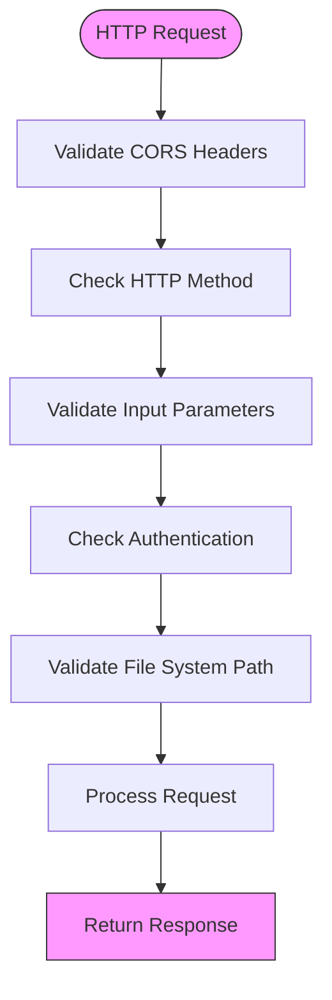
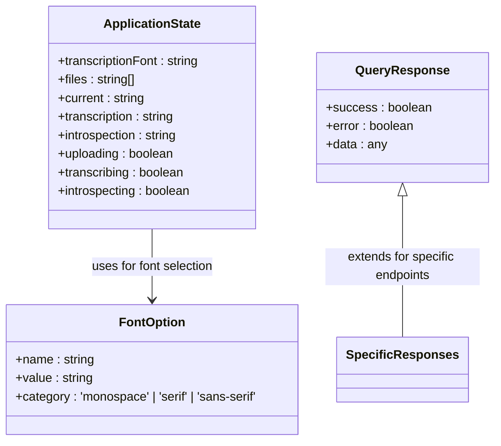

# Extending Features

<cite>
**Referenced Files in This Document**   
- [introspect.ts](file://pages/api/introspect.ts)
- [get-introspection.ts](file://pages/api/get-introspection.ts)
- [upload.ts](file://pages/api/upload.ts)
- [server.ts](file://common/server.ts)
- [queries.ts](file://common/queries.ts)
- [Application.tsx](file://components/Application.tsx)
- [run.js](file://scripts/run.js)
- [constants.ts](file://common/constants.ts)
- [utilities.ts](file://common/utilities.ts)
</cite>

## Table of Contents
1. [Introduction](#introduction)
2. [Creating New API Endpoints](#creating-new-api-endpoints)
3. [Integrating Backend with Frontend](#integrating-backend-with-frontend)
4. [Extending UI Components](#extending-ui-components)
5. [Batch Processing and Automation Scripts](#batch-processing-and-automation-scripts)
6. [Security Considerations](#security-considerations)
7. [Performance Implications](#performance-implications)
8. [Maintaining Type Safety](#maintaining-type-safety)
9. [Conclusion](#conclusion)

## Introduction
This document provides comprehensive guidance on extending features in the Next.js offline Whisper-to-LLM application. It covers practical examples of adding new functionality, including implementing API routes, connecting backend endpoints to frontend components, extending the user interface, creating automation scripts, and addressing critical considerations around security, performance, and type safety. The examples are based on existing code patterns such as the upload-transcribe-introspect workflow.

## Creating New API Endpoints

When extending the application with new functionality, creating API endpoints in the `pages/api/` directory is essential. Each endpoint follows a consistent pattern that includes CORS handling, input validation, file system operations, and integration with server utilities.

The process for creating a new API endpoint involves several key steps:

1. Create a new TypeScript file in the `pages/api/` directory
2. Import necessary utilities and constants
3. Implement CORS middleware using the shared server utility
4. Validate input parameters
5. Perform file system operations with proper error handling
6. Return appropriate HTTP responses

For example, the existing `introspect.ts` endpoint demonstrates this pattern by first applying CORS middleware, validating the input name parameter, locating the repository root, reading transcription and prompt files, processing the data through an LLM, and writing the results to a file.

**Diagram sources**
- [introspect.ts](file://pages/api/introspect.ts#L94-L148)
- [server.ts](file://common/server.ts#L54-L58)

**Section sources**
- [introspect.ts](file://pages/api/introspect.ts#L94-L148)
- [server.ts](file://common/server.ts#L54-L58)
- [utilities.ts](file://common/utilities.ts#L270-L278)

## Integrating Backend with Frontend

Connecting new API endpoints to the frontend requires implementing query functions in `common/queries.ts` and invoking them from React components using hooks. This pattern ensures consistent data fetching across the application.

The integration process follows these steps:

1. Create a new query function in `common/queries.ts` that wraps the fetch operation
2. Use the function in React components with appropriate state management
3. Handle loading, success, and error states in the UI

The existing code demonstrates this pattern through the `getData` utility function, which provides a consistent interface for making POST requests to API endpoints. Components like `Application.tsx` use this function to interact with various endpoints, managing component state to reflect the current operation status.

**Diagram sources**
- [queries.ts](file://common/queries.ts#L3-L29)
- [Application.tsx](file://components/Application.tsx#L64-L64)

**Section sources**
- [queries.ts](file://common/queries.ts#L3-L29)
- [Application.tsx](file://components/Application.tsx#L47-L51)

## Extending UI Components

Extending the user interface involves creating new components in the `components/` directory with SCSS modules for styling. The application uses a consistent pattern of component organization and state management that should be followed when adding new UI elements.

Key considerations for UI extension include:

- Using SCSS modules to ensure style encapsulation
- Managing component state with React hooks
- Ensuring accessibility through proper ARIA attributes
- Maintaining consistent visual design patterns

The `FontSelector` component demonstrates these principles by using a SCSS module for styling, managing its state through props, and providing appropriate accessibility attributes. It also handles disabled states consistently with other interactive elements in the application.

**Diagram sources**
- [FontSelector.tsx](file://components/FontSelector.tsx#L1-L49)
- [constants.ts](file://common/constants.ts#L100-L125)
- [utilities.ts](file://common/utilities.ts#L280-L295)

**Section sources**
- [FontSelector.tsx](file://components/FontSelector.tsx#L1-L49)
- [Application.tsx](file://components/Application.tsx#L47-L47)

## Batch Processing and Automation Scripts

The application includes support for batch processing and automation through scripts in the `scripts/` directory. The `run.js` file serves as a template for creating automation tasks that process audio files and generate insights.

To extend the application with new automation capabilities:

1. Create a new script file in the `scripts/` directory
2. Import necessary modules and constants
3. Implement the processing logic with proper error handling
4. Use consistent logging patterns for monitoring

The existing `run.js` script demonstrates batch processing by automating the transcription and introspection workflow. It uses the same `nodewhisper` library as the API endpoint, processes the transcription text, and sends it to the LLM for analysis. The script includes comprehensive logging with color-coded output to distinguish between different types of messages.

**Diagram sources**
- [run.js](file://scripts/run.js#L150-L150)
- [run.js](file://scripts/run.js#L94-L148)

**Section sources**
- [run.js](file://scripts/run.js#L1-L247)

## Security Considerations

When exposing new endpoints, several security considerations must be addressed to protect the application and its users:

1. **Input Validation**: All user inputs should be validated to prevent injection attacks and ensure data integrity
2. **Authentication and Authorization**: Endpoints should verify user permissions before processing sensitive operations
3. **Rate Limiting**: Implement rate limiting to prevent abuse of API endpoints
4. **File System Access**: Restrict file system operations to designated directories to prevent path traversal attacks
5. **CORS Configuration**: Properly configure CORS to allow only trusted origins

The existing codebase implements several security measures, including input validation through the `Utilities.isEmpty()` function, CORS middleware to handle cross-origin requests, and file system access restricted to the `public` directory. The application also uses environment variables for sensitive configuration, though some features remain commented out pending proper setup.

**Diagram sources**
- [server.ts](file://common/server.ts#L54-L58)
- [introspect.ts](file://pages/api/introspect.ts#L94-L148)
- [utilities.ts](file://common/utilities.ts#L270-L278)

**Section sources**
- [server.ts](file://common/server.ts#L54-L58)
- [introspect.ts](file://pages/api/introspect.ts#L94-L148)

## Performance Implications

Processing large audio files presents significant performance challenges that must be considered when extending the application. The existing implementation addresses these through several strategies:

1. **Streaming Processing**: The upload endpoint processes file uploads in chunks to avoid memory issues
2. **Asynchronous Operations**: All file operations and API calls are performed asynchronously to prevent blocking the event loop
3. **Response Limit Configuration**: API routes are configured with `responseLimit: false` to handle large responses
4. **Efficient Text Processing**: Transcription text is normalized to reduce processing overhead

When extending the application, consider the following performance implications:

- Large audio files can take several minutes to transcribe, requiring appropriate user feedback
- LLM processing time increases with input length, potentially leading to long response times
- File system operations should be optimized to minimize I/O bottlenecks
- Memory usage should be monitored, especially when processing multiple files concurrently

The application currently handles these concerns by providing loading indicators during processing and using efficient text normalization to reduce the input size for the LLM.

**Diagram sources**
- [upload.ts](file://pages/api/upload.ts#L16-L106)
- [introspect.ts](file://pages/api/introspect.ts#L94-L148)
- [run.js](file://scripts/run.js#L1-L247)

**Section sources**
- [upload.ts](file://pages/api/upload.ts#L16-L106)
- [introspect.ts](file://pages/api/introspect.ts#L94-L148)

## Maintaining Type Safety

The application is built with TypeScript, providing strong type safety across the codebase. When introducing new data structures, it's essential to maintain this type safety through proper interface definitions and type annotations.

Key practices for maintaining type safety include:

1. Defining interfaces for complex data structures
2. Using type annotations for function parameters and return values
3. Leveraging TypeScript's utility types for common patterns
4. Ensuring consistency between frontend and backend data structures

The existing codebase demonstrates these practices through the `FontOption` interface in `constants.ts` and the use of type annotations in React components. The `queries.ts` file also uses TypeScript to define function signatures, ensuring that data fetching operations return expected types.

When adding new features, create appropriate interfaces for any new data structures and ensure that all function parameters and return values are properly typed. This prevents runtime errors and improves code maintainability.

**Diagram sources**
- [constants.ts](file://common/constants.ts#L100-L125)
- [Application.tsx](file://components/Application.tsx#L47-L51)

**Section sources**
- [constants.ts](file://common/constants.ts#L100-L125)
- [Application.tsx](file://components/Application.tsx#L47-L51)

## Conclusion
Extending features in the Next.js offline Whisper-to-LLM application requires understanding the existing architecture and following established patterns for API creation, frontend integration, UI extension, and automation scripting. By leveraging the provided utilities and adhering to security, performance, and type safety best practices, developers can effectively add new functionality while maintaining the application's integrity and user experience. The documented examples provide a solid foundation for implementing features such as new API routes for exporting introspection results or enhancing the UI with additional analysis options.