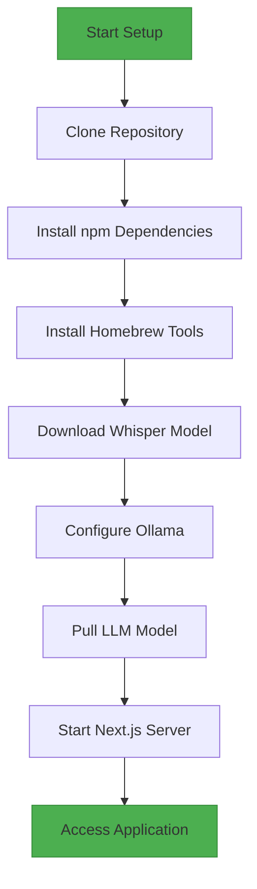

# Installation and Setup

<cite>
**Referenced Files in This Document**   
- [README.md](file://README.md)
- [package.json](file://package.json)
- [next.config.js](file://next.config.js)
- [pages/api/transcribe.ts](file://pages/api/transcribe.ts)
- [pages/api/introspect.ts](file://pages/api/introspect.ts)
- [scripts/run.js](file://scripts/run.js)
</cite>

## Table of Contents
1. [Introduction](#introduction)
2. [Prerequisites](#prerequisites)
3. [Step-by-Step Installation Guide](#step-by-step-installation-guide)
4. [Running the Application](#running-the-application)
5. [Troubleshooting Common Issues](#troubleshooting-common-issues)
6. [Performance Considerations for M4 MacBooks](#performance-considerations-for-m4-macbooks)
7. [Conclusion](#conclusion)

## Introduction

This guide provides comprehensive instructions for setting up the development environment for the Next.js Offline Whisper-to-LLM application on macOS. The application enables offline transcription of audio files using Whisper and local processing via an LLM (Gemma3) through Ollama, ensuring complete data privacy. This document covers the entire setup process from repository cloning to application execution, including dependency installation, model configuration, and server initialization.

## Prerequisites

Before beginning the installation, ensure your macOS system meets the following requirements:
- Node.js version 18 or higher
- npm package manager
- Homebrew package manager (for installing system-level dependencies)
- Sufficient disk space for model downloads (Whisper large-v3-turbo and Gemma3:27b require several GBs)
- At least 16GB RAM recommended (32GB ideal for M4 MacBook performance)

**Section sources**
- [package.json](file://package.json#L4-L7)

## Step-by-Step Installation Guide

### 1. Clone the Repository

Begin by cloning the project repository to your local machine:

```bash
git clone https://github.com/internet-development/nextjs-offline-whisper-to-llm.git
cd nextjs-offline-whisper-to-llm
```

### 2. Install Node.js Dependencies

Install all required npm packages specified in the `package.json` file:

```bash
npm install
```

This command installs essential dependencies including `nodejs-whisper` for local transcription and `next` for the frontend framework.

### 3. Install System Dependencies via Homebrew

Install the required system-level tools using Homebrew:

```bash
brew install cmake
brew install ffmpeg
brew install ollama
```

- **CMake**: Required for building native modules used by Whisper
- **FFmpeg**: Used for audio file processing and format conversion
- **Ollama**: Local LLM server for running Gemma3 model

### 4. Download Whisper Model

Download the recommended Whisper model optimized for this application:

```bash
npx nodejs-whisper download
```

This command downloads the `large-v3-turbo` model, which is specifically configured in the application's transcription logic for optimal accuracy.

**Section sources**
- [README.md](file://README.md#L15-L20)
- [pages/api/transcribe.ts](file://pages/api/transcribe.ts#L38-L40)

### 5. Configure and Initialize Ollama

Start the Ollama service with appropriate environment variables for reliable operation:

```bash
npm run llm
```

This script executes the following command with optimized environment settings:
```bash
OLLAMA_LOAD_TIMEOUT=30m OLLAMA_KEEP_ALIVE=10m OLLAMA_NOHISTORY=true ollama serve
```

Key environment variables:
- `OLLAMA_LOAD_TIMEOUT=30m`: Allows sufficient time for loading large models
- `OLLAMA_KEEP_ALIVE=10m`: Keeps the model loaded in memory for 10 minutes after requests
- `OLLAMA_NOHISTORY=true`: Prevents storage of chat history for privacy

### 6. Pull the LLM Model

In a separate terminal window, pull the recommended LLM model:

```bash
ollama pull gemma3:27b
```

This model is specifically chosen for optimal performance on M4 MacBook hardware with 32GB RAM, providing a balance between capability and resource usage.

**Section sources**
- [package.json](file://package.json#L13-L15)
- [README.md](file://README.md#L25-L28)

## Running the Application

### Start the Next.js Development Server

Once all dependencies are installed and models are downloaded, start the application:

```bash
npm run local
```

This command runs `next -p 10000`, starting the Next.js server on port 10000.

### Access the Application

Open your browser and navigate to:
```
http://localhost:10000
```

The application will be available for use, allowing you to upload audio files for offline transcription and analysis.

**Section sources**
- [package.json](file://package.json#L12)
- [next.config.js](file://next.config.js#L1-L5)

## Troubleshooting Common Issues

### Issue 1: Whisper CLI Not Found

If you encounter errors about missing `whisper-cli`, run the test script to repair the installation:

```bash
# First, ensure Ollama is running
npm run llm

# Then run the repair script
npm run script run
```

This script validates the Whisper installation and can resolve common setup issues by reinitializing the transcription pipeline.

**Section sources**
- [README.md](file://README.md#L32-L37)
- [scripts/run.js](file://scripts/run.js#L150-L155)

### Issue 2: Ollama Service Not Starting

If Ollama fails to start, verify the service status:

```bash
brew services list | grep ollama
```

If not running, restart the service:
```bash
brew services restart ollama
```

Ensure the `ollama serve` command is executed with the proper environment variables as specified in the `llm` npm script.

### Issue 3: Port Conflicts

If port 10000 is already in use, modify the startup command:

```bash
next -p 10001
```

Or update the `local` script in `package.json` to use an alternative port.

### Issue 4: Model Download Failures

For Whisper model download issues, ensure you have:
- Stable internet connection
- Sufficient disk space (at least 5GB free)
- Proper permissions for the installation directory

Retry the download command:
```bash
npx nodejs-whisper download
```

## Performance Considerations for M4 MacBooks

For optimal performance on M4 MacBooks with 32GB RAM:

### Memory Management
- The `OLLAMA_KEEP_ALIVE=10m` setting ensures the Gemma3:27b model remains in memory, reducing reload times
- 32GB RAM allows smooth operation of both the Next.js development server and the LLM simultaneously

### Processing Optimization
- The Whisper configuration uses `large-v3-turbo` model which is optimized for Apple Silicon performance
- Transcription settings disable unnecessary output formats (JSON, SRT, VTT) to focus on text output only

### Thermal Considerations
- Extended transcription sessions may cause thermal throttling
- Consider closing other memory-intensive applications during long processing tasks
- The application is designed to handle audio files up to 20 minutes in length efficiently

### Model Selection Rationale
The `gemma3:27b` model was selected because:
- It provides excellent reasoning capabilities for transcript analysis
- It runs efficiently on M4 architecture with 32GB RAM
- It balances performance and quality for local processing
- It supports the required prompt structure with `<transcript>` and `<plain_text_response>` tags



**Diagram sources**
- [README.md](file://README.md#L10-L30)
- [package.json](file://package.json#L12-L15)

## Conclusion

This installation guide provides a complete pathway to set up the Next.js Offline Whisper-to-LLM application on macOS. By following these steps, users can establish a fully functional offline environment for audio transcription and intelligent analysis using local models. The configuration is optimized for M4 MacBooks with 32GB RAM, ensuring smooth performance while maintaining complete data privacy. Regular maintenance of the Ollama service and proper management of system resources will ensure reliable operation of this powerful local AI pipeline.

**Section sources**
- [README.md](file://README.md)
- [package.json](file://package.json)