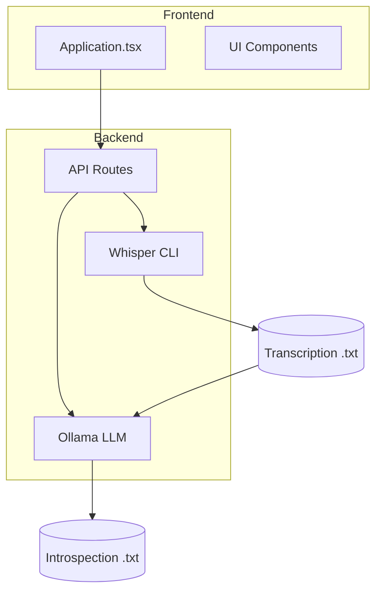
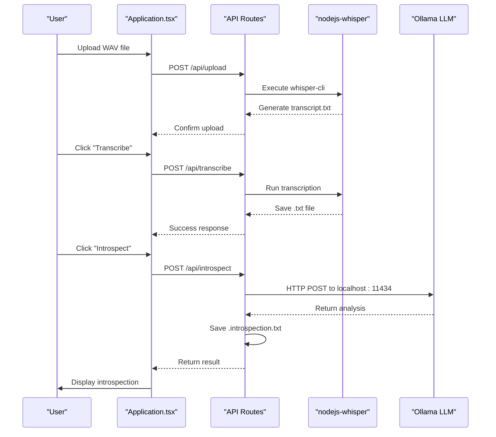
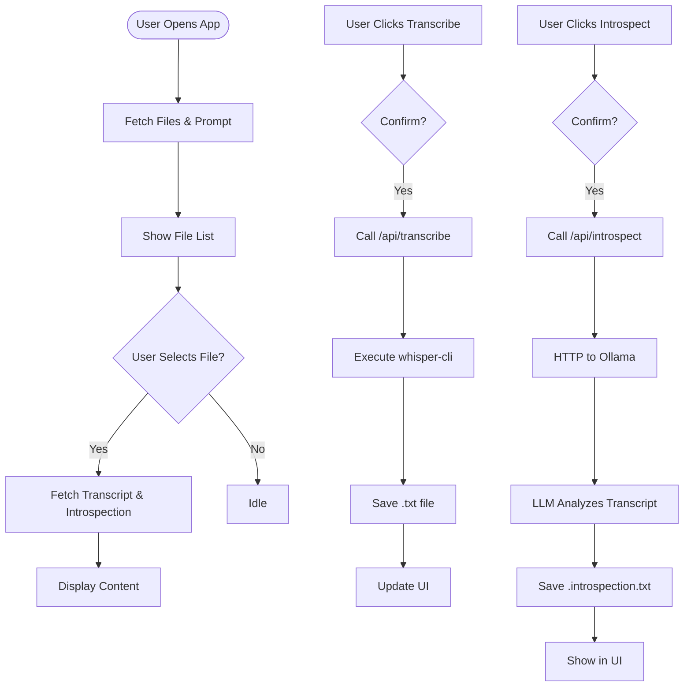
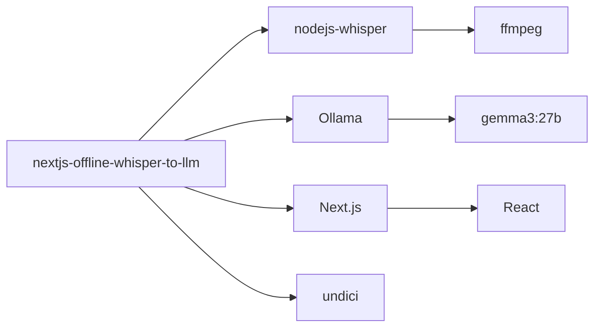

# System Overview

<cite>
**Referenced Files in This Document**   
- [Application.tsx](file://components/Application.tsx)
- [transcribe.ts](file://pages/api/transcribe.ts)
- [introspect.ts](file://pages/api/introspect.ts)
- [get-transcription.ts](file://pages/api/get-transcription.ts)
- [get-introspection.ts](file://pages/api/get-introspection.ts)
- [upload.ts](file://pages/api/upload.ts)
- [constants.ts](file://common/constants.ts)
- [queries.ts](file://common/queries.ts)
- [server.ts](file://common/server.ts)
- [package.json](file://package.json)
- [README.md](file://README.md)
</cite>

## Table of Contents
1. [Introduction](#introduction)
2. [Project Structure](#project-structure)
3. [Core Components](#core-components)
4. [Architecture Overview](#architecture-overview)
5. [Detailed Component Analysis](#detailed-component-analysis)
6. [Dependency Analysis](#dependency-analysis)
7. [Performance Considerations](#performance-considerations)
8. [Troubleshooting Guide](#troubleshooting-guide)
9. [Conclusion](#conclusion)

## Introduction
The **nextjs-offline-whisper-to-llm** application is an offline-first, browser-based tool designed for secure, local audio transcription and AI-powered introspection. Built with Next.js, it enables users to upload audio files (e.g., WAV) and transcribe them using the Whisper model, all within the local environment. The resulting transcripts are then analyzed by a locally hosted Large Language Model (LLM) via Ollama, ensuring complete data privacy by avoiding external network transmission. This system is ideal for researchers, content creators, and privacy-conscious users who require secure processing of sensitive audio content.

The application emphasizes local execution, with all processing—audio transcription and LLM analysis—occurring on the user's machine. It integrates Whisper for high-accuracy speech-to-text conversion and Ollama to run the LLM (e.g., `gemma3:27b`) locally. The UI, built with React and Next.js, communicates with backend API routes that orchestrate the transcription and introspection workflows.

## Project Structure
The project follows a standard Next.js structure with modular separation of concerns. Key directories include:
- `app/`: App router components (e.g., layout, page)
- `components/`: Reusable UI components (e.g., Application.tsx, buttons, loaders)
- `pages/`: API routes under `pages/api` for handling transcription, introspection, and file management
- `common/`: Shared utilities, constants, and query functions
- `public/`: Static assets and generated transcription/introspection files
- `scripts/`: Utility scripts for testing and setup

The architecture is designed to keep sensitive data local, with API routes acting as intermediaries between the frontend and local services (Whisper, Ollama).



**Diagram sources**
- [Application.tsx](file://components/Application.tsx)
- [transcribe.ts](file://pages/api/transcribe.ts)
- [introspect.ts](file://pages/api/introspect.ts)

**Section sources**
- [Application.tsx](file://components/Application.tsx)
- [pages/api](file://pages/api)

## Core Components
The system's functionality is driven by three core components:
1. **UI Layer**: `Application.tsx` manages state and user interactions, including file selection, transcription, and introspection triggers.
2. **API Handlers**: Backend routes (`transcribe.ts`, `introspect.ts`, `get-transcription.ts`, `get-introspection.ts`) handle file processing and model execution.
3. **External Dependencies**: `nodejs-whisper` for transcription and `Ollama` for LLM inference.

The flow begins with a user uploading a WAV file via the UI. The `upload.ts` API route saves the file to the `public/` directory. Upon request, `transcribe.ts` invokes Whisper to generate a `.txt` transcription. Subsequently, `introspect.ts` sends the transcript to the locally running Ollama instance for analysis, saving the result as a `.introspection.txt` file. The UI retrieves these results via `get-transcription.ts` and `get-introspection.ts`.

**Section sources**
- [Application.tsx](file://components/Application.tsx#L1-L241)
- [transcribe.ts](file://pages/api/transcribe.ts#L1-L65)
- [introspect.ts](file://pages/api/introspect.ts#L1-L149)

## Architecture Overview
The application follows a client-server model within a single-host, offline environment. The Next.js frontend serves as the user interface, while API routes act as serverless functions that execute local CLI tools. This design ensures that no audio or text data leaves the user's machine.



**Diagram sources**
- [Application.tsx](file://components/Application.tsx#L42-L44)
- [transcribe.ts](file://pages/api/transcribe.ts#L16-L64)
- [introspect.ts](file://pages/api/introspect.ts#L94-L148)
- [get-transcription.ts](file://pages/api/get-transcription.ts#L14-L47)
- [get-introspection.ts](file://pages/api/get-introspection.ts#L14-L47)

## Detailed Component Analysis

### Application UI Analysis
The `Application.tsx` component is the central UI controller, managing state for file selection, transcription, and introspection. It uses React hooks to track `current` file, `transcription`, and `introspection` content. On mount, it fetches the file list and default prompt via API calls.

When a user selects a file, `onSelect` retrieves both transcription and introspection results if available. The "Transcribe" button triggers `/api/transcribe`, which runs Whisper on the selected audio. The "Introspect" button calls `/api/introspect`, which sends the transcript to Ollama with a customizable prompt.



**Diagram sources**
- [Application.tsx](file://components/Application.tsx#L56-L56)
- [queries.ts](file://common/queries.ts#L1-L201)

**Section sources**
- [Application.tsx](file://components/Application.tsx#L1-L241)
- [queries.ts](file://common/queries.ts#L1-L201)

### API Workflow Analysis
The API routes form the backend logic layer. Each route handles a specific function:
- `upload.ts`: Saves uploaded audio files.
- `transcribe.ts`: Invokes Whisper with `large-v3-turbo` model.
- `introspect.ts`: Queries Ollama with transcript and prompt.
- `get-*` routes: Retrieve generated files.

All routes use CORS middleware from `server.ts` and validate input. The `responseLimit: false` configuration allows handling large responses from long audio processing.

```mermaid
classDiagram
class APIRoute {
+config : {responseLimit : false}
+cors(req, res)
+validateInput()
}
class Transcribe {
+apiTranscribe(req, res)
+modelName : 'large-v3-turbo'
+nodewhisper(destPath, options)
}
class Introspect {
+apiIntrospect(req, res)
+queryOllamaHTTP(prompt)
+normalizeMultilineText(text)
}
class FileHandler {
+get-transcription
+get-introspection
+list
+update-prompt
}
APIRoute <|-- Transcribe
APIRoute <|-- Introspect
APIRoute <|-- FileHandler
Introspect --> Ollama : HTTP POST
Transcribe --> Whisper : CLI
```

**Diagram sources**
- [transcribe.ts](file://pages/api/transcribe.ts#L12-L65)
- [introspect.ts](file://pages/api/introspect.ts#L90-L148)
- [server.ts](file://common/server.ts#L1-L98)

**Section sources**
- [transcribe.ts](file://pages/api/transcribe.ts#L1-L65)
- [introspect.ts](file://pages/api/introspect.ts#L1-L149)
- [server.ts](file://common/server.ts#L1-L98)

## Dependency Analysis
The application relies on several key dependencies:
- **nodejs-whisper**: Wraps OpenAI's Whisper for local transcription.
- **Ollama**: Hosts and runs LLMs like `gemma3:27b`.
- **Next.js**: Provides SSR, API routes, and development server.
- **undici**: For HTTP requests to Ollama with no timeout.
- **ffmpeg**: Required by Whisper for audio processing.

These are managed via `package.json` and installed with `npm install`. The setup requires `cmake`, `ffmpeg`, and `ollama` to be installed system-wide.



**Diagram sources**
- [package.json](file://package.json#L1-L29)
- [README.md](file://README.md#L0-L64)

**Section sources**
- [package.json](file://package.json#L1-L29)
- [README.md](file://README.md#L0-L64)

## Performance Considerations
Processing long audio files (up to 20 minutes) can be time-consuming. Transcription with Whisper's `large-v3-turbo` model may take over 5 minutes, depending on hardware. LLM introspection with `gemma3:27b` adds additional latency, especially for large transcripts.

The application disables response limits (`responseLimit: false`) to accommodate long-running operations. Model loading times for Ollama can be reduced by pre-pulling the model (`ollama pull gemma3:27b`). Running on hardware with sufficient RAM (e.g., 32GB) and Apple Silicon (M4) improves performance significantly.

Users are warned via confirmation dialogs before starting transcription or introspection to manage expectations.

**Section sources**
- [transcribe.ts](file://pages/api/transcribe.ts#L12-L65)
- [introspect.ts](file://pages/api/introspect.ts#L90-L148)
- [README.md](file://README.md#L0-L64)

## Troubleshooting Guide
Common issues and solutions:
- **Environment Setup Failures**: Ensure `cmake`, `ffmpeg`, and `ollama` are installed via Homebrew on macOS.
- **Whisper CLI Not Found**: Run `npx nodejs-whisper download` to install the model.
- **Ollama Not Running**: Start with `npm run llm` in a separate terminal.
- **Model Not Pulled**: Execute `ollama pull gemma3:27b` before running the app.
- **File Not Found Errors**: Verify the audio file is uploaded and has `.wav` extension.
- **CORS or API Errors**: Check that `server.ts` CORS configuration allows localhost.

The `scripts/run.js` utility can help diagnose issues by testing the full pipeline.

**Section sources**
- [README.md](file://README.md#L0-L64)
- [scripts/run.js](file://scripts/run.js#L1-L38)
- [server.ts](file://common/server.ts#L1-L98)

## Conclusion
The **nextjs-offline-whisper-to-llm** application provides a robust, privacy-preserving solution for audio transcription and AI analysis. By leveraging local processing with Whisper and Ollama, it ensures user data remains secure. The architecture cleanly separates frontend and backend concerns, with API routes orchestrating local tool execution. While setup requires technical proficiency, the system offers powerful capabilities for researchers and creators needing offline AI processing.