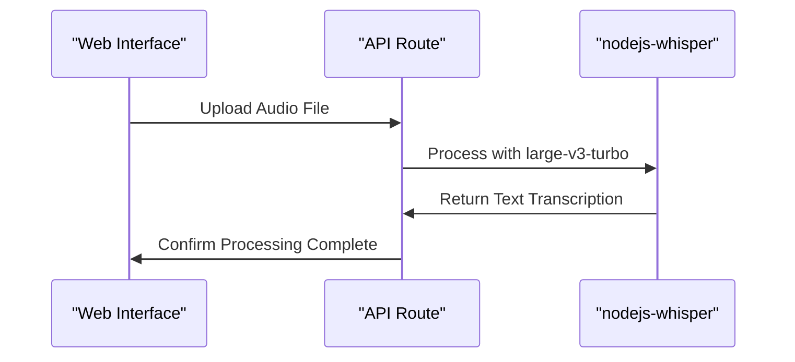
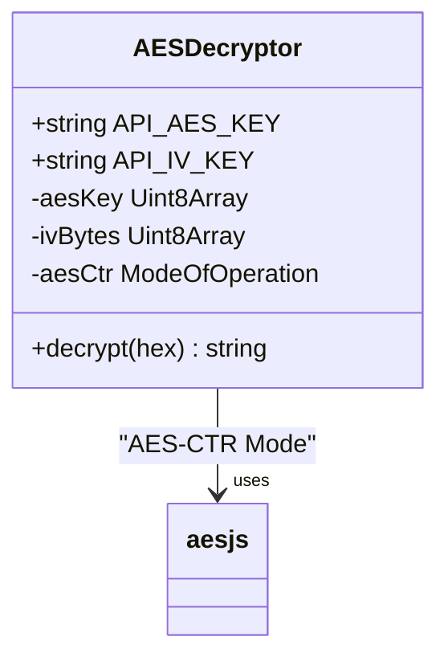
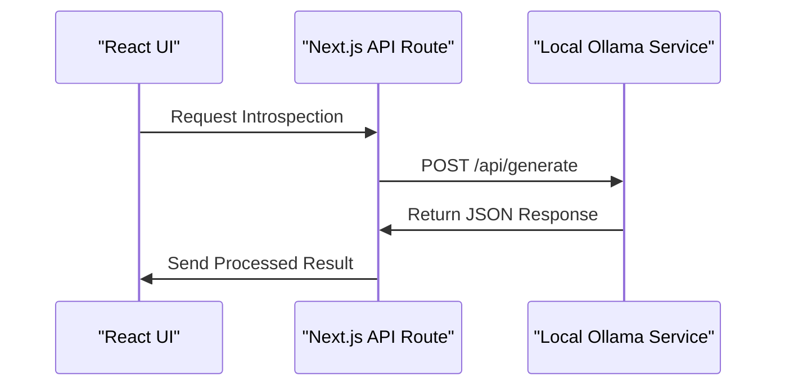

# Technology Stack

<cite>
**Referenced Files in This Document**   
- [package.json](file://package.json)
- [next.config.js](file://next.config.js)
- [tsconfig.json](file://tsconfig.json)
- [pages/api/introspect.ts](file://pages/api/introspect.ts)
- [pages/api/transcribe.ts](file://pages/api/transcribe.ts)
- [pages/api/upload.ts](file://pages/api/upload.ts)
- [common/server.ts](file://common/server.ts)
- [scripts/run.js](file://scripts/run.js)
- [README.md](file://README.md)
</cite>

## Table of Contents
1. [Core Frameworks and Libraries](#core-frameworks-and-libraries)
2. [Configuration and Environment Settings](#configuration-and-environment-settings)
3. [Technology Integration and Workflow](#technology-integration-and-workflow)
4. [Performance Optimization and Model Selection](#performance-optimization-and-model-selection)
5. [Integration Challenges and Setup Requirements](#integration-challenges-and-setup-requirements)

## Core Frameworks and Libraries

The application leverages a modern technology stack designed for offline-first, privacy-preserving audio transcription and LLM inference. The architecture combines full-stack React rendering with local AI processing capabilities.

### Next.js with App Router for Full-Stack Rendering
Next.js serves as the foundational framework, enabling server-side rendering and API route handling through its App Router architecture. The application utilizes API routes in the `pages/api` directory for backend functionality while maintaining a React-based frontend. This hybrid approach allows for seamless integration between client-side UI and server-side processing.

**Section sources**
- [pages/api/introspect.ts](file://pages/api/introspect.ts)
- [pages/api/transcribe.ts](file://pages/api/transcribe.ts)
- [pages/api/upload.ts](file://pages/api/upload.ts)

### React 19 for Component-Based UI
React 19 powers the user interface with a component-based architecture. The application implements reusable UI components such as `ActionUploadButton`, `CircularLoader`, and `TextArea` that follow modern React patterns. These components are styled using CSS modules and Sass, ensuring encapsulated styling and maintainable UI code.

### nodejs-whisper for Local Audio Transcription
The application integrates `nodejs-whisper` for local audio transcription, leveraging OpenAI's Whisper model to convert audio files to text without sending data to external servers. The transcription process is configured to use the `large-v3-turbo` model, which provides high accuracy for audio processing. The configuration disables unnecessary output formats, focusing only on plain text transcription to optimize performance.

**Diagram sources**
- [pages/api/transcribe.ts](file://pages/api/transcribe.ts#L16-L64)
- [pages/api/upload.ts](file://pages/api/upload.ts#L16-L106)

### Ollama for Offline LLM Inference
Ollama enables offline LLM inference by hosting the `gemma3:27b` model locally. The application communicates with Ollama's API endpoint at `http://localhost:11434/api/generate` to process transcribed text and generate insights. This setup ensures complete data privacy as all processing occurs on the user's machine without internet connectivity requirements.

### aes-js for Encryption
The `aes-js` library provides encryption capabilities for sensitive data handling. The application uses AES-CTR mode for decryption operations, with keys derived from environment variables `API_AES_KEY` and `API_IV_KEY`. This implementation ensures secure handling of authentication tokens and other sensitive information.

**Diagram sources**
- [common/server.ts](file://common/server.ts#L15-L40)

### undici for HTTP Requests
The `undici` library handles HTTP communication between the application and the locally hosted Ollama service. A custom Agent is configured with zero timeout values to accommodate long-running LLM inference operations. This ensures reliable communication even with extended processing times required for complex queries.

### Sass for Styling
Sass (Syntactically Awesome Style Sheets) manages the application's styling with CSS modules for component-level styles. The architecture combines global SCSS files with module-specific stylesheets, enabling consistent theming while maintaining component isolation. The build process compiles Sass to CSS, supporting variables, mixins, and nested rules for maintainable styling.

## Configuration and Environment Settings

### Next.js Configuration
The application's `next.config.js` file contains minimal configuration, disabling development indicators for a cleaner production experience. The server is configured to run on port 10000, as specified in the `local` script within `package.json`.

**Section sources**
- [next.config.js](file://next.config.js)
- [package.json](file://package.json#L10-L12)

### TypeScript Configuration
The `tsconfig.json` file defines comprehensive TypeScript settings for the project. Key configurations include:
- **Module resolution**: Set to "node" with ESNext modules
- **Path aliases**: Configured for easier imports using `@` prefixes
- **Strict type checking**: Enabled with `strictNullChecks`
- **JSX preservation**: Allows React components to be processed by Next.js

The configuration supports modern JavaScript features while maintaining compatibility with the Next.js framework.

**Section sources**
- [tsconfig.json](file://tsconfig.json)

## Technology Integration and Workflow

### API Communication with Ollama
The application demonstrates a practical integration pattern where API routes use `undici` to communicate with the locally hosted Ollama service. The `queryOllamaHTTP` function in the introspection API constructs a POST request to `http://localhost:11434/api/generate` with the following parameters:
- Model: `gemma3:27b`
- Prompt: Combined transcript and directive
- Stream: Disabled for complete responses

The response is processed to extract content wrapped in `<plain_text_response>` tags, ensuring consistent output formatting.

**Diagram sources**
- [pages/api/introspect.ts](file://pages/api/introspect.ts#L63-L86)
- [scripts/run.js](file://scripts/run.js#L127-L155)

### Data Processing Pipeline
The application implements a multi-stage processing pipeline that transforms raw audio into structured insights:
1. Audio upload and storage in the `public` directory
2. Local transcription using nodejs-whisper
3. Text normalization and formatting
4. LLM processing via Ollama
5. Result storage and retrieval

This pipeline ensures data remains local throughout the entire processing chain.

**Section sources**
- [pages/api/upload.ts](file://pages/api/upload.ts)
- [pages/api/transcribe.ts](file://pages/api/transcribe.ts)
- [pages/api/introspect.ts](file://pages/api/introspect.ts)

## Performance Optimization and Model Selection

### Model Selection Based on Hardware
The documentation recommends the `gemma3:27b` model for MacBook Air M4 (32GB) systems, indicating a performance optimization strategy based on hardware capabilities. This model selection balances inference quality with resource requirements, ensuring responsive performance on supported hardware.

For systems with limited resources, smaller models could be substituted to maintain acceptable performance. The application's architecture allows for easy model swapping by modifying the model parameter in the Ollama API calls.

### Processing Optimization
The application implements several optimization techniques:
- **Timeout configuration**: The `undici` Agent is configured with infinite timeouts (`headersTimeout: 0, bodyTimeout: 0`) to handle long-running inference operations
- **Selective output**: Whisper is configured to generate only text output, reducing processing overhead
- **Local execution**: All processing occurs on the client machine, eliminating network latency

These optimizations ensure reliable performance even with resource-intensive AI operations.

**Section sources**
- [scripts/run.js](file://scripts/run.js#L38-L40)
- [pages/api/transcribe.ts](file://pages/api/transcribe.ts#L45-L55)

## Integration Challenges and Setup Requirements

### Whisper CLI Availability
A critical integration challenge is ensuring the Whisper CLI is available in the system environment. The setup process requires installing `cmake`, `ffmpeg`, and the Whisper model via `npx nodejs-whisper download`. These dependencies must be properly configured for the transcription functionality to work.

### Ollama Model Management
The application requires the `gemma3:27b` model to be explicitly pulled using `ollama pull gemma3:27b`. This model is not automatically downloaded, requiring users to manually install it before the introspection features will function.

### Environment Variables
The encryption functionality depends on two environment variables:
- `API_AES_KEY`: AES encryption key
- `API_IV_KEY`: Initialization vector for AES-CTR mode

These variables are required for server-side decryption operations, though they may be optional for basic functionality.

**Section sources**
- [README.md](file://README.md)
- [common/server.ts](file://common/server.ts#L26-L34)