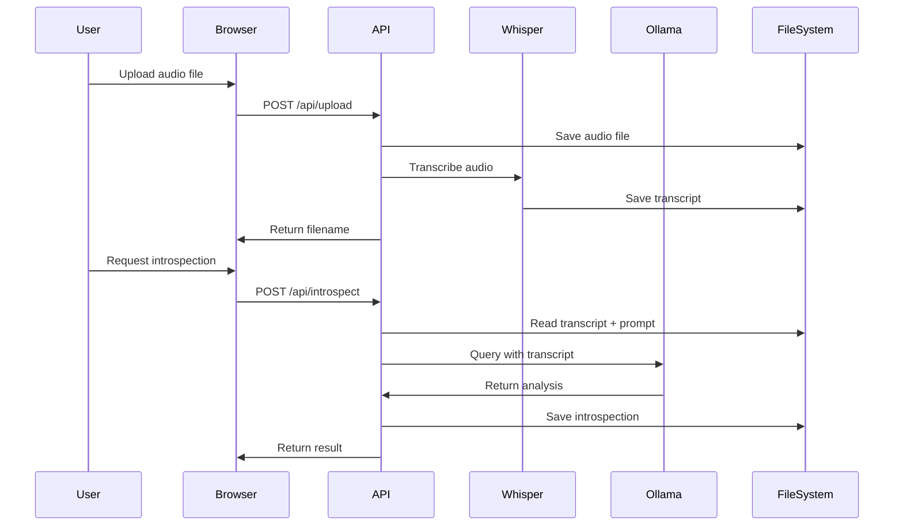

# NEXTJS-OFFLINE-WHISPER-TO-LLM


This repository contains an offline-first, browser-based application developed with [Next.js](https://github.com/vercel/next.js/) that allows users to locally transcribe audio recordings (successfully tested for audio lengths up to 20 minutes) into accurate, plain-text transcripts.

These transcripts can then be processed by a locally hosted [Large Language Model](https://ollama.com/library/gemma3) (LLM), entirely offline without compromising data privacy.

While the initial setup for this repository may pose challenges for people without technical expertise, only two straightforward commands via a [CLI](https://ghostty.org/) are required once the environment is properly configured. This repository serves as an open source reference for securely handling sensitive data, ensuring it remains local and never transits external networks.

Contributions are welcome. If you wish to contribute, please submit a proposal via a GitHub issue or directly provide a pull request.

### Setup (MacOS)

Start by cloning the repository.

You will have wanted to setup your development environment by following steps [here](https://github.com/internet-development/nextjs-sass-starter/issues/3).

Then you will need to run the following commands

```sh
cd nextjs-offline-whisper-to-llm

npm install

brew install cmake
brew install ffmpeg
brew install ollama

# Best model for us is the best whisper model `large-v3-turbo`
npx nodejs-whisper download

# Start Ollama for the first time
# This command runs `ollama serve` with some environment variables
npm run llm

# Best model for us running on a MacBook Air M4, 2025 (32GB)
ollama pull gemma3:27b
```

Now you can run this script in another window

```sh
npm run local
```

Go to `http://localhost:10000` in your browser of choice.

### Architecture

This application has been refactored for simplicity and maintainability following DRY principles.

#### Technology Stack

- **Frontend**: Next.js (React), TypeScript, SCSS
- **Transcription**: Whisper (via nodejs-whisper) - runs locally
- **LLM**: Ollama with Gemma3 27B model - runs locally
- **Storage**: File system (public directory)

#### Code Organization

```
common/
├── server/                    # Server-only utilities
│   ├── file-system.ts         # File path utilities and repository detection
│   ├── whisper-config.ts      # Whisper model configuration
│   ├── llm-config.ts          # Ollama LLM configuration and utilities
│   └── api-responses.ts       # Standardized API response helpers
├── api-client.ts              # Frontend API call utilities
├── shared-utilities.ts        # Utilities safe for both client and server
├── constants.ts               # Application constants
└── server.ts                  # Simplified CORS middleware

pages/api/                     # API endpoints (all refactored)
├── upload.ts                  # Upload and auto-transcribe audio
├── transcribe.ts              # Re-transcribe existing audio
├── introspect.ts              # LLM introspection on transcripts
├── get-transcription.ts       # Retrieve transcript
├── get-introspection.ts       # Retrieve introspection result
├── get-prompt.ts              # Get default prompt
├── update-prompt.ts           # Update default prompt
└── list.ts                    # List audio files

components/                    # React components
└── Application.tsx            # Main application interface
```

#### Configuration

All configuration is centralized for easy modification:

**Whisper Model** (`common/server/whisper-config.ts`):
- Change `WHISPER_MODEL` to use a different Whisper model
- Currently: `large-v3-turbo`

**LLM Configuration** (`common/server/llm-config.ts`):
- `OLLAMA_ENDPOINT`: Ollama server URL (default: `http://localhost:11434`)
- `OLLAMA_MODEL`: LLM model name (default: `gemma3:27b`)
- Can be overridden with environment variables: `OLLAMA_HOST`, `OLLAMA_MODEL`

**File Handling** (`common/server/file-system.ts`):
- Supported audio formats: `.wav`, `.mp3`, `.ogg`, `.flac`, `.m4a`
- Prompt file: `__prompt.txt` in public directory
- Transcripts: `filename.txt`
- Introspections: `filename.introspection.txt`

#### Data Flow



#### Key Features

- **No Code Duplication**: Repository root detection, Whisper config, and file paths centralized
- **Type Safety**: TypeScript with proper typing throughout
- **Standardized Responses**: Consistent API response format across all endpoints
- **Error Handling**: Comprehensive error messages for debugging
- **Local-Only**: No external API calls, all processing happens locally
- **Privacy-First**: Audio and transcripts never leave your machine

### Development Scripts

If you need to run our test script to test the pipeline, run this command. This Script can also help fix the Whisper installation if you're running into issues with not being able to find `whisper-cli`

```sh
# Start Ollama for the first time
# This command runs `ollama serve` with some environment variables
npm run llm

# Then run this script in another window.
npm run script run
```

### Contact

If you have questions ping me on Twitter, [@wwwjim](https://www.twitter.com/wwwjim). Or you can ping [@internetxstudio](https://x.com/internetxstudio).
